# Human spatial encoding {#sec-human-spatial-encoding}



```{=html}
<!--
# The chapters with David have a lot of the material for this chapter.
-->
```

The material about human vision in this chapter is under development.

Please refer to the chapters in [Foundations of Vision](https://foundationsofvision.stanford.edu){target="_blank"}.

-   [Retina](https://wandell.github.io/FOV-1995/chapter-5-the-retinal-representation.html){target="_blank"}
-   [Pattern sensitivity](https://wandell.github.io/FOV-1995/chapter-7-pattern-sensitivity.html){target="_blank"}

## Human spatial encoding overview {#sec-human-spatial-encoding-overview}
Many of the imaging system components characterized in previous chapters can be treated as input-output systems. For example, we characterized lenses by measuring how an incident light field is transformed into an optical image. Transfer functions estimated from these measurements allow us to build simulations of whole imaging systems.

For parts of the human visual system, we can apply the same systems engineering approach. The eye's cornea and crystalline lens form an optical system whose transformation of incident light can be measured directly. Similarly, the photoreceptor mosaic provides the input to retinal neural circuitry, while the action potentials along retinal ganglion cell axons form the output. 

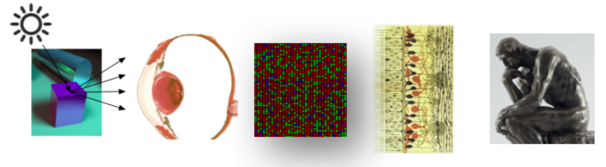{#fig-human-encoding-overview width="80%"}

In this book, we focus on the early stages of the visual pathway that can be characterized with measurable transfer functions. This chapter reviews the first steps in visual encoding: how optical blur by the eye's physiological optics and spatial sampling by the photoreceptor mosaic establish fundamental bottlenecks on spatial resolution. Spatial information lost at these initial stages cannot be recovered by downstream neural processing. Consequently, these early limits provide a principled foundation for creating quantitative image quality metrics (see @sec-human-metrics).

Later stages of visual processing are fascinating and present different challenges. The perceptual experiences and judgments — color, shape, texture — cannot be read out using a measurement instrument. The cortical circuitry has a wide variety of input and output connections that cannot be characterized using the transformation models we apply to the front end or to engineering components. The visual cortex performs perceptual inferences based on the retinal encoding (@sec-human-seeing), but understanding these inferences will require new science. How vision scientists investigate the cortical circuits and how we might model the relationship between these circuits and perception is explored more fully in [Foundations of Vision](https://foundationsofvision.stanford.edu){target="_blank"}. 

This chapter is deliberately targeted: we quantify how the front end transformations and how the human visual system limits the ability to detect and discriminate signals.  This chapter covers the spatial patterns in the light field. The next chapter target covers the wavelength encoding. These analyses are the foundation of the most important engineering tools used to model human visual performance

## Two stages of visual encoding {#sec-human-encoding-systems}
Two systems in the eye function together to convert the scene electromagnetic radiation into a neural signal that the brain interprets.

.](images/human/02-spatial-encoding/2048px-3D_Medical_Animation_Eye_Structure.jpg){#fig-human-eyeball width="60%"}

The **physiological optics**—the cornea and gathers the incident light field at the eye, focusing it to an image within the retina. The optics are an adaptive system.  When the illumination level is high or low the aperture shrinks or expands; when the object of interest is close or far the lens power adjusts its power to bring the object into focus onto the photoreceptors. In addition to neural signals from the brain to the eye that control pupil size and lens power, the system also controls eye, head, and body positions.  These signals combine to determine which part of the visual world falls on the retina. These neural signals do not reach the retina itself, but they control which parts of the scene arrive at the retina and how the image is focused.

Second, the **retina**, a thin layer of neural tissue lining the back of the eye, contains a set of highly specialized neurons that convert this optical image into neural signals. This process, called **transduction**, is performed by the **photoreceptors**. The signals from the photoreceptors, in the form of synaptic transmitter release, are processed by multiple distinct networks of retinal neurons. The output of these networks is sent to the brain on the **retinal ganglion cell (RGC) axons**.  The bundle of RGC axons exit the retina through a small hole and form the optic nerve. 

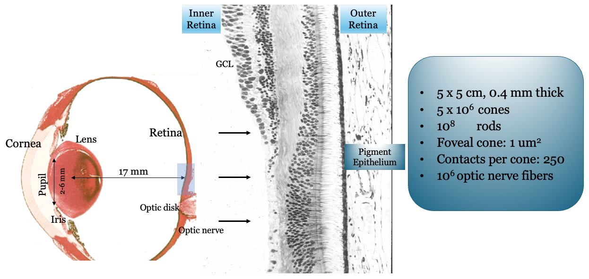{#fig-retina-color width="75%"}

The retina is a feed-forward system; there is virtually no direct neural feedback from the brain. This simplifies our work, allowing us to study the retina's input-output relationship without accounting for top-down signals—a luxury we rarely have when studying other parts of the brain.

## Physiological optics
The cornea and the flexible lens work together to focus light, forming an image on the retina, as shown in @fig-physiological-optics. This optical system is dynamic, constantly adjusting both the amount of light it lets in and its focal length.

The amount of light entering the eye is controlled by the **pupil**, an aperture that can dilate (open) to about 8 mm in diameter in dim light or constrict (close) to about 2 mm in bright light. This change in area adjusts the light intake by a factor of about 16 (or 1.2 log units). While significant, this is a small adjustment compared to the vast range of light levels we encounter in nature, which can span as much as 10 log units across a single day. The pupil's size changes automatically in response to light, but it is also influenced by cognitive and emotional states, which are labeled by terms such as *arousal* or *mental effort*. 

Notice that the pupil size determines which part of the cornea and lens contributes to image formation. When the pupil is constricted, the image is formed using a relatively small central part of the cornea and lens. Under these conditions, optical aberrations are minimized; the image quality can be very high, sometimes approaching the diffraction limit. When the pupil is wide open much larger regions of the cornea and lens are used to focus. Biological optics are never perfect; under these conditions the aberrations become more significant. More photons reach the retina, improving sensitivity. But the image quality is much worse than diffraction-limited.

::: {#fig-physiological-optics .figure}
::: {.panel-tabset}

### Eyeball image

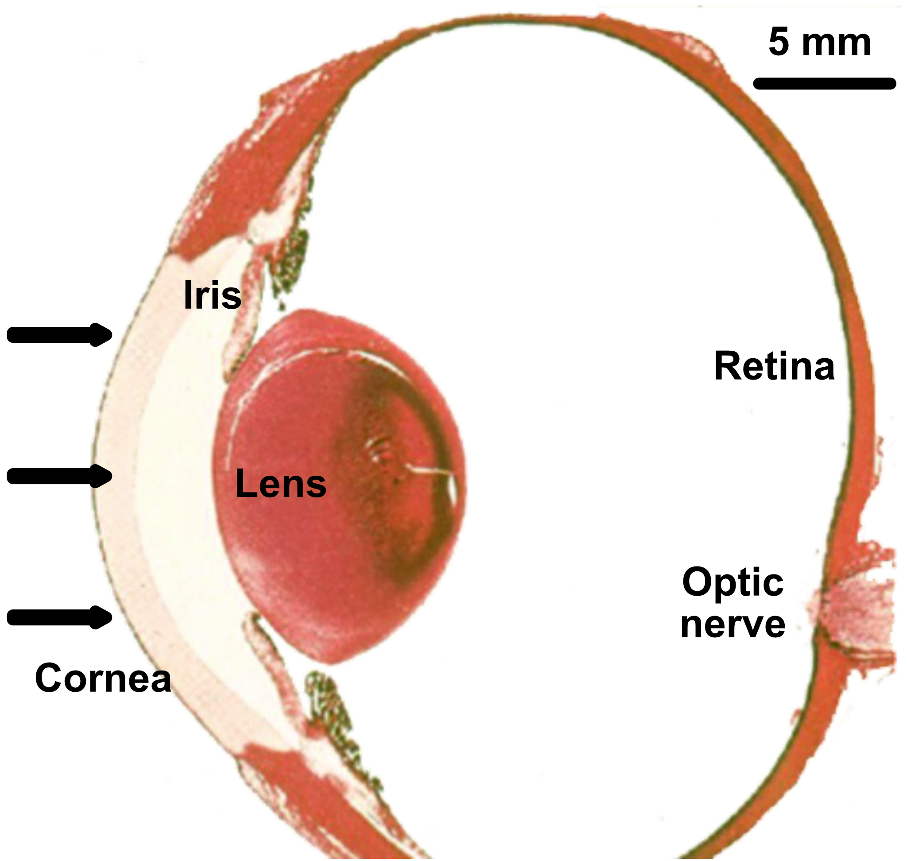{#fig-eyeball-image width="50%"}

### Eyeball sketch

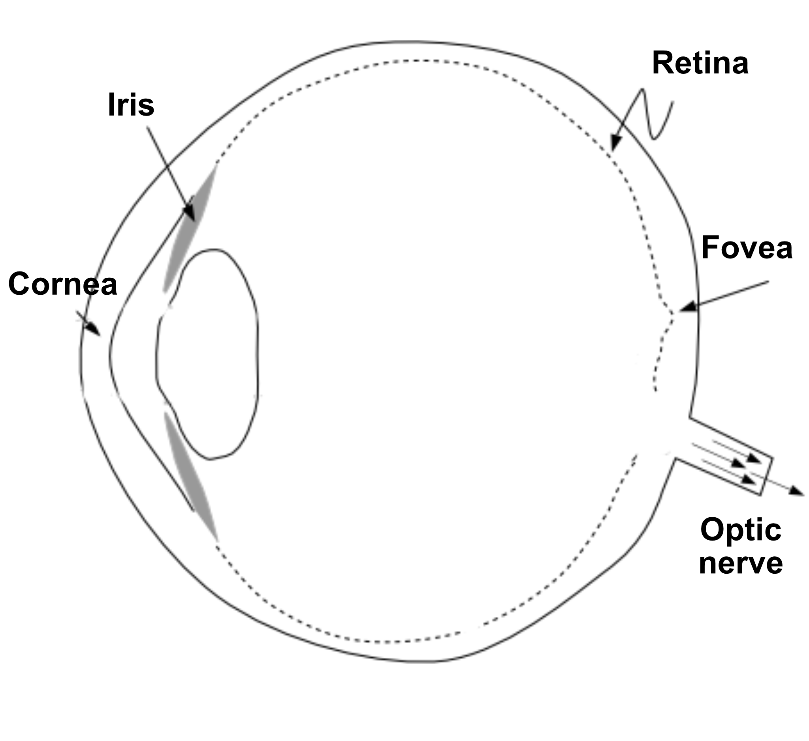{#fig-eyeball-sketch width="50%"}
:::
The physiological optics of the human eye. The cornea provides most of the eye's fixed optical power. The lens adjusts its shape and optical power, which changes the in-focus plane.
:::

The eye changes the object plane that is in focus through a process called **accommodation**. Neural signals control the ciliary muscles, which are connected to the lens by the zonule fibers. To focus on nearby objects, the ciliary muscles contract. This contraction reduces the diameter of the ring they form, relaxing the tension on the zonule fibers. This allows the elastic lens to become more rounded (convex), increasing its optical power. To focus on distant objects, the ciliary muscles relax. This increases the diameter of the ring, which pulls on the zonule fibers and flattens the lens, decreasing its optical power.

This lens flexibility is not permanent. With age, the lens gradually stiffens, reducing its ability to change shape. This condition, known as **presbyopia**, makes it difficult for older people to focus on near objects. The loss of near-field visual acuity typically becomes noticeable in one's early to mid-40s and is a natural part of aging, commonly corrected with reading glasses. It happens to all of us.

<!-- 
https://commons.wikimedia.org/wiki/File:3D_Medical_Animation_Eye_Structure.jpg 
https://www.scientificanimations.com, CC BY-SA 4.0 <https://creativecommons.org/licenses/by-sa/4.0>, via Wikimedia Commons
-->


## Adaptive optics {#sec-adaptive-optics}
By the 1990s, astronomers were routinely using **adaptive optics**—a Shack-Hartmann wavefront sensor (@sec-shack-hartmann) paired with a deformable mirror to correct the blur that atmospheric turbulence imposes on telescope images (@sec-adaptive-optics-astronomy). 

David Williams, at the University of Rochester, recognized that the eye's optics distort the retinal image in much the same way the atmosphere distorts starlight, and that a sensor and mirror built to correct one could be turned inward to correct the other. 

The principle of the wavefront measurement is illustrated in @fig-wavefront-aberrometer. A narrow beam of light is directed through the center of the pupil. Some of the light is reflected from the retina, at the layer between the inner and outer segments of the receptors. The reflected light is Lambertian (spread in all directions) and fills up the lens as it passes back through the optics. If the optics were perfect, the rays exiting the eye from the small spot would be close to collimated and the wavefront would be a constant. But the rays are not parallel and thus the wavefront has some deviations from constant. These are the aberrations that we measure with the Shack-Hartmann wavefront sensor; they are introduced by the optics of the eye.

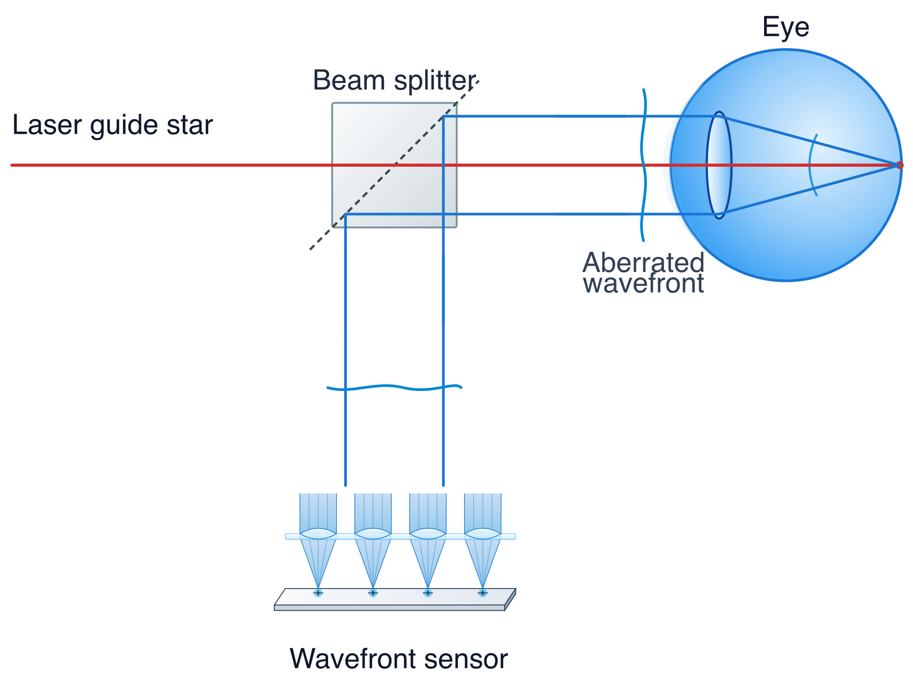{#fig-wavefront-aberrometer width="60%"}

Just as in the case of astronomy, knowledge of the wavefront distortion lets us pre-distort an image before it passes through the optics, so that the aberrations cancel and the retinal image is diffraction limited. The resulting image, from a small region of the retina, is sharp enough to visualize single cones. 

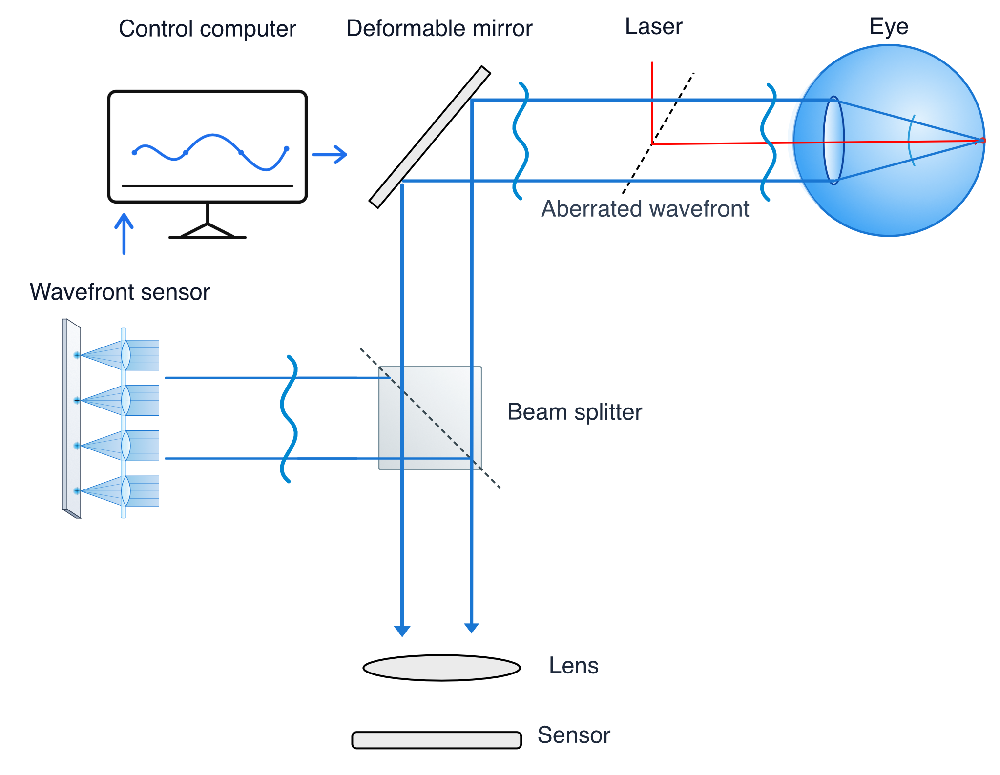{#fig-human-adaptive-optics width="80%"}

The same correction can be applied to a create a spot that is scanned across the retina. When the pupil aperture is fairly large, say 7 mm diameter, the diffraction-limited PSF (Airy disk) diameter is about 3 microns. Scanning a corrected spot across the retina therefore creates a point-by-point image at the back of the eye, at about the same spatial resolution as an individual cone. This technique, adaptive optics scanning laser ophthalmoscopy (**AOSLO**). Austin Roorda - who lead a group for many years at UC Berkeley and is now at the University of Waterloo - developed and spread this technology over the last twenty years [@roorda2002-aoslo; @roorda2011-review; @roorda2015-ophthalmoscopy].

Importantly, by modulating the scanning laser beam (e.g., using acousto-optic modulators) in synchrony with the raster scan, the system can selectively turn the laser on/off at exact pixel coordinates. Because the adaptive optics system maintains a diffraction-limited spot on the retina, AOSLO can project highly localized visual stimuli directly onto specific, targeted individual photoreceptors (photoreceptor-targeted psychophysics) while simultaneously tracking and imaging them. Using this technique it is possible to ask questions about the perception of stimuli initiated in a single cone, something that almost never happens in normal vision [@tuten2017-at].

There have been great advances in this technology in recent years from Don Miller, who has learned how to to make measurements of the retinal ganglion cells in the living human eye [@liu2017-rgc-ao; @marte2024-rgc-ao]. 

::: {.callout-note title="Human eye wavefront sensing" collapse="false"}
Working with Junzhong Liang and Donald Miller, he built the first adaptive optics system for the living human eye and demonstrated "supernormal vision"—retinal images sharper than the eye's own optics would otherwise allow [@liang1997-sm, @williams2023-oa].

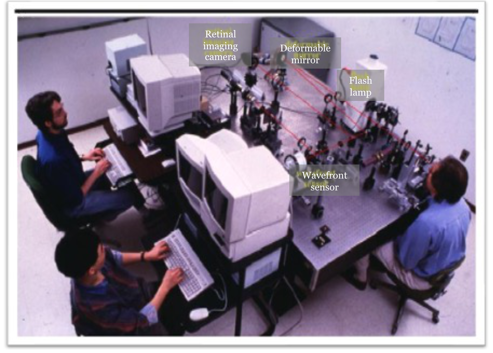{#fig-williams-ao width="80%"}
:::

<!--
My chatgpt conversation about AO and AOSLO imaging. This book should have a short form of that.  A longer explanation can go into FOV 2nd ed.

https://chatgpt.com/share/690926d6-4d98-8002-b395-5e93bb3f900a
-->

## Retina
Since the 1990s, vision scientists have been able to measure the quality of the physiological optics. Below, I describe the techniques invented to make these measurements. The Appendix explains how we use these measurements and ISETBio to simulate the transformation of the incident light field into the retinal image.

It is important to understand these optics in terms of the photoreceptor sampling array. A 5-micron optical spread has different implications if sampled every 2 microns versus every 10 microns. Thus, before discussing physiological optics, we consider the retina and the photoreceptor mosaic.

The retina is approximately $200–300$ microns thick near the posterior pole, varying from about $100$ to $500$ microns across the retina. Its total area is on the order of $10–12~cm^2$. It is a laminated neural tissue comprising three nuclear layers separated by two plexiform layers. There are on the order of 80 different cell types that can be identified through their genetic expression, responses to light, and anatomical form. The retinal cells form stereotyped connections, which we call retinal circuits. We believe that there are about 20 such circuits. The circuit outputs, carried on the retinal ganglion cell axons in the optic nerve, project to a variety of locations in the brain.

The vast majority of light-driven activity is initiated in the photoreceptors (rods and cones). The rods are the dominant source under very low light levels, and the cones are the dominant source under moderate to high light levels. The typical retinal circuit is driven by activity that starts in a local region of the photoreceptors. The same basic circuit will be present throughout the retina, tiling the photoreceptor mosaic, though the absolute size of the cells and their input regions generally vary across the retina. The size of the region increases as one measures from the highly specialized central fovea into the periphery.

There is one important and interesting exception, only recently discovered. There exists a class of retinal ganglion cells that contain a light-sensitive pigment (melanopsin). These cells, called the intrinsically photosensitive RGCs (ipRGCs), absorb photons and respond to overall light level. There are not a lot of these cells, but their outputs are important for circadian rhythms and pupillary control. They may also influence other aspects of vision.

<!-- The Massey 2006 retinal anatomy paper has lots of great images.  Use that as a resource!  Some better than the ones here. -->

::: {#fig-physiological-optics .figure}
::: {.panel-tabset}

### Retinal layers
](images/human/02-spatial-encoding/retina-ej.png){#fig-retina-ej width="50%"}

### Five retinal cell types
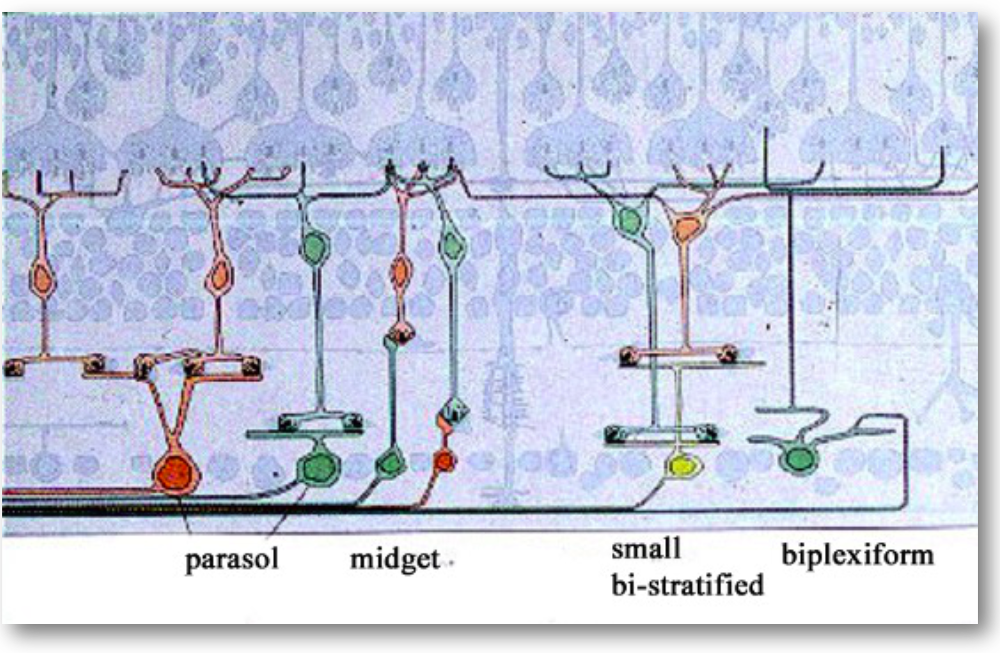{#fig-retina-rodieck width="70%"}

### Peripheral retinal layers
![This Differential Interference Contrast (DIC) microscopy[^DIC] image gives a sense of the density and interconnectedness of the different retinal layers and cells. It may also make it clear why it is such an accomplishment that scientists have painstakingly identified individual cell types and their circuits. Source:  @massey2006-retinalanatomy](images/human/02-spatial-encoding/retina-massey.png){width="90%"}

### Fovea 
{#fig-retina-fovea width="80%"}
:::
A variety of ways of visualizing and characterizing the retina.
:::

[^DIC]: Differential Interference Contrast microscopy is a technique that enhances the contrast in unstained, transparent specimens. The microscope converts gradients in specimen thickness or refractive index (which naturally occur at the boundaries of structures like cell layers, membranes, and organelles) into differences in light intensity (contrast). It is particularly useful in imaging the layers of a retina, making features visible that would otherwise be nearly invisible in a brightfield microscope.

<!--
### How DIC Optics Work

1.  **Light Manipulation:** It uses specialized optical components, primarily **polarizers** and **Nomarski prisms** (or Wollaston prisms), to split a single beam of light into two beams that are slightly offset from each other.
2.  **Phase Shift:** These two beams pass through adjacent regions of the specimen. Since the specimen has a varying refractive index (e.g., one beam passes through a cell membrane, the other through the surrounding cytoplasm), the light waves emerge with a slight **phase difference**.
3.  **Interference:** The beams are then recombined. Due to the phase difference, they **interfere** with each other. This interference creates a high-contrast, pseudo-three-dimensional relief image, making structures like the cell layers and fine details mentioned in the caption (e.g., cone pedicles) much more distinct and easier to observe without the need for staining. 

In the context of the figure caption, using DIC optics allowed the researchers to clearly delineate the layered structure of the macaque retina—the **plexiform layers** and the **nuclear layers (ONL, INL, ganglion cell layer)**—in a fresh or relatively unstained preparation.
-->

## Photoreceptor types
The rod and cone photoreceptors are specialized neurons whose principal function is to convert electromagnetic radiation into a neural signal. Both types of photoreceptors accomplish this using a light-sensitive pigment (photopigment). This pigment absorbs photons and, in so doing, initiates a chain reaction of events within the cell (@Stryer1986-ug). These events, the transduction cascade, result in a change in the synaptic signal from the photoreceptor. The spatio-temporal pattern of changes across the photoreceptor mosaic is the signal that the nervous system interprets and the basis of our sight.

The arrows at the bottom indicate the direction of the incoming light (the lens is below). The light arrives at the photoreceptor layer, brought into focus by the physiological optics. Some of the light enters the cell through the inner-segment aperture. Because of the refractive-index contrast between the inner segment and surrounding medium, the inner segment acts as a waveguide that directs the light toward the outer segment, where it initiates the transduction cascade. 

<!-- These folks think that the mitochondria act as microlenses to guide the light within the cone photoreceptors (@ball2022-cones-microlens). -->

::: {#fig-photoreceptors .figure}
::: {.panel-tabset}
### Simple rod and cone
![Denis Baylor's Proctor Medal award included this very simple diagram, which he entitled 'A physiologist’s diagram of a rod and cone.' The horizontal lines show the stacks of photosensitive pigment molecules within the outer segment of these cells. The arrangement differs between the rods and cones. In the rods, the photopigment is mainly contained in discs (saccules) that are not continuous with the cell’s surface membrane. In the cones, the photosensitive membrane is continuous with the cell surface. The absorption of a photon initiates a series of events (transduction cascade) that modulates the membrane potential and the rate of synaptic transmitter release. The transmitter itself is packaged in synaptic vesicles, shown by the circles. Source: @baylorphotoreceptorsignalsvision1987](images/human/02-spatial-encoding/photoreceptor-baylor.png){#fig-photoreceptor-baylor width="50%"}

### Detailed rod and cone
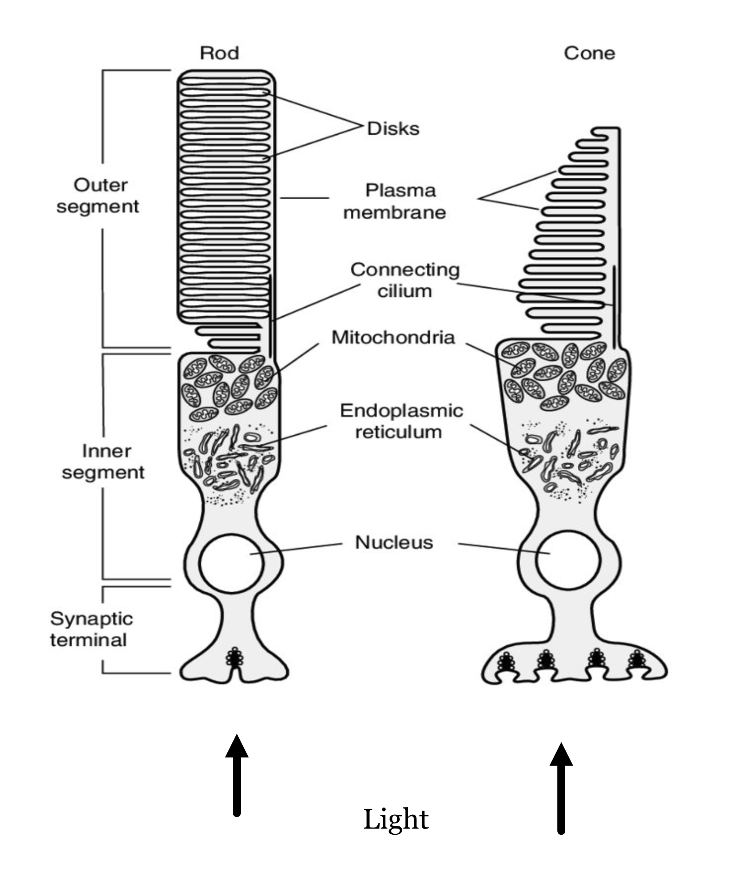{#fig-photoreceptor-anatomy width="50%"}
:::
The photoreceptors convert electromagnetic radiation into a neural signal. The radiation enters the photoreceptor through the inner segment and is absorbed by the photosensitive molecules in the outer segment. The absorption initiates a series of chemical events resulting in transmitter release at the synaptic ending.
:::

The rod and cone photoreceptors are two largely distinct systems. The rods are mainly used to provide vision under low light levels (scotopic; e.g., nighttime). There is only one type of rod photopigment, rhodopsin. For this reason the rod system provides no information to compare the different wavelengths of light incident at the retina.

The cone photoreceptors dominate vision at modest to high levels of illumination. There are three types of cones, containing three different photopigments. These photopigments absorb over a fairly broad wavelength band, but they have different peak sensitivities in the long-, middle-, and short-wavelength parts of the visible spectrum. I will cover more on this in the color section below.

The spatial resolution of the human eye depends on the aperture size and spacing of the photoreceptor inner segments, particularly for the cones. A great deal was discovered about the sampling mosaic in the 1980s and 1990s @curciohumanphotoreceptortopography1990. Prior to that time, the nature of the cone sampling mosaic and the importance of sampling were not widely appreciated. The importance of sampling was emphasized by Yellott and colleagues, who analyzed the spatial sampling. William Miller and Joy Hirsch, at Yale, were among the first to crisply show the dense packing (@hirsch1987-ka). Over small patches of the primate retina the packing is quite dense (@fig-inner-segment-miller), in a spatial arrangement called a triangular (hexagonal) packing.

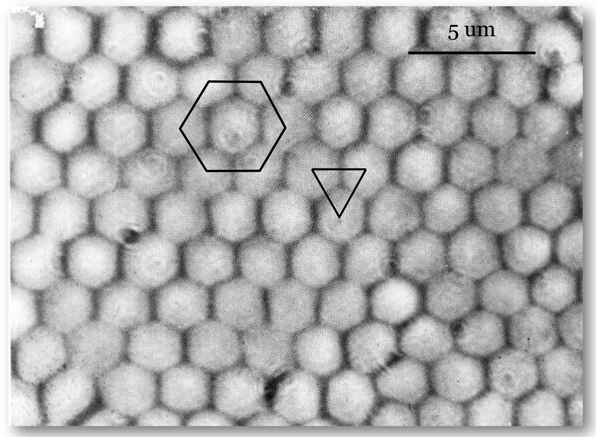{#fig-inner-segment-miller width="50%"}

How does the spatial sampling of the cones compare to the optical PSF? One comparison we can make is for the central fovea. There the inner-segment apertures are about 1.5–2 microns in diameter. Using ISETCam we can calculate the diffraction-limited Airy disk diameter (first minimum) for a 550 nm light. For a 3 mm pupil, the f-number of the human optics is 17 mm / 3 mm ≈ 5.6. Using @eq-airydisk1, this is:

```
>> radius = airyDisk(550,5.6,'units','um','diameter',true)
radius =
    7.5152
```

This calculation shows that a tiny point in the scene -say star light- will be spread over a diameter of about 7 $\mu\text{m}$ on the retinal surface, which corresponds to a 3 or 4 foveal cones. In natural vision, therefore, no stimulus will excite a single photoreceptor; the nervous system always receives signals from multiple cones, even if it draws the inference that the source is a single, very tiny point of light.

One reason for creating such a system that spreads the light over several cones may be to enable us to judge the wavelength information. It is likely that spreading the light across 5-10 cones will engage cones with more than one type of photopigment, and the relative excitation of the different types of cones is the signal we use to judge color.  We encountered a similar principle when describing the color filter array in cameras; designers purposefully introduced some blur so that any small region of the scene would engage the R,G and B pixels (@sec-sensor-cfa). 

What is the arrangement of the different cone types in the human eye? Some data on this point emerged in the 1980s and 1990s when biologists discovered fluorescent markers that would attach to just one type of photoreceptor (@demonasterio-yellow1981, @Wikler1990-hu).  These measurements could distinguish the L,M cones from the S-cones.

::: {#fig-cone-type-sampling .figure}
::: {.panel-tabset}
### Cone types
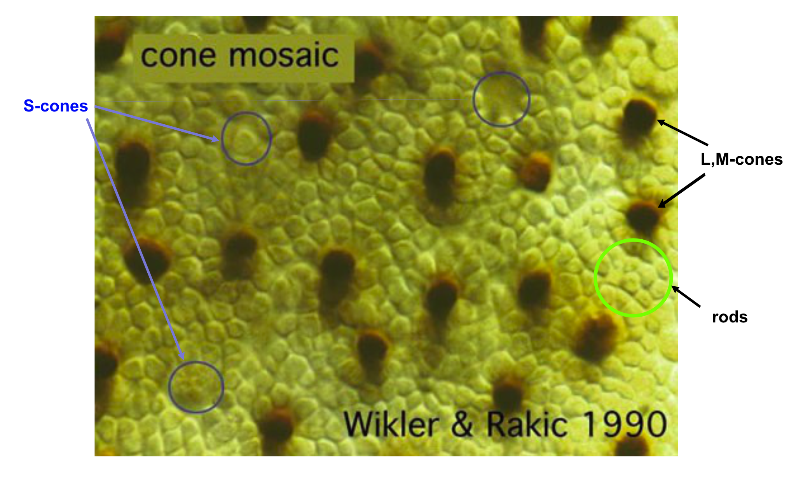{#fig-scones-wikley width="80%"}

### S-cones sampling
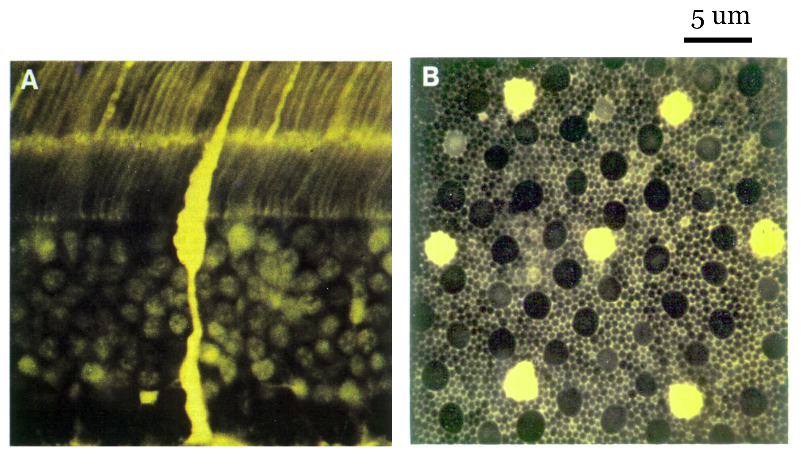{#fig-scones-schein width="80%"}
:::
Cone mosaics of the different cone types are interleaved.  The L and M cone mosaics are interleaved approximately randomly at high resolution. The S-cone mosaic samples the image much more coarsely, and it is relatively more uniform.
:::

About ten years later, new estimates that could distinguish between the L- from M-cones were obtained in the living human eye. These measurements used adaptive optics coupled with knowledge about the relative wavelength selectivity of the different cone types (@Roorda1999-xb, @Hofer2005-hf, @hoferColorVisionRetinal2014). I explain these measurements in the Foundations of Vision, 2nd edition.  When that gets written. 

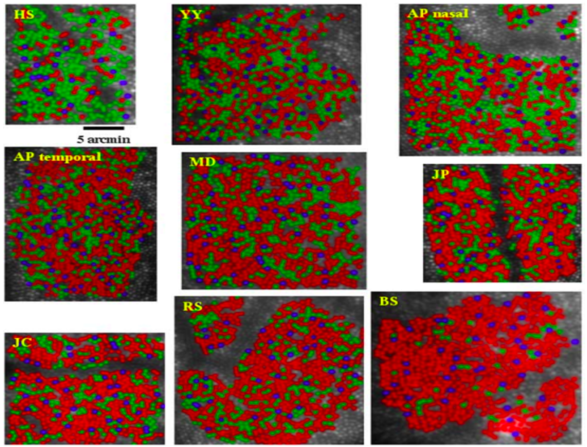{#fig-hofer-mosaic width="70%"}

These measurements revealed something that was quite surprising to vision scientists: the ratio of L- to M- cones in the living human eye differs greatly between people. Some of us have equal numbers of L- and M- cones, while others have a large predominance of L-cones. To this point in time, we have not learned how to measure these differences in behavioral experiments, although there have been some attempts. I suspect that an enterprising engineer or scientist will find a means to do so in the future. One of the reasons that the difference is hard to reveal is that the L- and M-cones are so similar to one another.

## Cone mosaic at different eccentricities
The cone spatial sampling density and inner segment aperture size varies a great deal between the fovea and periphery. In the central fovea, the cones are tightly packed and their inner segment aperture diameters are very small (1-2 microns). In the periphery the cones are much more widely spaced and their inner segment apertures are nearly ten times larger (@fig-cone-mosaic-density).  Hence, our encoding of the retinal irradiance is very different between the fovea and periphery.

TODO:  Incorporate Watson estimates for RGC density, as well.

TODO: There is an ISETBio figure related to s_coneEccentricities.m that we could reference and include as a fise_<> file.


::: {#fig-cone-mosaic-density .figure}
::: {.panel-tabset}
### Fovea
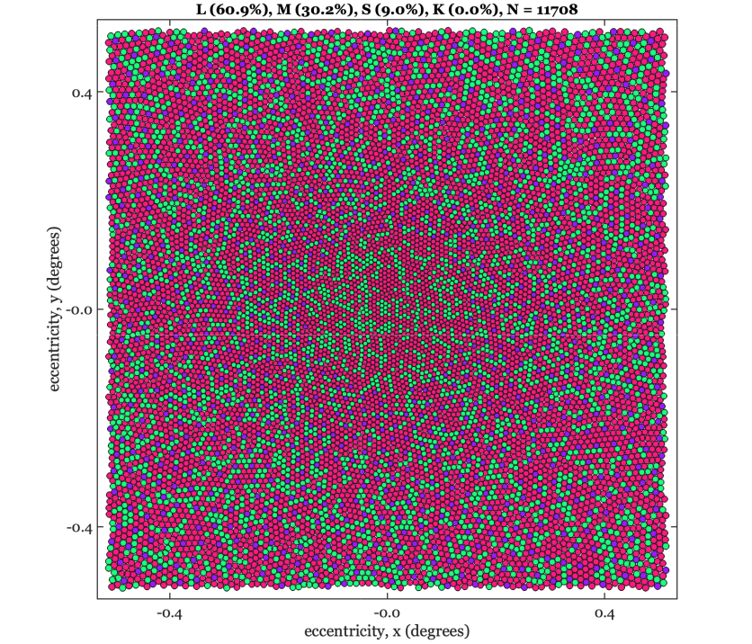{#fig-mosaic-0 width="70%"}

### 3 deg
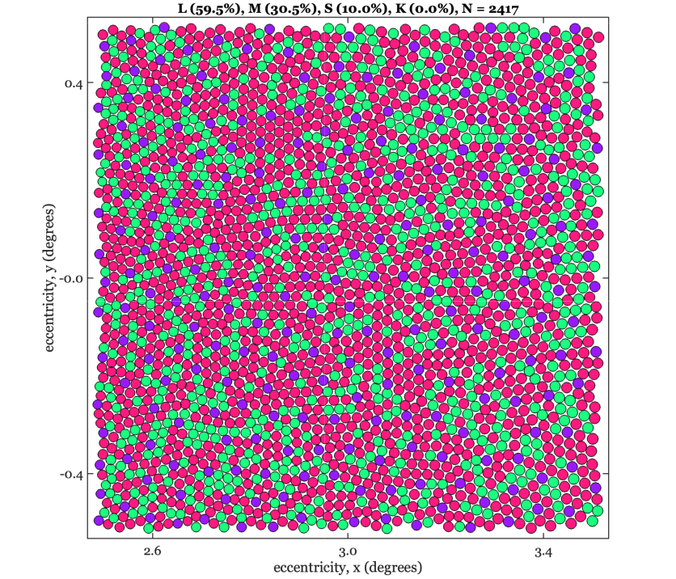{#fig-mosaic-3 width="70%"}

### 6 deg
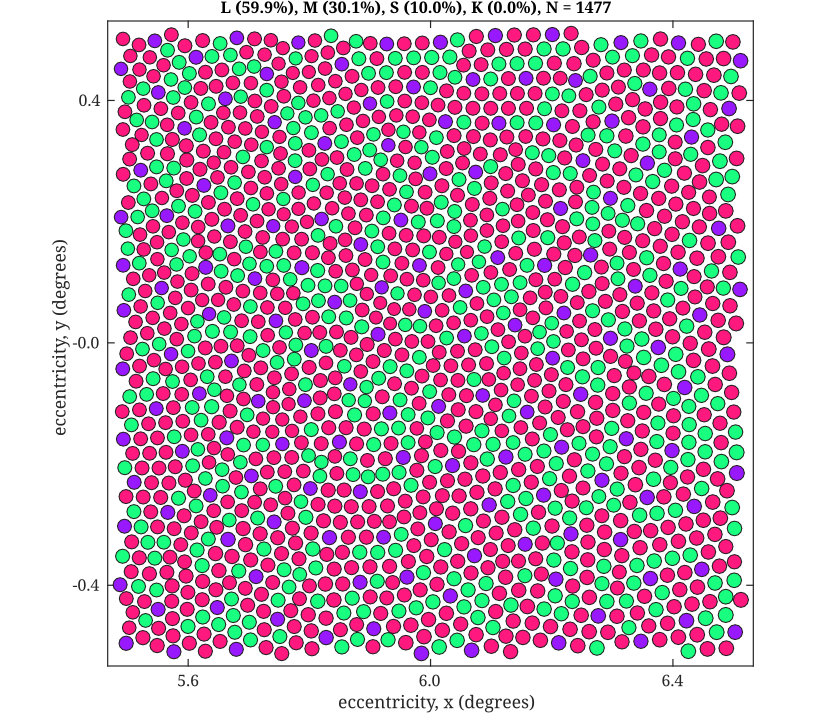{#fig-mosaic-6 width="70%"}

<!--{fig-cap="Cone inner-segment apertures from fovea to periphery" fig-cap-location=margin width="0.5\\textwidth"}-->
<!-- {fig-cap="Cone inner-segment apertures from fovea to periphery" fig-cap-location=bottom width="0.5\\textwidth"}-->

### 12 deg
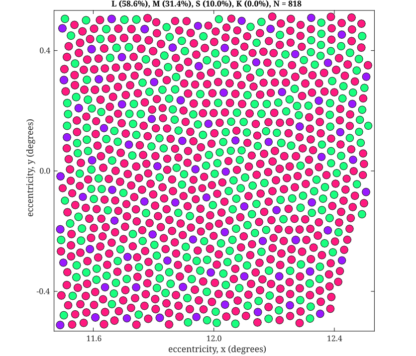{#fig-mosaic-12 width="70%"}
:::
ISETBio simulations of the cone sampling mosaic at four different eccentricities. Source: fise_humanMosaic.m
:::


<!-- See fise_humanConePSF.m in code/human -->
## PSF at the cone inner segments
We are now ready to describe the optical spread with respect to the cone spatial sampling. First, we illustrate for a typical person how the PSF changes with visual field eccentricity.  Second, wwe illustrate how the PSF changes with wavelength.

### Eccentricity dependence
The set of images in this panel illustrates the PSF on the cone mosaic for locations in the central fovea, 3 deg, 6 deg and 12 deg.  The original scene is a set of 9 points (3 x 3), spanning about half a degree. The points are broadband lights. In the fovea, the PSF excites about 3-7 cones. In this region this light causes about 2000 excitations per cone.

In the peripheral locations the cone inner segment apertures are bigger, and the blur is bigger as well.  The larger blur matches the increased size of the cone apertures, so once again about 3-7 cones are significantly excited. Further, the cones all absorb about 2000 photons. for this subject, at 12 deg eccentricities, the cone apertures are not quite as well matched. Only 2-4 cones are significantly excited and they each capture about 4000 photons.

::: {#fig-cone-psf .figure}
::: {.panel-tabset}
### Fovea
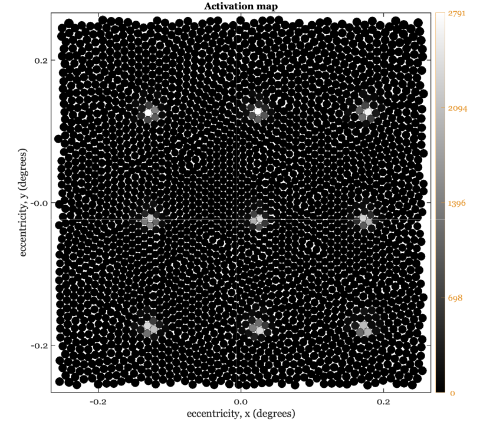{#fig-mosaic-0 width="70%"}

### 3 deg
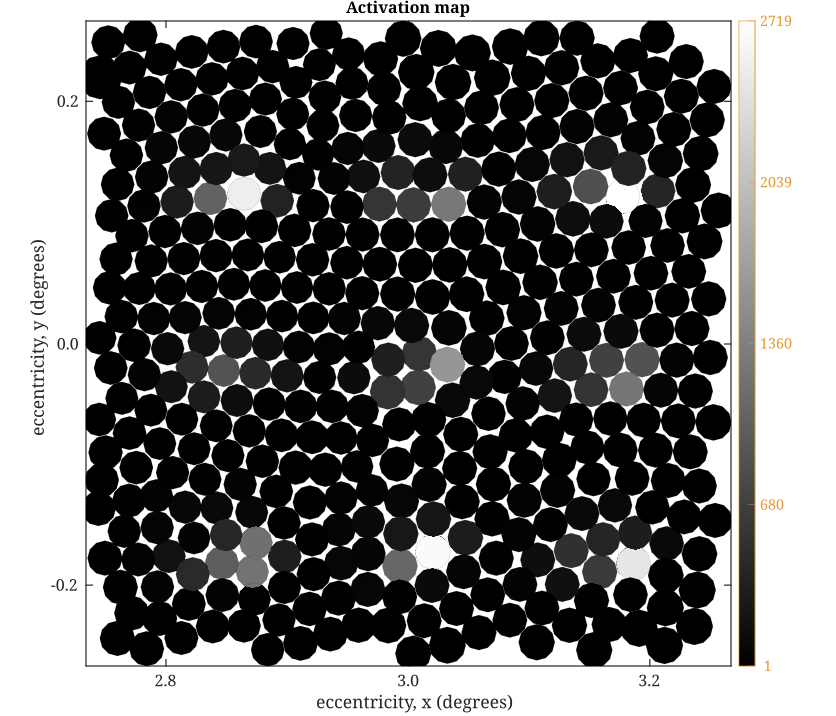{#fig-mosaic-3 width="70%"}

### 6 deg
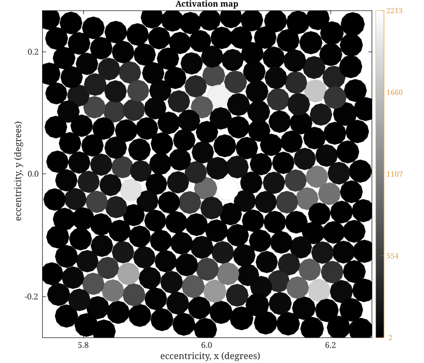{#fig-mosaic-6 width="70%"}

### 12 deg
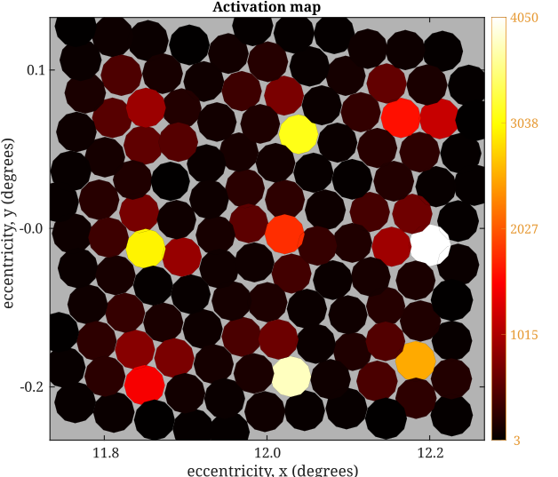{#fig-mosaic-12 width="70%"}
:::
ISETBio simulations of the PSF superimposed on the cone sampling mosaic.  The four panels show four different eccentricities. This precise pattern varies between subjects because we all have slightly different optics and mosaics. The main trend, which we believe to be true, is that the blur and cone aperture size both increase with eccentricity. In some cases, as illustrated here, the two changes approximately balance one another so that the same number of cones are stimulated by about the same amount. The optical blur is from one example subject based on Artal optics measurements. Source: fise_humanConePSFm
:::

If we measure an input-referred spatial resolution, the eye's sensitivity is considerably reduced with eccentricity.  If we think purely in terms of the number of excited cones, the signal is much closer to constant from fovea to periphery.  Perhaps this latter measure is the important one for how the nervous system is wired up. I can speculate a little, right?  Though I sure would like a better story.

### PSF wavelength dependence
In normal viewing, the human eye's optics brings the middle wavelengths are in good focus at the inner segment. Because of chromatic aberration, the short wavelength light is focused at the RGC layer, and measured at the inner segment layer the short wavelength light is considerably spread out (@fig-cone-psf-wavelength). The defocus of the short wavelength light is wired into the design of the cone sampling density.

We can see this by comparing the spacing of the L- and M-cones with the S-cone (@fig-cone-psf-wavelength). That figure shows the sampling density of the L,M cones separately from the much lower sampling density of the S-cones.  There are about 3-5 cones within the point spread of the middle wavelength light, and there are also about 3-5 S-cones within the point spread of the short-wavelength light. Nature has evolved a photoreceptor mosaic so that the spatial sampling of each cone type matches the wavelength-dependent optical blur. 

::: {#fig-cone-psf-wavelength .figure}
:::{.panel-tabset}
### PSF for 550nm
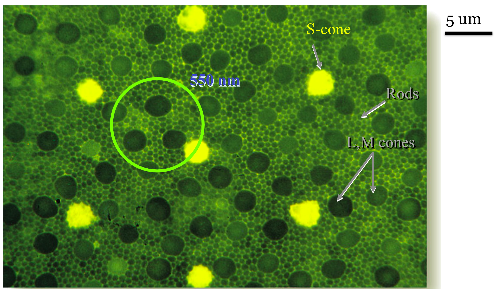{#fig-psf-550nm width="60%"}

### PSF for 480nm
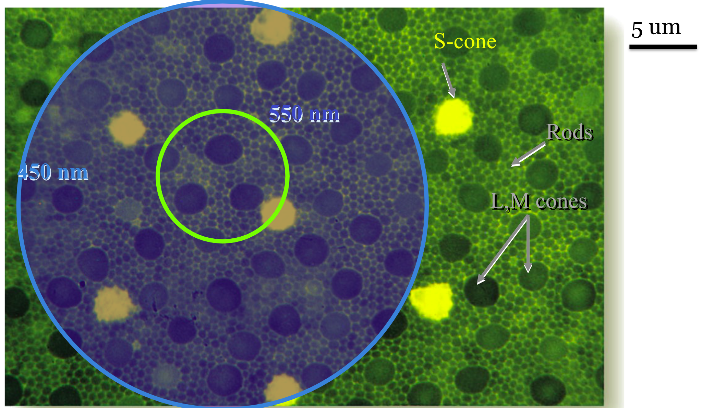{#fig-psf-450nm width="60%"}
:::
The two tabs show the approximate size of the point spread function at two different wavelengths, 550 nm and 450 nm, estimated at the inner segments. The spread is superimposed on the photoreceptor sampling mosaic. The retinal region shown here is in the near periphery, where there are both rods and cones. 
:::

Modern measurements of the eye's wavefront aberrations enable us to simulate the wavelength-dependent PSF at the cone mosaic effect. Recall that in the very center of the fovea, there are no S-cones.  But there are some about 0.2 deg in the periphery.  If you click on the images in @fig-cone-psf-wavelength-isetbio, you will see a simulation of the absorptions along with a label of the cone type by the color of the circle around each cone. For the 550 nm light in the left panel, the excitations are spread over only about 3 cones.  

::: {#fig-cone-psf-wavelength-isetbio .figure}
:::{.panel-tabset}
### PSF for 550nm
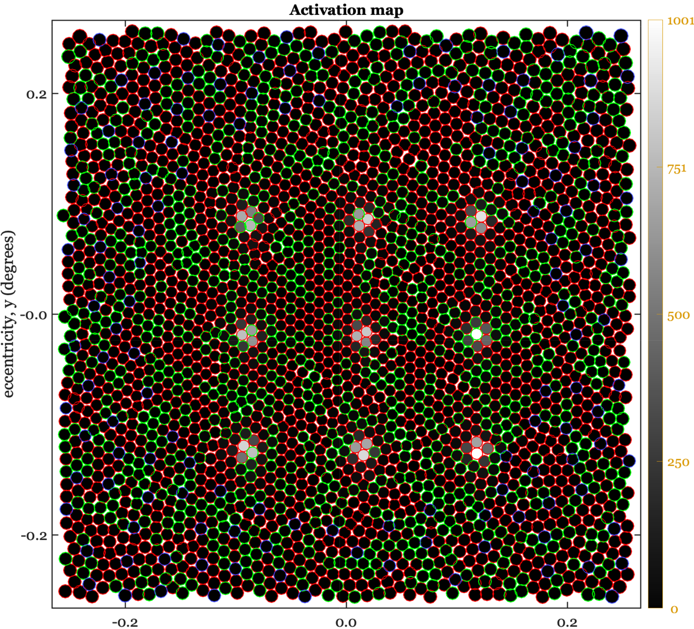{#fig-psf-550nm width="60%"}

### PSF for 480nm
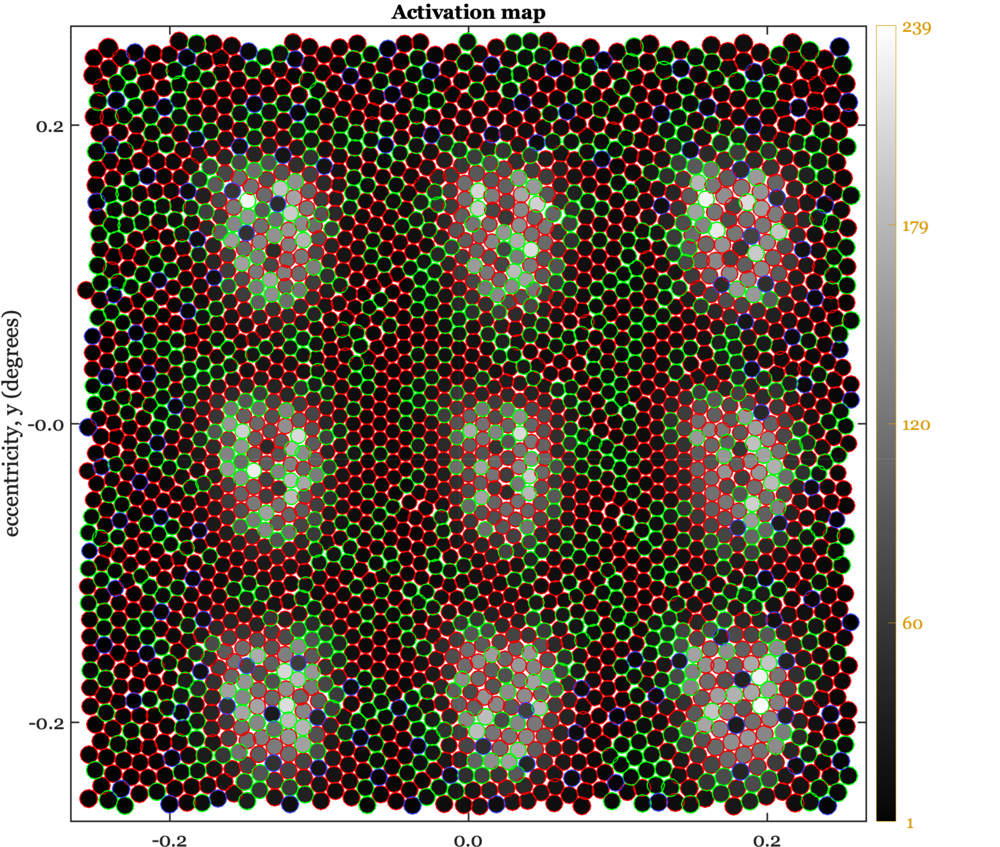{#fig-psf-480nm width="60%"}
:::
The two tabs show simulations of the cone excitations in response to a point of light (PSF).  The left panel is for a 550 nm light and the right for a 480 nm light. The simulation is for the central fovea region.
:::

For the 450 nm light in the right panel, the PSF is spread over a larger retinal region. But again, click on the image to see it enlarged in a new tab.  The number of S-cones excited by the short-wavelength PSF is still only 3-5, as in @fig-cone-psf-wavelength.  The number of excitations of all the cones, including the S-cones, is much lower for the short-wavelength light.  Recall that the short-wavelength light is absorbed by the cornea, lens, and macular pigment.  To equate the number of absorptions, we would need to scale the intensity of the light quite a bit. 

## Spatial sensitivity in the transform domain
The usefulness of the analyses in the transform domain, in engineering generally and optics specifically, led vision scientists to ask whether measurements using harmonics could be useful for understanding and characterizing the human visual system. Perhaps the first person to see the potential application was the image systems engineer Otto Schade.  This is the person who developed the concept of the modulation transfer function (MTF) for  image systems engineering questions (@sec-MTF).

I created four Google docs with historical information about CSF measurements, how to download the historical data, and how to imlement the modern models of the historical and more modern data.  Integrate those pages here and write some Matlab scripts to create figures.

Show the data he collected of the CSF (1/MTF) he measured that I include in FOV.  Maybe in the human spatial encoding chapter.

The use of harmonics to probe the visual system is quite different from their use in studying typical systems.  At many points in this volume I have pointed out that harmonics are particularly valuable stimuli for space-invariant linear systems @sec-appendix-spaceinvariance-overview. These systems have an input and an output. THe use of harmonic stimuli in human vision faces two significant limitations.  First, as we have just seen, the system is not at all space-invariant (@fig-cone-mosaic-density). It is justifiable to use harmonics as special stimuli over small regions of the retina, which can be close to space-invariant. Stimuli that span more than a degree or two will not have the special property (harmonics being nearly eigenfunctions) that make them so useful in systems analysis.

Second, even at the earliest stages of vision the neural encoding is not restricted to a single system.

### Contrast sensitivity functions (CSF)  {#sec-contrast-sensitivity}
Optical scientists use both the space domain (PSF) and the transform domain (MTF) to study their system, and vision scientists use both domains as well. The nonuniformity of the optical blur, coupled with the nonuniformity of the cone spatial sampling, imply that shift-invariant methods only make sense over patches of the visual field. As a result, the carefully controlled harmonics used in vision experiments are modulated over relatively small regions of space.

There are several ways in which this modulation is accomplished in experiments, though perhaps the most common is to use a **Gabor function**; named after Denis Gabor, the Nobel Laureate credited with the discovery of the laser. 

$$
\begin{aligned}
g(x,y) &= \exp\!\left(
  -\frac{(x - x_0)^2 + (y - y_0)^2}{2\sigma^2}
\right)
[1 + a \cos\!\big(2\pi f x +  \phi\big)]
\end{aligned}
$$ {#eq-gabor-function}

Gabor functions are harmonics modulated by a Gaussian.  The standard deviation of the Gaussian ($\sigma$) controls the spatial spread; the frequency of the harmonic $f$, controls the center frequency of the image. The phase term, $\phi$, controls the spatial relationship between the harmonic and the peak of the Gaussian.  The central position in the visual field is $(x_0,y_0)$, and the amplitude of the harmonic is controlled by $a$. 

Figure:  Show images of different Gabors.

Show classic contrast sensitivity functions  (CSF) measured with Gabor patches shown here.  

Note:  Should we adjust $f$ and $\sigma$ together, or should we fix $\sigma$ and adjust $f$ on its own.  Thinking about the space-variant part of the human visual system, we realize both are important parameters.

### Vernier acuity

Gerald and Suzanne lead the discussion of Vernier acuity.

::: {.callout-note title="Pierre Vernier" collapse=true}

https://www.fisicanet.com.ar/biografias/cientificos/v/vernier-pierre.php

Something about Vernier calipers and the story of Pierre Vernier.

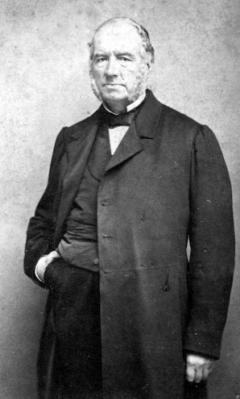{#fig-vernier width="60%"}

Historical

https://en.wikisource.org/wiki/1911_Encyclop%C3%A6dia_Britannica/Vernier,_Pierre

:::
