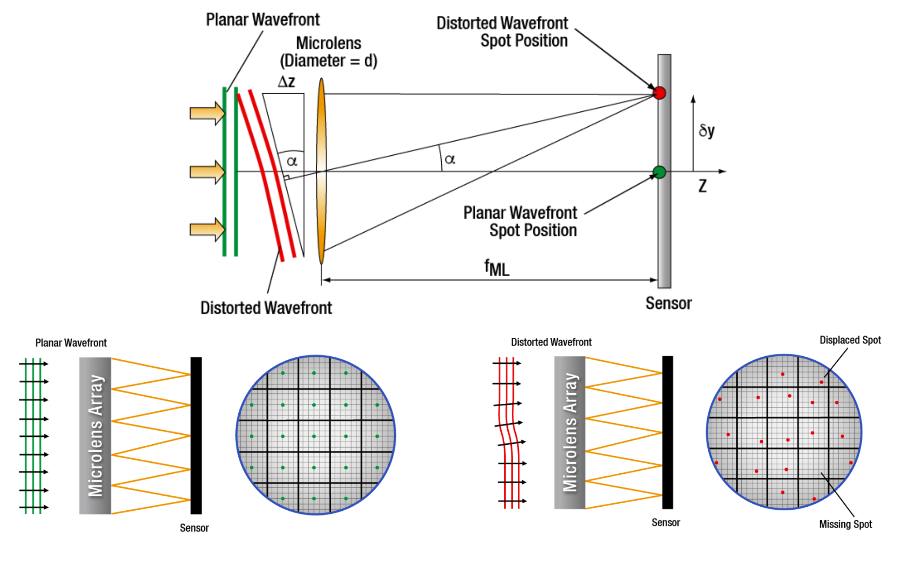
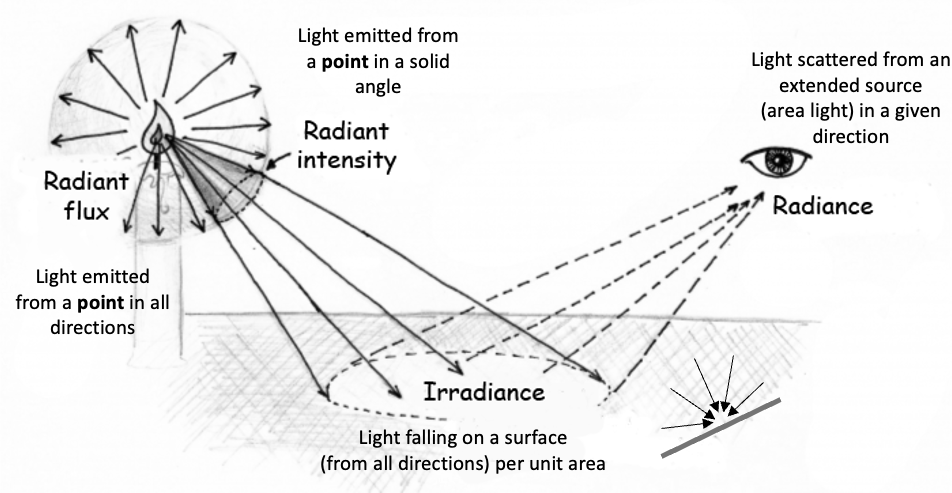
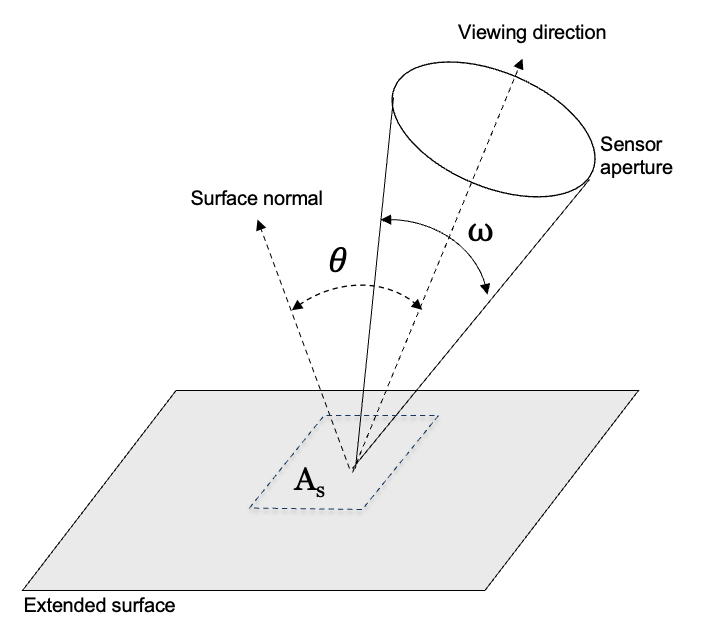
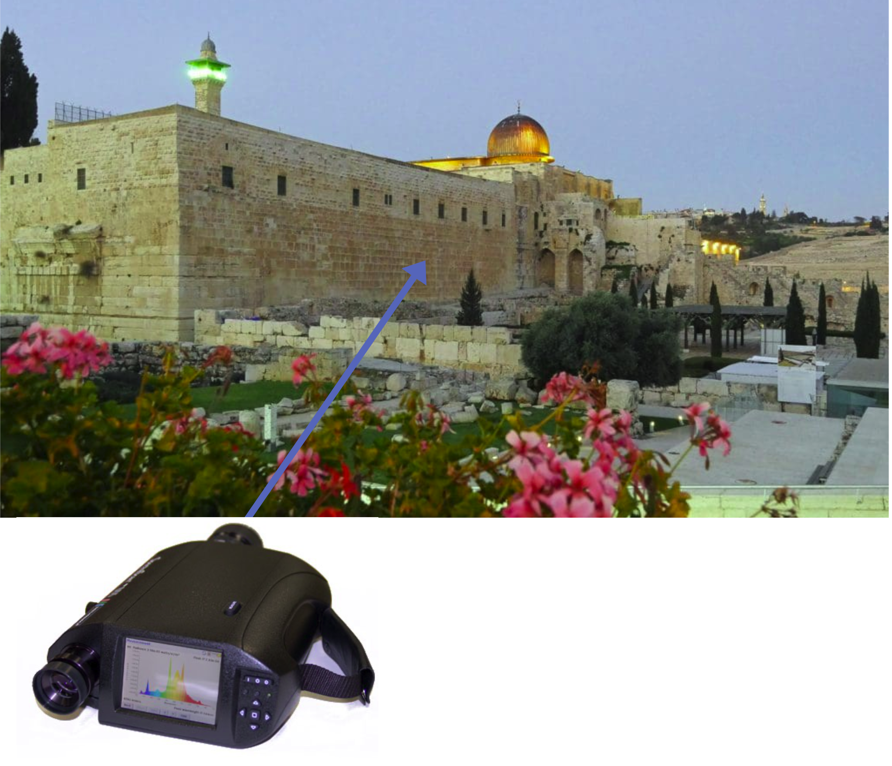
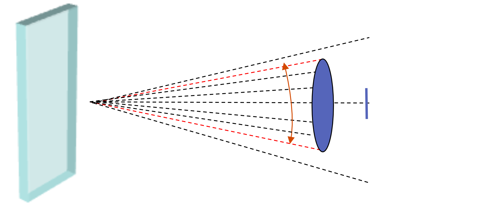
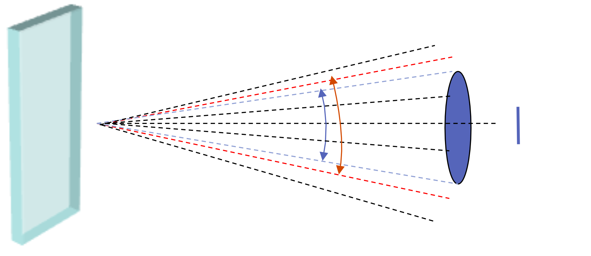
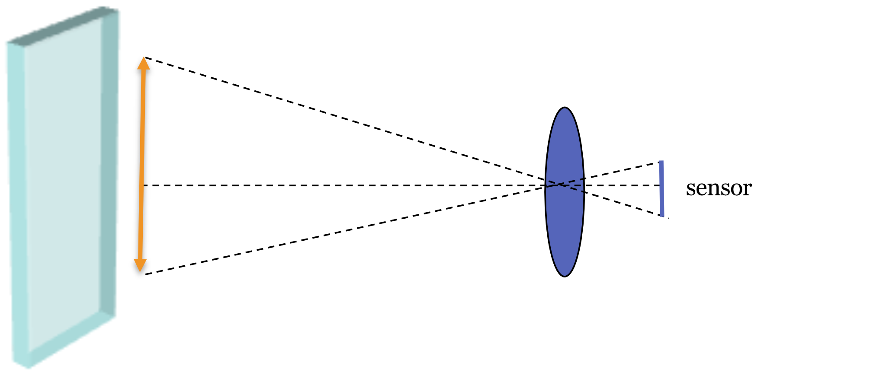
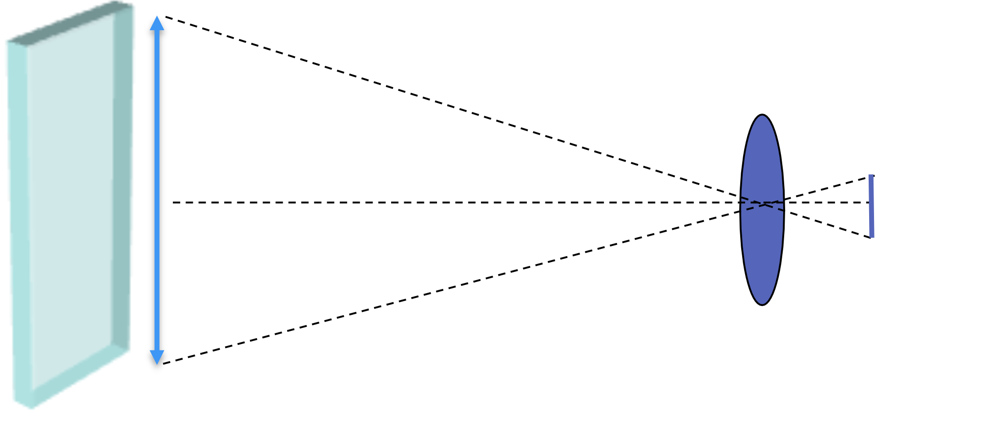
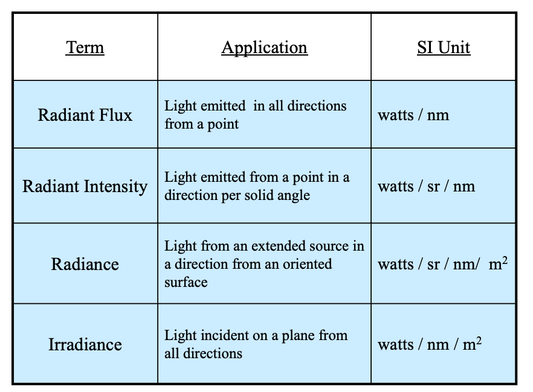

# Measuring light {#sec-lfmeasurement}



## Measuring light: An overview {#sec-lfmeasurement-overview}

In this chapter we describe several ways to measure light. 

First, we explain measurements of the light field incident at a detector. These measurements capture the directions of the rays.  Understanding how an optical instrument or passage through a medium (such as the atmosphere) transforms the incident ray directions into a new set of directions is an important, foundational measurement. 

For many of the applications in this book, we can model light as comprising rays. But a single ray is only an idealization with no energy. Real measurements always integrate over a small area (or aperture), a small solid angle (direction range), a finite wavelength band, and a finite time interval. We think of the instruments as measuring ray bundles; these may be diverging from a source or converging onto a surface. The same principles apply in either case. In this case, we are integrating the energy across bundles of rays using techniques that account for the different geometry of the ray bundles. 

**Radiometry** is the field that provides the quantitative framework for these integrative measurements. We will work primarily with spectral (per-wavelength) quantities and SI[^SI-units] units (e.g., watts or photons per second), which are standard in imaging and used by simulation tools such as ISETCam. The next sections define the core quantities — radiant flux, radiant intensity, radiance, and irradiance— and show how geometry (area, angle, and foreshortening) enters their units.

[^SI-units]: Système International d'Unités.  These units are the modern form of the metric system, the most widely used system of measurement in the world.

## Measuring the light field {#sec-lightfield-measurement}
How do we measure a light field? A pinhole camera offers a simple conceptual answer. An image from a pinhole camera is a measurement of the incident light field at the pinhole's location. The intensity at each image point corresponds to the intensity of a small bundle of rays arriving from a single direction. To learn more about the environmental light field, we can follow Leonardo's lead and move the pinhole to different locations, accumulating information with each measurement.

The camera arrays in @fig-camera-array are a practical implementation of this idea. They sample the environmental light field by measuring the incident light field at multiple camera positions. However, these cameras use lenses, not pinholes. A lens gathers light from across its entire aperture, and a conventional sensor integrates all of this light. For any single point on the sensor, the rays in the optical light field arrive from many positions within the lens's exit pupil. A conventional sensor sums the energy from all these rays, losing the information about where each ray originated in the pupil. Consequently, a conventional camera measures an integrated version of the light field, not the full angular distribution of light at each point.

While a conventional camera array does not capture the complete light field, it captures enough information for its intended purpose: rendering a scene from various viewpoints by interpolating between the captured images. The light field concept is a powerful theoretical guide for the design and interpretation of such systems, even when the full light field is not measured.

### Shack-Hartmann wavefront sensors
In many scientific and clinical applications a measurement of the light field is valuable. The fundamental way to characteriz how an optical system transforms an incident light field into an optical light field (@eq-lightfield-optical) is illustrated in @fig-shack-hartmann. The instrument used to measure the wavefront is called a Shack-Hartmann wavefront sensor.

{#fig-shack-hartmann width="80%" fig-align="center" .margin-caption}

TODO: Explanation of the principles to go here.  Top image shows the local wavefront direction.  Bottom images show the measurements across space to capture the larger area of the wavefront.

### Wavefront sensor applications
The wavefront sensors are used in applications far beyond optical measurement. For example, astronomers measure the wavefront of light from a guide star at the top edge of the atmosphere. The rays from this small point of light would ordinarily be parallel when they arrive at the telescope.  But the atmosphere distorts the wavefront. They measure the actual wavefront and couple it with a wavefront corrector to compensate for the atmospheric distrotions.  These are called adaptive optics systems (@sec-adaptive-optics), and they enable creating a much sharper image of the sky, limiting the distortions from the atmosphere.

<!-- https://www.thorlabs.com/shack-hartmann-wavefront-sensors?tabName=SH%20Tutorial
-->

, which credits C. Max, Center for Adaptive Optics.](images/lightfields/01-lightfields/01-wavefront-sensing.png){#fig-wavefront-sensing width="80%" fig-align="center" .margin-caption}

A second and quite different example is that Shack-Hartmann wavefront sensors are used to measur the optics of the human eye. Imperfections in a person's cornea and lens can be corrected with spectacles or laser surgery. To design these corrections, we must first measure how the eye's optics transform incoming light rays. These measurements are central to the fields of ophthalmology and vision science, as we will explore further in @sec-human-spatial-encoding.

### Light field cameras
A modern image sensor design that directly captures the optical light field was invented by @adelson-wang-1992. They placed a lenslet array in front of a standard camera sensor. Each lenslet covers a small group of pixels. As @fig-lightfield-pixel illustrates—using a pinhole array rather than lenslet for simplicity—rays arriving from different angles are captured by different pixels behind the pinhole. This sensor records both the position of a ray (which lenslet or pinhole) and its angle (which subpixel). @adelson-wang-1992 describe how to use this information to estimate depth. The ideas was further developed by Ren Ng and his colleagues.  Ng formed company, Lytro, that commercialized light field cameras [@ng2005-lightfield]. These cameras allow users to perform novel operations, such as refocusing an image after it has been captured (@sec-sensor-lightfield).

![A light field sensor captures both the position and angle of incoming light rays. The sensor is composed of an array of "macropixels" (bottom). Each macropixel consists of a microlens (or a pinhole, as simplified here) and a group of pixels beneath it. The microlens or pinhole location on the sensor determines the ray's position. The subpixels are below the pinhole.  Which of these detects the light determines the ray's angle. By capturing the position and angle data across the entire sensor, a light field camera can perform powerful computations, such as refocusing an image after it has been taken. (Image by me and Gemini 2.5 Pro.)](images/lightfields/01-lightfields/Gemini_lightfieldPixel-Circle.png){#fig-lightfield-pixel width="60%"}

The principles of the light field camera continue to be used in modern sensors. While full depth estimation is not common in consumer devices, many cameras use a simplified version of this technology for autofocus (@sec-focus-control). We will return to light field cameras in @sec-sensor-lightfield and discuss the parallel developments of Shack-Hartmann wavefront sensing in @sec-wavefront-sensor.

::: {.callout-note title="Lightfield measurement instruments"}
* **Hartmann (1900)** developed the **aperture mask** (Hartmann screen) to sample ray angles across a telescope pupil to detect optical aberrations.
* **Lippmann (1908)** invented *integral photography*, using a **microlens array** on photographic emulsion to record directional light rays and create 3D imagery.
* **Gershun (1936)** formalized the **radiometric concept** and mathematical foundation of the 3D "light field."
* **Shack & Platt (1971)** replaced Hartmann's aperture mask with a **microlens array**, creating the Shack-Hartmann wavefront sensor to measure ray slopes in astronomy and optical testing.
* **Adelson & Wang (1992)** placed a microlens array at the focal plane of a camera lens to extract disparity and depth for computer vision (the single-lens plenoptic camera).
* **Perwaß & Wietzke / Raytrix (2010)** brought the first industrial light field camera (Raytrix R11) to the commercial market for metrology and machine vision.
* **Ren Ng / Refocus Imaging (later Lytro, 2012)** commercialized the first integrated handheld light field camera for the consumer market.
:::

## Interpreting the light field
Encoding the light field data is the first step in seeing. The instrumentation for encoding is a critical bottleneck because it limits what we can infer about the scene. For example, if an instrument does not record information about certain wavelengths, we can only guess at the missing information, for instance, by choosing the most likely value based on context.

Knowledge of the light field encoding is always connected to the next step in an image system: interpreting the measurement. The invention of algorithms that interpret the light field—to recognize objects or measure distances—is central to building computers that see. Interpreting the light field is also important for consumer photography, where we may wish to distinguish a surface marking from a shadow, or the color of an object from the color of the ambient lighting. In vision science, a primary goal is to discover how the brain interprets the signal encoded by the retina.

We will review many algorithms for interpreting images, but one overarching principle has endured for centuries. The principle is that image systems, whether artificial or biological, should use the encoded signal to build an internal model of the scene.

> The general rule determining the ideas of vision that are formed whenever an impression is made on the eye, is that *such objects are always imagined as being present in the field of vision as would have to be there in order to produce the same impression on the nervous mechanism*. [Italics in the original; from *Treatise on Physiological Optics*, Vol. III, 1867]

Understanding the light field—how it interacts with objects, how it is measured by instruments, and how it is interpreted—is fundamental to achieving that goal. We are still working on the project assigned to us by Helmholtz.  We will return to this important issue later in the book.

## Radiometric units

Radiometric measurements are made separately for each wavelength. For people working in radiometry and image systems, wavelength is commonly expressed with respect to nanometers [^lightfields-measurement-1]. We quantify the amount of radiance by measuring the amount of energy, or equivalently the number of photons, present at a location. The basic energy unit is joules per second, (watts) and for photons the basic unit is photons per second. Thus, in radiometry one often finds units such as (watts per nanometer) or (photons per sec per nanometer). 

[^lightfields-measurement-1]: Units of micrometers (microns, $\mu$) are commonly used by people working in the infrared studies, units of angstroms in atomic and x-ray studies, and electron volts in high-energy photon research.

We describe the energy separately for each wavelength because, in most cases, the energy at different electromagnetic wavelengths act independently: we can measure the energy at two wavelengths separately, mix the two lights, and the result is simply the sum of the individual measurements. This additivity is a critical feature of light behavior in many cases [^lightfields-measurement-2] and is a foundational principle for many image systems (@sec-ls-superposition).

[^lightfields-measurement-2]: There are important cases light when radiance at one wavelength evokes emissions at a different wavelength (fluorescence). There are also important cases of non-linear behavior (e.g., two-photon imaging). We discuss these when we review special instrumentation. But the vast majority of image systems are linear and the Principle of Superposition applies (@eq-superposition).

Radiometry defines units that are helpful for different types of geometry. The radiometric measures can be divided with respect to those from a source (radiance) and those arriving at a surface (irradiance). These can be further divided with respect to measurements from a small (point) source, or from an extended surface.  Here are some of the basic physical quantities that we build upon to create radiometric units.

| Concept | Definition | Energy-Based Units | Photon-Based Units (q) |
| --- | --- | --- | --- |
| **Wavelength** | dimension along which electromagnetic energy is measured independently.  | nanometers (nm) | nanometers (nm) |
| **Power / Flux** | energy present at a location over time. | joules/sec (watts) | photons/sec (q/s) |
| **Spectral Power** | power per unit of wavelength. | watts / nm | photons / (s nm) |

(Note: In the photon-based units column, "q" is often used as shorthand for quanta/photons, "m" represents the spatial area and "s" represents seconds).

## Photometric units
There is a set of units that summarize the impact of the radiation on the human visual system. These units are based on the spectral radiometry units, and we then calculate a weighted sum across wavelengths. The weights are selected to represent (roughly) the relative visibility of each wavelength. These **photometric** units parallel the radiometric units; for example, radiance and irradiance correspond to luminance and illuminance. In this section, we will describe the radiometric quantities. The experimental basis of photometry for the weighted sum across wavelengths -the key step to spectral radiometric quantities into photometric quantities- is explained in @sec-human-metrics.

 *Part IV: Human Vision* summarizes aspects of human vision that are important for image systems engineering. Please consult [Foundations of Vision](https://wandell.github.io/FOV-1995){target=_blank} for more information about wavelength encoding and color appearance in human vision.

## Radiance from a point

{#fig-radiometry fig-cap-location="bottom" width="100%" fig-align="center" .margin-caption}

@fig-radiometry illustrates the geometry of four basic radiometric measures. The upper left illustrates a point source. The *radiant flux* measures the total energy emitted from the point in all directions. As for all radiometric measurements, the energy (watts) is specified as a function of wavelength (watts/nm).

Often, we measure the light emitted by a point source in a particular direction, the *radiant intensity*. In that case we measure the energy within a cone of rays in a particular direction. The standard unit for angles in three-dimensions is the *steradian*, just as the radian is the standard unit for angles in two-dimensions. The radiant intensity has units of watts per steradian per nanometer (watts/sr/nm). Thus, if the measurement instrument measures energy over an angle of 0.5 steradians, we divide the measurement by 0.5. If the instrument sums over 10 nm bands, we divide the energy by 10. In this way, the radiant intensity normalizes the angle we measure to the unit steradian and per nanometer. The standard symbol for radiant intensity is $I(\lambda)$.

::: {.callout-note collapse="false" title="Steradians"}
{#fig-steradian width="80%" fig-cap-location="bottom"}
:::

## Radiance from a surface

In many applications we measure radiance from a patch on an extended, flat surface - such as a large light fixture with a diffuser, a wall, or a large display screen. The geometry of such a measurement accounts for two main factors illustrated in [@fig-foreshortening-sketch]. First, we must account for the area of the surface patch, as seen from the detector. For example, if the measured surface patch is a square $0.1$ meters on a side its area is $A_s = (0.1~m)^2$. The area of this patch, as seen from the detector, is foreshortened. We calculate the foreshortened area using the angle between the viewing direction and the surface normal, $\theta$, which becomes $A_s \cos(\theta) ~ m^2$. Second, we account for the size of the bundle of rays captured by the detector. We measure this size by its three-dimensional angle, $\omega ~ sr$, from a surface point that will be measured by the detector. The *radiance* combines the energy measured at the sensor ($watts/nm$) with these geometric factors. The standard symbol for spectral radiance is $L(\lambda)$. It has units of watts per nanometer per unit foreshortened-area per steradian: 

$$ 
\frac{Watts}{nm ~ \cos(\theta) ~ m^2 ~ sr}
$$

{#fig-foreshortening-sketch width="60%"}

## Radiance from a large surface

{#fig-wall-distance width="70%"}

We often measure the radiance from a large uniform surface, say a large wall or a large display screen, with a spectroradiometer. When the surface is large and uniform, the distance from the wall does not impact the measurement.  Why?

::: {#fig-radiance-surface .figure}
::: {.panel-tabset}

### Rays - close

### Rays - far

### Surface area - close

### Surface area - far

:::
The tradeoffs between angular bundle and surface area when measuring a large surface as the distance increases. The spectroradiometer -comprising a lens and a sensor- captures a large angular bundle when it is closer, but a smaller portion of the surface.  These two factors cancel.  Thus the distance away from a large surface is largely irrelevant when measuring the radiance.
:::

The different tabs in the figure illustrate how the tradeoffs balance nicely so that the distance from the uniform surface does not matter.  When the instrument is close, the aperture captures a bundle of rays that is a bit *larger* (Rays - close) than when we measure a little further away (Rays - far). On the other hand, the amount of the surface that makes it on to the sensor is *smaller* when close (Surface area -close) compared to farther (Surface area - far).

Here is a tabular summary of the tradeoffs as the distance changes - solid angle and contributing surface area cancel one another. If the wall is uniform, the distance does not matter. 

| Parameter     | Distance  |
|---------------|-----------|
| Solid angle   | Decreases |
| Surface area  | Increases |

: As distance from a surface increases, the solid angle subtended by each surface point decreases, while the measured surface area increases proportionally. {#tbl-angle-area-tradeoff}

## Irradiance on a surface

Another important measurement is the radiance incident upon a surface, the *irradiance*.  This quantity is important to calculate the radiance available to an image sensor or the retina. It is also a practical measure in assessing room lighting, say how much light will arrive at a desk top. The irradiance sums the energy arriving from all directions, hence no three-dimensional angles (steradians) are specified. The irradiance measures the total energy per unit area of the surface. The standard symbol for irradiance is $E(\lambda)$, has units $watts/nm/m^2$.

The amount of light from a small source, say a point source or a light bulb, that irradiates a surface depends on the geometry relating the light source and the surface. @fig-foreshortening-irradiance illustrates two cases:  the same angular rays emerging from both light bulbs. On the left the surface is perpendicular to the direction of the central ray.  On the right, the surface is slanted and not perpendiulcar; th same bundle of rays is spread across a larger surface area. Thus, there will be less light per unit area when the surface is not perpendicular to the main ray.  In the most extreme case, when the surface is parallel to the central ray, no light will fall on the surface at all.

{#fig-foreshortening-irradiance width="60%" fig-cap-location="bottom"}

The geometric relationship between surfaces and relatively small light sources in an image is an important part of rendering images in computer graphics and measuring the illumination on surfaces in natural settings.  The geometric factor illustrated here is complementary to the geometric factor illustrated in @fig-foreshortening-sketch for how we measure the light radiating from a surface.

## Radiometric units

@tbl-SI-units is a guide to help you remember the four fundamental spectral radiometric measurements. Please note that people will sometimes report a measure of any of these radiometric quantities by summing the energy across all wavelengths. This would be called, for example, the *total radiance* or *total irradiance,* rather than the spectral radiance. 

| Term | Application | SI unit |
| --- | --- | --- |
| Radiant flux | Light emitted in all directions from a point | Watt (W) |
| Radiant intensity | Light emitted from a point in a direction per solid angle | W sr⁻¹ |
| Radiance | Light from an extended source in a direction from an oriented surface | W sr⁻¹ m⁻² |
| Irradiance | Light incident on a plane from all directions | W m⁻² |

: The four fundamental radiometric measurement quantities. The table lists the name of the measurement, how it is used, and the International System of Units (SI) definition for each {#tbl-SI-units}

I list the corresponding **photometric** measurements in @sec-human-wavelength-encoding. The photometric units corresponding to these radiometric terms have the same geometry, but they sum across wavelengths, weighted by the relative visual significance of each wavelengths.  The term 'significance' is doing a lot of work there, which I explain later.

<!--
{#fig-radiometry-units fig-cap-location="bottom" width="100%" fig-align="center"}
-->

::: {.callout-note collapse="false" title="Surface or point?"}
<!--# The difference between radiant intensity and radiance is a question of whether we are measuring from a point or a surface.  But as a surface patch becomes smaller and smaller, how do we know when it should be considered a point?   -->

How do we determine whether we are measuring a part of a surface or a point? The distinction between measuring a surface and a point source is not always clear-cut. Here are some principles, though none is definitive.

-   **Distance:** If the distance to the source is significantly larger than the dimensions of the source itself, it can be approximated as a point source.
-   **Solid Angle:** If the solid angle subtended by the source at the detector is very small, it can be approximated as a point source.
-   **Precision:** If high accuracy is required, it's generally better to use the radiance formula, even for small surfaces. This allows you to account for the angular distribution of the emitted radiation. If lower accuracy is sufficient, and the source can be reasonably approximated as a point source, the radiant intensity formula can be used.

These recommendations are filled with imprecision that I always try to remove. They contain words, like 'small', 'large', 'high', and 'low' because there is no fixed threshold at which a surface definitively becomes a point source. It is your decision whether to treat the source as a point. What is important is to tell people exactly what you did. If they don't like your choice, they can do it their own way. Or they can ask you - nicely - to try it another way.
:::

## Beyond the basics: BRDF, light field, colorimetry
The four fundamental radiometric measurements provide a foundation for understanding light. In later chapters, we will expand on these concepts by introducing additional factors.

A key extension is directional dependence. Radiance from a surface patch varies with viewing direction and is often written as $L(\mathbf{x}, \omega, \lambda)$, where $\omega$ denotes direction using polar angle $\theta$ (from the surface normal) and azimuth $\phi$. Likewise, the irradiance at a surface point is the directional radiance integrated over the hemisphere, weighted by the cosine-foreshortening factor,
$$
E(\mathbf{x}, \lambda) = \int_{\Omega^+} L(\mathbf{x}, \omega, \lambda)\,\cos\theta\, d\omega.
$$
These angle-dependent behaviors are central to how materials reflect and transmit light. We will study them with the bidirectional reflectance distribution function (BRDF), $f_r(\omega_i,\omega_o,\lambda)$, in @sec-properties-brdf.

The properties of modern image sensors also add practical constraints. Sensors are 2D arrays of small light-sensitive elements (pixels) that spatially sample the irradiance at the sensor plane. Each pixel integrates photons over its finite area, over the exposure time, over wavelengths weighted by its spectral sensitivity, and over the acceptance cone set by the lens and pixel aperture.  Pixel counts, and the corresponding microlens arrays, have grown from early arrays with a few hundred by a few hundred pixels to today’s sensors with tens of millions. 

Capturing directional information—measuring rays from different directions separately, as in @fig-lightfield-pixel—yields richer data and is the basis of light field imaging.  The geometry of pixels, including small lenslet arrays placed over the pixel arrays, enables us to make useful measurements about the light field. 

Similarly, reproducing color requires pixels with different wavelength sensitivities (e.g., a color filter array). The idea that we can use just three measurements to represent human color perception was formalized in @maxwell1872-colorvision and led to the field of **colorimetry**, which we will explore in *Part IV: Human vision*.
