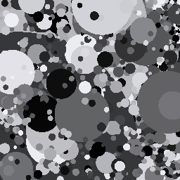

# Spatial regularities {#sec-spatial-regularities}



## Spatial regularities overview {#sec-spatial-regularities-overview}
Information about the spectral characteristics of natural images, including the illuminant and surfaces, is helpful for rendering images and for reasoning about their contents. The reason is simple: the more we know about these statistics, the better we can do at interpreting the images we measure. 

Characterizing the spatial statistics of natural images is a second important quest within image systems engineering and vision science. Knowing about the likely spatial image will enable us to remove measurement noise more effectively, especially to the extent that natural images are not like noise. We can even hope that we do a better job of estimating the spatial properties of images that are just beyond our spatial resolution, being able to interpolate what we do see to a higher resolution based on knowing the likely structure of the object (@sec-image-regularities). 

Over the last four decades, our knowledge about the spatial statistics has grown considerably. The development of machine learning algorithms, particularly diffusion methods for generating natural images, has been a recent striking advance.  In this chapter we will start with the foundations and work our way towards the most recent insights.

::: {#Things-stuff .callout-note collapse="false" appearance="simple"}
## Things and Stuff

I am fond of a distinction that Ted Adelson [@adelson2001-stuff] introduced to help think about the environment: *"things and stuff"* . Things are the countable, discrete objects with defined shapes and boundaries (e.g., cars, chairs, animals). Stuff is amorphous materials or textures without fixed boundaries (e.g., water, grass, sky, sand). Dividing the environment into these categories also helps us set computational goals.

{#fig-things-stuff fig-align="center" width="70%"}

The distinction helps separate out the types of algorithms we might apply to understand the environment. Segmentation and edges applies to *things* which are analyzed for object identity and function; in contrast, *stuff* is regionally based on texture and material properties. A great deal of computer vision focuses on tasks such as naming or counting cars on the road, people in the room, airplanes in the sky. We wish to be able to recognize such things whatever their material might be. A vision system must also be able to make judgments about a sandy beach, a cloudy sky, a grassy hillside. We wish to be able to recognize such stuff whatever its shape might be.

A related challenge in human vision is quantifying the appearance of things and stuff, and for this challenge surface reflectance, texture, and context (e.g., ambient illumination, or what things and stuff are nearby) all play a role @schmid2023-materialperception. A corresponding concept - something we might call appearance for a computer vision system - seems desirable. One way to formulate the problem of appearance for a computer vision system is to use an estimate of material reflectance and texture to mean appearance for the computer.

[The COCO-Stuff 164k dataset](https://datasetninja.com/cocostuff164k){target=_blank} has many images categorized in terms of 'things' and stuff.
:::

## Spatial correlations  {#sec-spatial-correlations}
Image scientists were immediately drawn to analyzing the very different spatial statistics of images.  If we examine the three panels of @fig-naturalspatial, one very obvious feature jumps out.  In the left panel, every pixel is completely independent of the other. That was how this image was created:  every pixel intensity is drawn from an independent random simple. This pointwise independence is rarely found in natural images at the scale we see; the light level at one point is quite likely to be similar to the level at a nearby point. 

In the middle panel, the similarity of adjacent pixels is extreme.  Almost all the pixels are the same as their neighbor.  That doesn't happen in natural images either. The image is so unnatural, it might be surprising that we can recognize its contents at all. I often wonder whether other species can interpret such line drawings, that only represent the object boundaries.

What are the regularities that make the right panel - synthesized by a diffusion models - appear to be natural? Here are some ideas.

## Natural scenes and the 1/f spatial frequency falloff  {#sec-spectrum-power-law}

One idea is that natural images satisfy a simple statistical regularity: when an image is expressed as a weighted sum of harmonic functions (sines and cosines), the harmonic amplitudes decline inversely with spatial frequency. This property was demonstrated in an influential paper by @fieldRelationsStatisticsNatural1987 and further measured and analyzed by [@ruderman1994-imagestats; @simoncelli2001-imagestats; @geisler2008-imagestats].

We can express this property using a simple equation:

$$
A(f) = \frac{C}{f^\alpha}
$$

where $f$ is spatial frequency, $\alpha$ is a decay parameter typically close to 1, and $C$ is an overall amplitude scaling factor related to image contrast. In terms of the power spectrum (amplitude squared), this falloff is $P(f) \propto 1/f^{2\alpha}$ (often approximated as $1/f^2$).

Notice what is missing from this equation: there is no parameter with units of spatial frequency (such as an $f_0$) that specifies a "typical" size or frequency. This is what is meant by the phrase **has no characteristic spatial scale**. 

To see what this means, consider an image that *does* have a characteristic scale—for example, a brick wall or a checkerboard. In those images, there is a dominant, privileged spatial frequency determined by the physical size of the bricks or squares. If the spectrum were an exponential falloff, $A(f) = C e^{-f/f_0}$, the constant $f_0$ would define a characteristic scale where contrast drops off sharply. 

In a power law, however, scaling the spatial frequency by a factor $s$ (such as magnifying or demagnifying the image) simply multiplies the amplitude by an overall constant: $A(s f) = s^{-\alpha} A(f)$. The relative distribution of frequencies remains identical: the contrast drop across any octave (e.g., from 1 to 2 cycles/deg, or from 10 to 20 cycles/deg) is always the same factor $2^{-\alpha}$. Because no particular scale is privileged, people often say that natural scenes are *scale invariant*: zooming in or out on natural textures—like clouds, coastlines, or rocks—yields images with the same relative frequency statistics.

### The paradox of the 1/f rule {#sec-one-over-f-paradox}

Despite its widespread prominence in the literature, treating the $1/f$ rule as a fundamental property of natural scenes raises important conceptual difficulties. 

First, we must distinguish between properties of the incident light field and properties of acquired images. In acquired images, optical blur and sensor noise inevitably alter the measured spectral slope [@zoran2009-scale-invariance]. While that is an important practical consideration, a more fundamental conceptual issue concerns the basis functions themselves: harmonic functions (sines and cosines) span the entire field of view, whereas natural scene textures are localized.

To appreciate the paradox that arises from using global harmonics, consider a surface texture measured at viewing distance $d$. Suppose the pattern has a spatial frequency of $f$ cycles per degree (@fig-one-over-f-1). 

![Consider a single contrast pattern shown as the black curve at the top of both panels. Panel (A) shows a camera that images a pattern that is close to a harmonic at frequency $f$ from a distsance $d$; panel (B) shows the same camera imaging from a distance $d/2$.  Panel (B) images only a portion of the pattern. When we render the image in the first case the spatial frequency of the pattern is still about $f$, but in panel (B) the truncated and rendered image has a lower spatial frequency of about $f/2$.](images/lightfields/05-spatial/one-over-f-1.png){#fig-one-over-f-1 width="50%"}

Now consider observing the same physical pattern from half the distance, $d/2$ (the yellow shaded region in @fig-one-over-f-1). Because the viewing distance is halved, the visual angle subtended by each cycle doubles, meaning the pattern now has a frequency of $f/2$ cycles per degree. If the Fourier amplitude simply reflected the physical contrast of the surface pattern, the amplitude measured at $f/2$ from distance $d/2$ should equal the amplitude measured at $f$ from distance $d$. Yet the empirical $1/f$ rule asserts that the lower frequency ($f/2$) should have substantially higher amplitude. Why should stepping closer to a surface boost the measured contrast?

### Local carrier contrast and spatial coherence length {#sec-one-over-f-coherence}

The resolution to this apparent paradox hinges on distinguishing between **global Fourier amplitude density** and **local carrier contrast**.

Global Fourier analysis presumes infinite sinusoidal coherence across the entire field of view. But natural image textures possess a finite **spatial coherence length** ($L_c$). Natural textures modulate in contrast, local frequency, and phase across an image; they remain consistent only across a limited spatial extent before encountering surface boundaries, occlusions, perspective changes, or physical surface irregularities.

Crucially, natural textures tend to remain coherent over a comparable *number of cycles* rather than a fixed angular distance. Consequently, higher spatial frequencies have proportionally shorter spatial coherence lengths:
$$
L_c(f) \propto \frac{1}{f}
$$

If we measure the pattern's contrast over an aperture smaller than this coherence length—scaling the measurement window to span a fixed number of cycles ($W(f) \propto 1/f$)—we find that the **local carrier contrast is scale-invariant and roughly constant across frequencies**. A high-frequency texture (like the weave of a shirt or fine bark) has essentially the same physical modulation contrast locally as a low-frequency texture (like large sand dunes or rolling hills).

The measured reduction in global Fourier amplitude across frequency arises from the loss of spatial coherence, not from a loss of local carrier contrast:

1. **Low spatial frequencies** have long coherence lengths ($L_c \propto 1/f$), meaning they maintain phase coherence across a large fraction of the camera's field of view and sum constructively into a tall, sharp Fourier peak.
2. **High spatial frequencies** have shorter coherence lengths. A fixed field of view encompasses many independent, phase-incoherent patches. When integrated across the entire image, destructive phase interference and boundary discontinuities scatter the high-frequency energy across adjacent frequencies, depressing the measured global peak amplitude.

Thus, the $1/f$ rule does not mean that the world fades away in contrast at fine scales. It means that high-frequency contrast is packaged into smaller, spatially localized packets. This is precisely why the visual system—and modern multi-scale representations—abandons global Fourier harmonics in favor of localized receptive fields (wavelets) whose spatial extent scales with wavelength.

:::{.callout-note title="Spatial coherence calculation"}
This interactive calculation simulates how finite spatial coherence length affects measured Fourier spectra across viewing distances:

[fise_spatialCoherence1d.html](https://htmlpreview.github.io/?https://github.com/ISET/isetfise/blob/main/fise/01Lightfields/spatial_coherence/fise_spatialCoherence1d.html){target=_blank}
:::

## The dead leaves model {#sec-dead-leaves}

The spatial coherence analysis highlights the critical role of phase and localized structure. The *dead leaves model* [@lee2001-deadleaves] takes this insight even further, demonstrating that a $1/f$ amplitude spectrum emerges naturally from object occlusion boundaries alone, without requiring any internal surface texture.

{#fig-dead-leaves width="60%"}

@fig-dead-leaves illustrates an example. The image is constructed by randomly placing disks of varying sizes and gray levels across the image plane, allowing later disks to occlude earlier ones—much like fallen leaves gathering on the ground[^dead-leaves]. Notice that the disks themselves are completely flat and uniform; all of the image contrast arises strictly from the step edges formed by the occluding boundaries.

Remarkably, when the distribution of object sizes follows a scale-invariant power law ($p(r) \propto r^{-3}$), the resulting image mathematically yields a $1/f^\alpha$ power spectrum (with $\alpha \approx 2$, corresponding to an amplitude spectrum of $1/f$). In this model, the interior of each surface is constant - with no texture - and all the contrast arises from the boundaries. The $1/f$ falloff is thus a geometric consequence of object occlusions and scale-free size distributions in the physical world, rather than a property of wave-like oscillations.

[^dead-leaves]: I may be a sensitive soul, but I would have preferred the name 'fallen leaves'. Too many years in California, I guess.

To me, these two perspectives reflect Ted Adelson's distinction between *things* and *stuff*. The traditional $1/f$ view invites us to think about the spatial statistics of continuous textures (*stuff*). The dead leaves model shows that the very same $1/f$ falloff can emerge entirely from the boundaries between discrete objects (*things*) of many sizes. Both contribute to natural images, of course, but you can choose which intuition resonates more with you. Personally, I find myself in the dead leaves camp.

:::{.callout-note collapse="true" title="Resource: Dead leaves and scale invariance"}
An upcoming ISETCam script (`fise_deadleaves`) will demonstrate the generation and spectral calculation for synthetic dead leaves images.

For an exploration of the historical connection between $1/f^\alpha$ power spectra, fractal dimension, and texture perception—along with opportunities for student code development in ISETCam—see the resource page on [Fractals, Scale Invariance, and Natural Textures](resources/fractals.qmd).
:::

## Diffusion models {#sec-spatial-diffusion}

Diffusion models implemented in a neural network.

Eero's analysis of the statistical properties of images using diffusion models.

The idea that the networks learn fairly complex image statistics and when we start them out with noise, they drive the image towards something that is within the realm of a natural image.

This doesn't get us to objects.  But it is great for generative, when coupled with a text prompt that guides it to a particular content of natural images.

Explaining such models might be complicated, but let's see if I can get us there from the Simoncelli and other papers.

**Note:** Save image compression and JPEG, which is a big one, for later.  It depends a great deal on human vision and so it is too early to describe here. 

