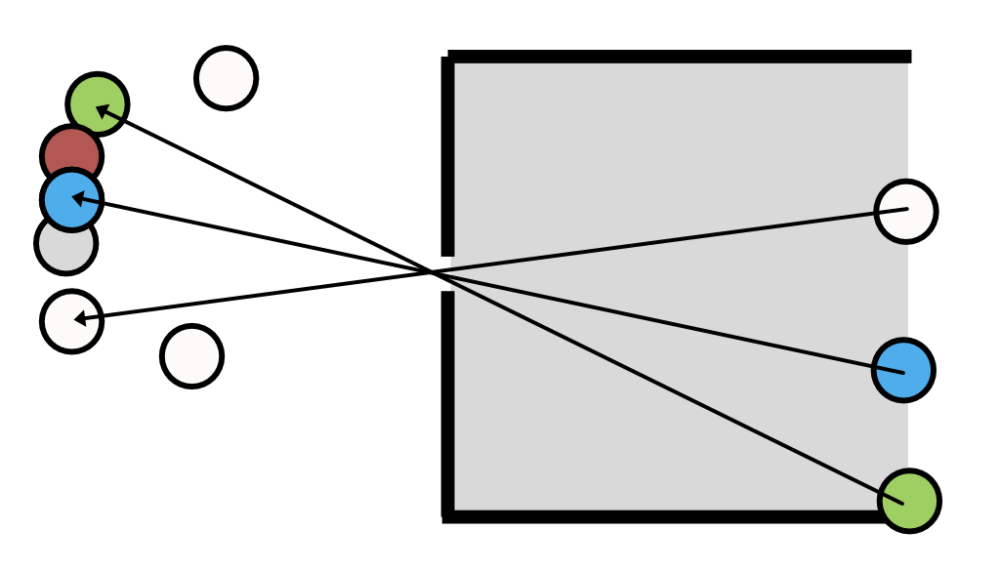
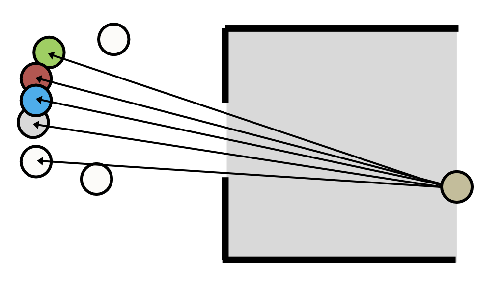
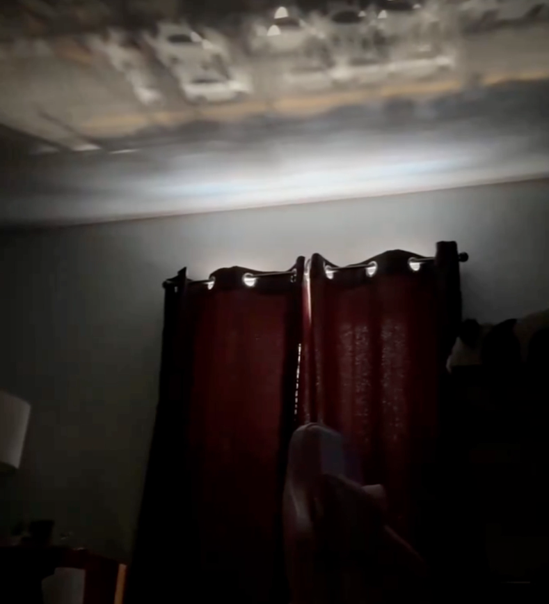

# Geometric optics {#sec-geometric-optics}


## Geometric optics overview
Modeling light as rays is a useful approximation for many calculations. This method enables us to use simple geometric calculations (e.g., similar triangles), to derive many properties of simple lenses. For this reason this approach is also called **geometric optics**. In this chapter we use geometric optics to describe the simplest image forming optics, a **pinhole**. The ray model has limits, however: the next chapter (@sec-diffraction) explains why we also need to model light as waves, and introduces the **point spread function**, a concept that plays a role in every modeling approach we use in this book. I extend the geometric optics calculations further in the chapters that follow, before turning to linear systems theory and wavefronts (Fourier optics).

## Pinhole optics
If we model light as a collection of rays, it is easy to understand why imaging through a pinhole produces an image (@fig-pinhole-image). The figure shows a set of *objects* on the left.  The camera is a dark chamber with only a pinhole opening. The *image* is formed on the planar surface, at the right.  The light rays travel in a straight line, so only a small subset of the rays from each object passing through the pinhole.  We can trace the light path by starting at a point on the image and drawing a straight line into the object space. The geometry illustrates how the rays from adjacent objects arrive at adjacent positions in the image plane, forming a reversed and inverted image.

<!-- Think about pinhole-size.png as an alternative -->

{#fig-pinhole-image width=60%}

If the pinhole is small, each image point receives rays from a small region in object space (@fig-pinhole-blur). As we increase the pinhole diameter, each image point receives rays from larger regions on the objects. If multiple objects contribute rays to an image point, the image will be blurry. Conversely, according to the ray model, reducing the pinhole size should sharpen the image.

{#fig-pinhole-blur width=60%}

### Parallel (collimated) rays {#sec-pinhole-collimated}
The rays from a point on an object often radiate in a wide range of directions. A special case -that is important in many practical applications- are the rays from distant points (@fig-pinhole-distant). When the point is far, only a small angular bundle of rays arrives at the pinhole. When the angle is very small, the rays are nearly parallel. In that case we say the beam of light is **collimated**.

![Pinhole camera geometry. The rays from a distant objects arrive in parallel (collaimated) at the pinhole. If rays travel in straight lines, they would continue to form an image the size of the pinhole (short dashed black lines). Hence, the size of the point image would be the same for on-axis (A) and off-axis (B) points. However, you can see that although I drew the same pattern of rays for the two points, we expect fewer rays from the off-axis point (B) to pass through the aperture. Its image will be dimmer. ](images/optics/06-geometric/pinholePSF.png){#fig-pinhole-distant fig-align="center" width="60%"}

For an object point, **A** that is aligned with the pinhole (on-axis), the ray model of light predicts that the rays will continue straight through the pinhole aperture and form an image that is very close to the same size as the pinhole itself. Consider a distant off-axis point, **B**. Its rays, too, will start in many directions and only a narrow, collimated subset of rays will arrive at the pinhole aperture. Because of the angle between the collimated rays and the pinhole, a smaller fraction of the rays will pass through the pinhole aperture. There will be less light from **B** than from **A**. The relative amount of light that makes it through the pinhole depends on the cosine of the angle between the pinhole and the rays. But the shape of the image from the two points does not differ. If the pinhole is circular, on- and off-axis points will produce a circular image with the same diameter as the pinhole.

@fig-ayscough by Ayscough illustrates an image formed by a complex scene, with many points. Each point in the scene is blurred and rendered at a unique position. Also, the intensity at each point will be impacted by its relative angle to the pinhole and image surface. If the image intensity through the pinhole is adequate, and we do not mind the blurring, we will have a satisfactory image.

### Pinhole: Computer graphics
Pinhole cameras are often used in computer graphics calculations. They are simple to compute, tracing light from the recording surface (film or sensor) through the pinhole back into object space. In computer graphics it is fairly common to aim to render a nice looking image, rather than a physically accurate image. The pinhole approximation to optics provides a sharp image with large depth of field that is suitable for many applications.

It is also possible to use pinhole computations to illustrate the limitations of this model in real image systems. In @fig-pinhole-chessset I rendered a chess set scene with the pieces, each a few cm tall, positioned about 0.5 meters from the pinhole camera. The four pictures were rendered using different pinhole diameters. The upper left allows only one ray through from each location in the scene. The aperture diameters for the next three pictures are for three different pinhole sizes. The images are brighter as the pinhole size increases. For this example, the image at the two smaller pinhole sizes are tolerable. Depending on your viewing distance from the screen or page, the third pinhole image might be usable. But the largest pinhole, which lets in the most light, loses so much spatial information that the individual pieces blur together in the image (@sec-airy-pattern).

![A simulated scene rendered through a pinhole camera, using only ray tracing. The size of the pinhole diameter increases from the upper left to the lower right. The relative intensity is preserved in the renderings so that the scene becomes brighter as the pinhole diameter increases. Rendered with [@pharrPBRTVersion4] and [@iset3d2022].](images/optics/06-geometric/01-pinhole-chessset.png){#fig-pinhole-chessset width="80%" fig-align="center"}

### Pinholes: real life
The basic idea of the pinhole camera (also called the **camera obscura**) has been known for thousands of years.  Surely, many people noticed the phenomenon in different times and places. We have a record that the Chinese philosopher Mozi (c. 470–391 BC) wrote that an inverted image is formed through a pinhole, and moreover he explained the phenomenon by positing that light travels in straight lines! The Chinese scientist Shen Kuo (1031–1095) described the process explicitly in his book Dream Pool Essays, also noting that the image is inverted because light rays travel in a straight line from the source to the pinhole and then continue straight to form the image.

The most significant Islamic figure is Ibn al-Haytham (c. 965–1040), also known as Alhazen. His influential work, the Book of Optics, provides a comprehensive analysis of the camera obscura phenomenon. He used the term al-bayt al-muthlim ("the dark room") to describe the pinhole camera, and he conducted experiments to demonstrate that a small hole could project an image of an external scene onto the opposite wall. Al-Haytham correctly reasoned that the pinhole created a clear image because it isolates and channels individual light rays from different points of the object, preventing them from mixing. His work included many other observations that laid the groundwork for modern optics.

::: {.callout-note collapse="false" title="Natural pinholes"}
From time-to-time people report on interesting examples of naturally occurring pinhole cameras.  This video shows how the holes at the top of a curtain produce a series of overlaping images of the street below.

::: {.content-visible when-format="html"}
{#fig-pinholes-rainmaker width="40%" fig-align="center"}
:::

::: {.content-visible when-format="pdf"}
{#fig-pinholes-rainmaker width="40%" fig-align="center"}
:::

([See the original source](https://x.com/Rainmaker1973/status/1830854129155031206){target=_blank})

@torralba2012-mi described examples of naturally occurring pinhole cameras, and how to create a pinhole image computationally even when a window is too big to produce a useful image.  They say you can take record the very blurry image from a large window opening, and then you can put a small occluder into the window (maybe stand sidewise in the middle of the window) and take a second image. Then, subtract the two images. By the Principle of Superposition, the difference image corresponds to the image when the aperture was the same size as the occluder. This method is more complex to implement because it involves acquiring two (linear) images and then subtracting them. And the world might have changed between the time you took the two image. But it's a good trick for spies who are desperate to learn where they are being held hostage.

{#fig-torralba width="80%"}
:::
