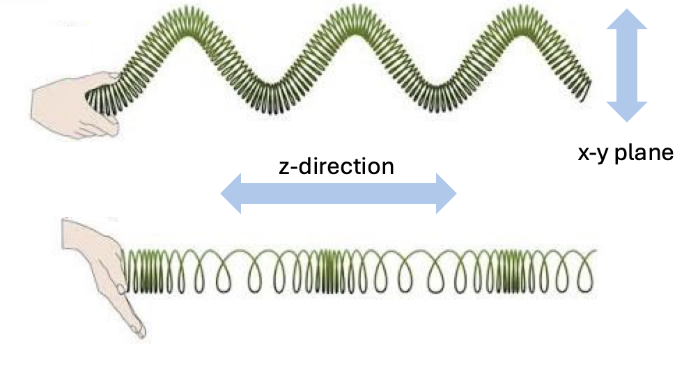

# The wave theory of light {#sec-wave-theory}



## Wave theory overview {#sec-wave-overview}

The ray model of geometric optics in @sec-geometric-optics explains pinhole image formation, but it fails to account for how light behaves near small apertures and sharp edges. In this chapter I describe the transition from rays to waves: Francesco Grimaldi's first observations of diffraction, Christiaan Huygens' wave model of secondary wavelets, Thomas Young's decisive double-slit interference experiments, and Augustin-Jean Fresnel's mathematical theory confirmed by Poisson's spot. I close by discussing polarization—showing that light is not merely a wave, but a transverse electromagnetic wave. In the next chapter (@sec-diffraction), we apply this wave model to understand diffraction limits and the **point spread function (PSF)**.

## The failure of the ray model {#sec-lightfields-diffraction}

Useful as the ray model has been, for more than 300 years scientists have known that geometric optics is not completely accurate. Consider the simple prediction of the ray model in @fig-ray-wave. The parallel rays from a point source should pass through the pinhole and continue in a straight line, forming an image the size of the pinhole. An observer to the side should see only darkness, as no rays are heading toward their eyes.

But this isn't what happens. As the Jesuit scientist Francesco Grimaldi, a contemporary of Newton, documented, light behaves in surprising ways near small apertures and edges [@grimaldi1665-physico]. He observed that light spreads out, allowing the pinhole to be seen from the side and creating an image on a screen that can be larger than the pinhole itself. He gave the name **diffraction** to this phenomenon where light deviates from a straight path.

{#fig-ray-wave width="80%" fig-align="center"}

The trade-off between pinhole size and image sharpness provides a second, compelling example of diffraction. In their classic textbook, Jenkins and White showed a series of images of a light bulb filament through pinholes of decreasing size (@Jenkins1976-jt). As predicted by the ray model, reducing the pinhole size initially sharpens the image. But beyond a certain point, further reducing the pinhole size makes the image *blurrier*, directly contradicting the ray model. These observations demand an explanation that goes beyond geometric optics.

{#fig-diffraction-filaments width="70%"}

## Huygens wave model {#sec-huygens-wave}

The Dutch scientist Christiaan Huygens, working at the same time as Newton, proposed an alternative to the ray model: he modeled light as waves expanding to fill space. In Huygens' theory, light from a point source expands as a spherical wave. The leading edge of this expansion, the **wavefront**, can be seen as a collection of points, each acting as a source for a new secondary wavelet. This model successfully predicts many phenomena, including reflection from a mirror and the change in light's direction (refraction) as it passes from one medium to another (@fig-huygens-waves).

{#fig-huygens-waves fig-cap-location="bottom" width="80%" fig-align="center"}

When a plane wave travels through open space, the constructive interference of all the secondary wavelets results in a new plane wave that propagates straight ahead, much like an ocean wave. However, when this wavefront passes through a small aperture or near an edge, the aperture blocks most of the secondary sources. The few wavelets that do pass through are revealed, causing the light to spread out spherically.

This directly explains diffraction. A very small pinhole allows only a tiny portion of the wavefront to pass, which then propagates outward as a nearly perfect spherical wave, allowing it to be seen from many directions. As the aperture size increases, more of the plane wave passes through, and the output more closely resembles a plane wave. This wave model elegantly explains why a pinhole's effect on an image depends so critically on its size relative to the wavelength of light.

::: {.callout-note collapse="false" title="Rays, waves and hypotheses"}
<!-- History.  https://chatgpt.com/c/67098b1d-ae24-8002-be3d-d55f2bc87045 -->

Although the ray and wave theories were proposed at about the same time, Newton's 1704 framing of light as rays was widely accepted for roughly a century. Widespread recognition of the accuracy of Huygen's wave theory was delayed until Thomas Young's 1804 demonstration of the interference pattern created by light from two coherent, nearby sources. I find it interesting to learn about the [the history of these ideas.](resources/optics-diffraction.qmd).

I have worked in fields where scientists rely mainly on hypothesis testing: they perform experiments to see if a theory is provably wrong. Surely Newton's theory of light as a ray is provably wrong, and it was so proved more than 300 years ago! And yet, we use rays to describe light routinely. This is because in many cases the ray theory is an excellent approximation, and we use it as a simple way to reason about radiation - approximately.

This is a very pragmatic approach, which is deeply embedded in the mind of many scientists and engineers: Use the tool that is accurate enough for the problem at hand. Approach your problem with a toolbox of methods, and choose the one that gets the job done. In this spirit, the phrase 'all models are wrong, some are useful', @box-science-1976 is widely quoted in many engineering disciplines. In these fields hypotheses that are useful are included in the toolbox. It is essential to understand the scope over which the tool can be reasonably relied upon.

```{=html}
<!-- Gemini link
Some scientific fields rely strongly on hypothesis testing - asking whether a theory can be proven wrong by experiment.  Other fields accept that theories are largely wrong, but they can still be useful as tools to compute approximations and make devices or products.  Can you describe which fields rely more on the hypothesis testing approach and which rely more on theories as useful tools and approximations?

Gemini puts basic sciences into hypothesis and engineering into tools.
https://g.co/gemini/share/9013b83cc4f6 -->
```
:::

## Evidence for the wave theory {#sec-evidence-wave-theory}

### Young's double-slit experiment

Grimaldi’s observations documenting how light spreads out after passing the edge of an obstacle or through a narrow slit, are easily reproducible and important. Huygens put forward a genuine wave theory of light. His principle of secondary wavelets elegantly explained reflection and refraction, and even hinted at diffraction (@huygens-1690-traite). It is surprising to me that Newton felt he could promote a ray theory of light despite these prior observations and theory. It was fascinating to learn that Newton and Huygens directly confronted one another on both optics and gravity (@Shapiro1989-er). Perhaps because Newton was remarkable in so many ways, his voice dominated the scientific scene for decades.

Even though Huygens theory did account for many important phenomena; to me the simple observation in @fig-ray-wave decisively demonstrates the necessity of a theory that allows for waves. Nonetheless, it wasn't until Thomas Young presented his famous double-slit experiments to the Royal Society in 1801–1803 that Newton's hold on the field began to loosen (@young1804-bakerian-optics). This paper was a crucial step in the shift of the scientific consensus towards the wave theory of light. The ability to see the interference fringes provided quantitative, unmistakable proof of the value of the wave theory. Only waves, not particles, could add and cancel in this way and made the phenomenon hard to ignore. Young -and many others- considered- the demonstration of interference to be decisive[^optics-02-wave-1].

[^optics-02-wave-1]: In making some experiments on the fringes of colours accompanying shadows, I have found so simple and so demonstrative a proof of the general law of the interference of two portions of light, which I have already endeavoured to establish, that I think it right to lay before the Royal Society, a short statement of the facts which appear to me so decisive (@young1804-bakerian-optics).

The experiment requires some precision, but it is fairly straightforward to instrument (@fig-double-slit). One begins with a collimated beam arriving at a small aperture (part A). The light passing through the aperture serves as a coherent light source. It is allowed to transport forward to a second surface that has two narrow slits separated by some small distance. It is now the turn of these two slits to provide separated coherent light sources. When we observe the image formed by the double slits on a surface, the image is a striped pattern. As Young explained and drew in his original paper (part B), this is what one might expect of the two slits are both emitting waves at the same frequency.

](images/optics/06-geometric/double-slit.png){#fig-double-slit width="80%"}

Even after Young's presentations to the Royal Society, the wave theory met resistance. The loudest was from Henry Brougham who made personal attacks on Young[^optics-02-wave-2]. But serious thinkers also wondered whether a wave theory could be right. What was the medium that supported the waves? Huygens referred to it, but the so-called 'ether' had not been measured[^optics-02-wave-3]. And if the waves were propagating through a medium, wouldn't inhomogeneities cause them to deviate from straight lines?

[^optics-02-wave-2]: Henry Brougham was a particularly fierce critique of Young's entire research program and an ardent defender of Newton's work. His strongest attacks were against Young's important -and accurate!- observations about human color vision. More on that, including Young's response (@young1804-reply) in @sec-human-wavelength-encoding.

[^optics-02-wave-3]: "Now there is no doubt at all that light also comes from the luminous body to our eyes by some movement impressed on the matter which is between the two."—Christiaan Huygens

::: {.callout-note title="A modern double-slit experiment" collapse="false"}
I was delighted to see the fundamental principle of the double-slit experiment return in my Inbox while writing this book. The core idea of the experiment is to measure the superposition of two signals. Even as technology has scaled, scientists continue to use this principle to investigate and characterize the properties of electromagnetic radiation.

{#fig-double-slit-atoms width="60%"}

Here is a link to see the [article in Physics World.](https://physicsworld.com/a/famous-double-slit-experiment-gets-its-cleanest-test-yet/?utm_source=Live+Audience&utm_campaign=01bdf7753f-nature-briefing-daily-20250827&utm_medium=email&utm_term=0_b27a691814-01bdf7753f-49658492){target="_blank"}

```{=html}
<!-- A bit about the history.
https://chatgpt.com/s/t_68af573578f08191a975ae4de6749069
-->
```
:::

### Settling the debate: Poisson's spot

A particularly important event that turned the tide occurred a decade later, when Augustin-Jean Fresnel supplied the mathematics of diffraction and interference. This was a famous event in the history of physics. In 1818, Fresnel submitted his wave theory to a competition sponsored by the French Academy of Sciences. One of the judges, Siméon-Denis Poisson, was a staunch supporter of Newton's particle theory and sought to disprove Fresnel's work. Using Fresnel's own equations, Poisson calculated that if a circular obstacle were illuminated by a point source of light, a bright spot should appear in the very center of the shadow. Poisson presented this as a *reductio ad absurdum*—an absurd conclusion that surely proved the wave theory was wrong.

However, the head of the committee, François Arago, decided to perform the experiment. To the astonishment of many, Arago observed the bright spot exactly as predicted. This dramatic confirmation of a counter-intuitive prediction was a decisive victory for the wave theory. The spot is now ironically known as **Poisson's spot** (or sometimes Arago's spot). This work ended the dominance of the corpuscular theory for some time. It was to return with Einstein's work, which I explain in @sec-sensors-photons-electrons.

## Polarization

Waves are broadly classified into two types (@fig-optics-wave-types): *transverse* waves, where oscillations are perpendicular to the direction of travel, and *longitudinal* waves, where oscillations are parallel to travel (such as sound waves).

{#fig-optics-wave-types width="80%"}

Light is a transverse electromagnetic wave. When propagating along the $z$-axis, its field oscillates within the $x\text{--}y$ plane. The orientation of this oscillation defines the wave's **polarization angle**, and materials that selectively transmit oscillations along a specific direction are called **polarizers**.

::: {.callout-note title="YouTube: How do we know light is a transverse wave?" collapse="true"}
This video provides an intuitive demonstration showing why light must be a transverse wave rather than a longitudinal one.

::: {.content-visible when-format="html"}

<!-- Responsive, centered YouTube embed -->
<div style="max-width: 800px; margin: 0 auto;">
  <div style="position: relative; width: 100%; padding-top: 56.25%;"> <!-- 16:9 -->
    <iframe
      src="https://www.youtube.com/embed/E9qpbt0v5Hw"
      style="position: absolute; top: 0; left: 0; width: 100%; height: 100%; border: 0;"
      allow="accelerometer; autoplay; clipboard-write; encrypted-media; gyroscope; picture-in-picture; web-share"
      allowfullscreen>
    </iframe>
  </div>
</div>

:::

::: {.content-visible when-format="pdf"}
[In this YouTube video, learn how we know light is a transverse wave.](https://youtu.be/E9qpbt0v5Hw){target=_blank}
:::

:::
