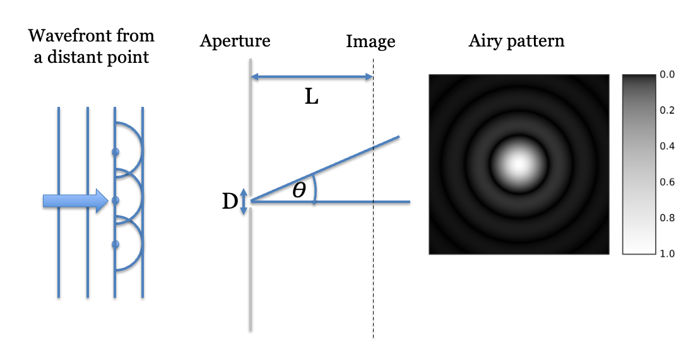
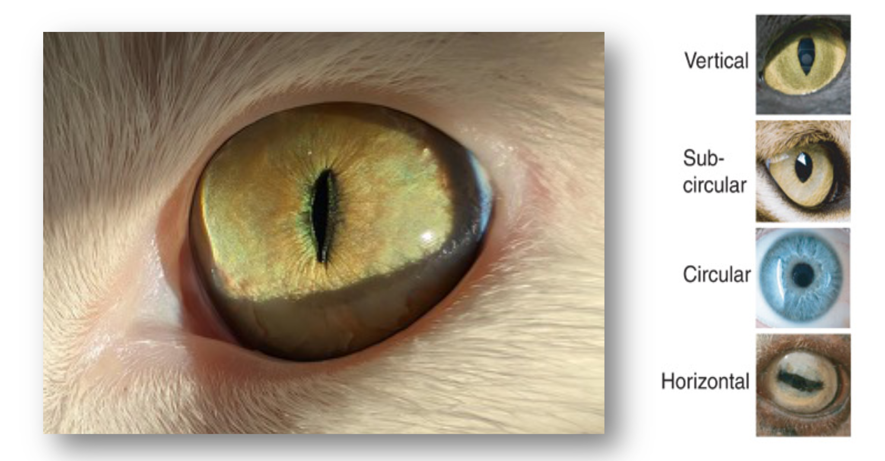
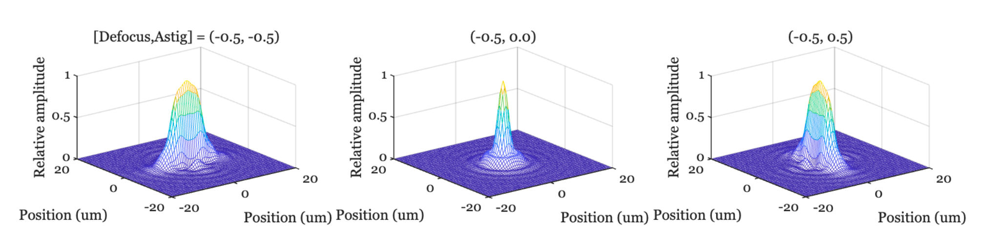

# Diffraction and the PSF {#sec-diffraction}



## Diffraction and PSF overview {#sec-diffraction-overview}

Geometric optics predicts that a smaller pinhole produces a sharper image, but in reality diffraction sets a fundamental limit: shrink the aperture too far, and the image blurs again. In this chapter we examine the trade-off between geometric blur (size of the pinhole) and wave diffraction. We define the **point spread function (PSF)**—the fundamental description of how an optical system images a single point.  We are helped by the Airy disk formula for circular apertures, which predicts the PSF for a circular aperture. Using the PSF within a linear systems framework (superposition and convolution), we explore how aperture geometry (rectangular, polygonal) and optical imperfections shape the PSF, concluding with the PSF of the human eye.

## The point spread function {#sec-pointspread}

Throughout this section, we have analyzed optical systems by asking a simple question: what does the image of a single point of light look like? The resulting image pattern is called the **point spread function (PSF)**, and it is a fundamental measure of optical performance. The Airy pattern, for example, is the PSF for a diffraction-limited circular aperture. We will encounter other types of PSFs when we analyze optical systems using linear systems theory (@sec-optics-linear-space).

The PSF is a cornerstone of lens simulation, characterization, and computational imaging. Its importance stems from a crucial property of many optical systems: they are approximately **linear**. This means that the image of two points added together is the same as the sum of the images of each point individually (a property known as superposition).

Because of linearity, we can simulate the image of any complex scene. We can model the scene as a vast collection of individual light points. If we know the PSF, we can calculate the final image by scaling the PSF by the intensity of each point in the scene and summing all the resulting patterns. This process might involve millions of points, but it is a task that modern computers handle with ease.

In an idealized system, the PSF might be the same for every point in the scene, merely shifted in position. Such a system is called **linear and space-invariant (LSI)**, and in that case the scaling and summing is called **convolution**. In most real-world optics, however, the system is **space-variant**: the PSF's shape and size change depending on the point's position in the field of view (e.g., its distance from the center, or **field height**).

The concept of building an image from the sum of PSFs is foundational, and we will use the ideas of linear systems throughout this book. The appendices provide more mathematical detail on general linear systems (@sec-appendix-linear-systems-overview) and the special case of LSI systems (@sec-appendix-spaceinvariance-overview).

## Circular pinholes and Airy disk {#sec-airy-pattern}

From these simple considerations, we have seen that the image is blurred by two effects: the pinhole size and diffraction. Increasing the pinhole would create a larger spot on the wall, but decreasing the pinhole size reveals the wavefront which predicts an increase of the size of the spot on the wall. We can compare the size of these two effects numerically.

{#fig-blur-comparison fig-cap-location="margin" width="80%"}

First, consider what we expect from the pinhole size. If the pinhole diameter is $D$, a far-away point on the main axis will produce a blurred spot in the image of size $D$. Also, the pinhole-blur predicted by the ray model is the same no matter how far the image plane is from the pinhole.

Second, consider the light pattern we expect for light from a distant point (and thus a plane wave) passing through a circular pinhole aperture. This pattern was derived by the astronomer George B. Airy [@airy-1835-diffraction] and is shown in @fig-blur-comparison. The intensity of the pattern as a function of the radial distance $x$ from the center on the image plane is given by

$$
\text{Airy}(x) = I_0 \left[ \frac{2 J_1\!\left(\frac{\pi D x}{\lambda L}\right)}{\frac{\pi D x}{\lambda L}} \right]^2
$$ {#eq-airy-formula}

where $D$ is the pinhole diameter, $\lambda$ is the wavelength, $L$ is the distance from the pinhole to the image plane, $I_0$ is the peak intensity at the center, and $J_1$ is the first-order Bessel function of the first kind.

The Airy pattern has a central bright spot (the Airy disk), surrounded by a series of concentric rings of decreasing intensity. The Airy disk contains about 85% of the total light energy. Because the first zero of the Bessel function $J_1(u)$ occurs at $u \approx 1.22\pi$ (or $3.832$), the radius of the central bright disk is $x_0 = 1.22~L(\lambda / D)$. The full diameter of the Airy disk, $d = 2x_0$, therefore has the simple formula

$$
d = 2.44~L~(\lambda / D)
$$ {#eq-airy1}

Suppose we calculate the size of the diffraction diameter when the image plane is 1 m away, so $L=1$, and for a wavelength of light is 550 nm. Suppose the pinhole diameter is $D = 10^{-4} m$. The diameter of the Airy disk, $d$, will be

$$
d = 2.44 \times (1 m) (550 \times 10^{-9} m )/ 1 \times 10^{-4}m) = 0.0134 m
$$ {#eq-airydisk1}

```{=html}
<!--
The diffraction spread is larger than the pinhole spread when $d$ exceeds $D$. We do the calculation in the scripts in this [ISETCam script](https://htmlpreview.github.io/?https://github.com/wandell/FISE-git/blob/main/code/fise_diffraction.html).  For $L = 1m$ the pinhole blur is larger than the diffraction blur for a diameter of about $1 mm$.  When $L$ is much closer, say $10 mm$, the pinhole blur exceeds the diffraction blur when the diameter is $100 \mu$.
-->
```

The diffraction spread exceeds the pinhole spread when $d$ exceeds $D$. We do the calculation for different assumptions about the distance to the image plane [ISETCam:fise_diffraction](https://htmlpreview.github.io/?https://github.com/ISET/isetfise/blob/main/fise/02Optics/fise_diffraction.html). As an example, we find that when the distance to the image plane is $L = 1m$, the pinhole blur is larger than the diffraction blur for a pinhole diameter of about $1 mm$. When the image plane distance, $L$, is closer, say $10 mm$, the pinhole blur exceeds the diffraction blur when the diameter is $100 \mu$.

::: {.callout-note collapse="false" title="The diameter of the diffraction point spread"}
In a paper entitled "On the Diffraction of an Object-glass with Circular Aperture", George Airy provided the mathematical description of the diffraction pattern [@airy-1835-diffraction]. A modern derivation of the full point spread function for both the circular aperture and other shapes is in @Goodman2022-fv (pages 88-94). The computation is implemented and frequently used in ISETCam. It is explained [in this tutorial](https://htmlpreview.github.io/?https://github.com/ISET/isetcam/blob/main/tutorials/optics/t_opticsAiryDisk.html).

In the main text, we expressed the formula for a particular distance from the pinhole to an image plane. For a pinhole, the formula is usually given in terms of the angle of the bundle of rays emerging from the pinhole.

$$sin(\theta) = 1.22 \lambda / D$$

When the angle is small, $\theta < 10 \deg$, the formula is very accurately approximated as

$$
\theta = 1.22 \lambda / D
$$

The size of the spot on the image plane depends on the distance how far away the pinhole is from the pinhole, as you can see in [@eq-airy2]. In @sec-optics-thinlens we provide a formula for the Airy disk size for ideal lenses.
:::

## Pinhole and distance: Fraunhofer and Fresnel

Even for a pinhole camera, the PSF isn't a single, fixed pattern. Its shape depends on how far the light source is from the aperture and the wavelength of the light. The distance determines which of two diffraction regimes applies.

When the point source is far away, its rays arrive collimated and thus the wavefront is a plane. This is the realm of **Fraunhofer diffraction** (or far-field diffraction). In this common scenario, the PSF for a circular pinhole is the classic Airy pattern we discussed earlier.

When the point source is close to the pinhole, its rays arrive diverging and the wavefront is a curved, spherical wavefront. This situation is described by **Fresnel diffraction** (or near-field diffraction). In the near field, the PSF's shape and size change with the distance between the source and the pinhole.

## Pinhole shapes

So far, we have focused on circular pinholes. This is a practical choice, as many apertures—from the human pupil to camera lenses—are approximately circular. A key advantage of a circular aperture is its rotational symmetry; rotating the camera (or your head) doesn't change the image blur. The resulting PSF, like the Airy pattern, is also circularly symmetric and can be described simply by its radial profile.

However, both nature and technology provide many examples of non-circular apertures. These produce more complex, two-dimensional PSFs that are not rotationally symmetric. In the following sections, we will use an ISETCam script to explore how to calculate the diffraction-limited PSF for some of these interesting shapes.

## Rectangular apertures

The script [fise_oiAperture](https://htmlpreview.github.io/?https://github.com/ISET/isetfise/blob/main/fise/02Optics/fise_oiAperture.html){target="_blank"} illustrates how to calculate the PSF for a rectangular aperture in ISETCam. An image computed using the PSF from a diffraction limited rectangular pinhole, and the PSF for that pinhole, are shown in @fig-pinhole-rectangle. The images illustrate a case for the rectangular aperture is three times wider (x) than high (y). The larger vertical height causes less blur in the y-direction, making the image sharper for the horizontal stripes.

{target="_blank"}.](images/optics/06-geometric/pinhole-rectangle-both.png){#fig-pinhole-rectangle width="80%"}

There is a formula for the rectangular diffraction-limited PSF, given in terms of distance on the sensor surface.

$$
\text{PSF}(x',y') \;\propto\;
\left[\operatorname{sinc}\!\left(\frac{\pi a}{\lambda f}\,x'\right)\right]^2
\;\left[\operatorname{sinc}\!\left(\frac{\pi b}{\lambda f}\,y'\right)\right]^2,
$$

where $a$ and $b$ are the aperture widths in the $x$ and $y$ directions, $f$ is the focal length, and $\lambda$ is the wavelength. We define $\operatorname{sinc}(u) = \tfrac{\sin(u)}{u}$.

In the script, you will see that I didn't use the formula directly. Rather, I simply defined the shape of the aperture and ran a calculation. In @sec-optics-wavefront I will explain that calculation. Being able to numerically compute with the wavefront means we can find the PSF for many different shapes.

::: {.callout-note collapse="false" title="Animal pupil shapes."}
Approximately rectangular pupils are fairly common in biology, as well, and the pupil shape is associated with how they live their lives (@Banks2015-yr). Vertically elongated pupils are associated with ambush predators that are active both day and night. So beware! Horizontally elongated pupils are more likely to be found in prey, who also have laterally placed eyes that helps them look all around.

{#fig-cat-pupil width="60%"}
:::

## Regular polygon apertures

Classic cameras with mechanical shutters often had regular polygon shapes (left) or the interesting 'leaf' pattern at the right. These apertures introduce structure into the PSF that differs from a circularly symmetric aperture.

{#fig-pinhole-polygon width="60%"}

```{=html}
<!--
This is a mechanical shutter.  This is a leaf https://www.photoreview.com.au/tips/shooting/mechanical-vs-electronic-shutters/
This is a polygon https://stackoverflow.com/questions/56467558/trying-to-create-a-camera-shutter-effect-with-divs
-->
```

The impact of the regular polygon shape is quite visible in high dynamic range (HDR) scenes that include light sources. The script [fise_oiAperture](https://htmlpreview.github.io/?https://github.com/ISET/isetfise/blob/main/fise/02Optics/fise_oiAperture.html){target="_blank"} simulates an HDR scene, superimposing some very bright light sources on the background image. These apertures produce the flare pattern that one often sees in professional productions, including movies and sports shows. The three images show the flare pattern for polygons with different numbers of sides.

{#fig-pinhole-hdr width="90%"}

For the simulation in @fig-pinhole-hdr, I also added some scratches and dust on to the lens for realism. The brightest light in each scene (left) is five orders of magnitude ($10^5$) more intense than the dimmest light (right), which is barely visible. The lights are all the same size, but the bright ones appear larger because of the blurring by the PSF.

## Human PSF

Human eyes have approximately circular pupils. In bright light the pupil is contracted to about 3 mm diameter, and the PSF can be roughly circularly symmetric. For some lucky people, when the pupil shrinks down the optics approaches a diffraction-limited system.

In darker environments, the pupil widens and imperfections of the human optics (cornea, lens) often have a very large and irregular impact on the PSF. The pupil aperture is circular, but the optical imperfections distort the PSF and it takes on a very irregular shape [@thibosStatisticalVariationAberration2002; @thibos2020-qs].

You can assess your own PSF easily. Glasses or contact lenses are typically designed to sharpen the PSF and counter any astigmatism. To see the PSF of your lens, take off your glasses or contact lenses, and look with one eye at a small spot of light in the dark -maybe a night light from across the room, or one of the LED lights on electronic gear- against in the presence of a uniform background such as a wall. The image you see is the PSF of your own visual system. If you are looking in a dark room, your pupil is probably relatively large. By squinting, you reduce the size of your eye's aperture, and this is likely to sharpen the PSF. The squinting reduces how much the lens contributes to image formation. If the aperture is made quite small, say by using an artifical pupile, the image will be diffraction limited.

I will describe measurements and simulations of a range of human PSFs in @sec-human-physiological-optics-overview. 

<!-- Isn't there some notion that the astigmatism can be well-modeled as two types (horizontal and vertical)?  Is that true, or just old fashioned stuff.

Even though the PSF is quite irregular, we often approximate its shape. One approximation summarizes whether or not the PSF is very different in two directions. If it is very different in two perpendicular directions, we say the person is **astigmatic**. @fig-astigmatism shows PSFs with some defocus and astigmatism. These were simulated using the same wavefront methods I described above and that will be covered in @sec-optics-wavefront.

{#fig-astigmatism width="100%"}
-->
