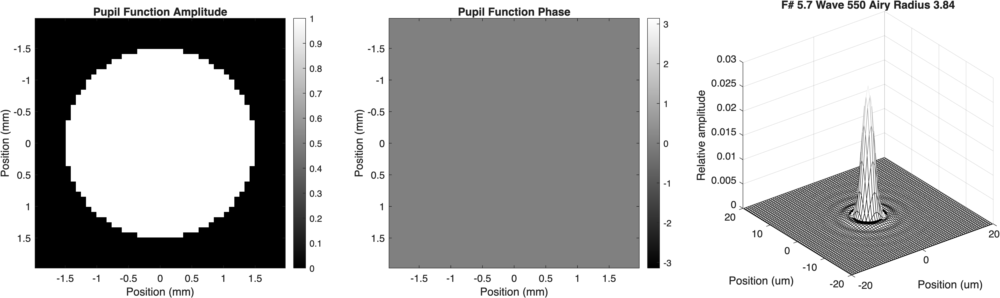
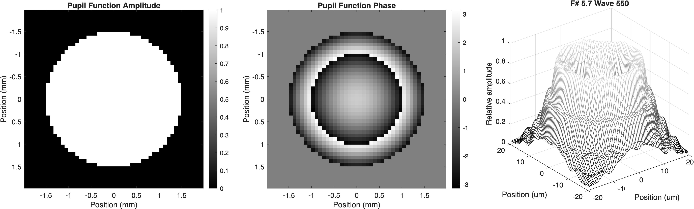

# Wavefronts {#sec-optics-wavefront}


## Wavefronts overview {#sec-optics-wavefront-overview}

When we reviewed why Newton's ray model is clearly wrong, we also realized the need for Huygens's model of light as a wave [@sec-diffraction]. I delayed a full discussion because it wasn't really necessary to rely on wavefronts until after we finished several other basic principles of optics. Many of the important principles can be described using rays, and three hundred years of practice has taught us that working with rays is useful.  Wrong, but useful.

Here we develop more of the infrastructure that is used to describe light as waves. I want you to understand how we use wavefronts in the ISETCam calculations for optics.  In the next chapter we will review how we can measure wavefronts using specialized instrumentation (@sec-shack-hartmann). We will also learn about how adaptive optics systems use wavefront measurements in applications ranging from astronomy (@sec-adaptive-optics-astronomy) to ophthalmology (@sec-adaptive-optics-human). 

## Wavefronts
In @sec-optics-rays-wavefronts we introduced the connection between the idea of light as a wave and a ray. Recall that given a sketch of a wavefront, we can draw the perpendicular along the wavefront to find the local ray direction [@fig-waves-rays]. If a point is relatively far from the aperture, the rays in the incident light field will be nearly parallel (collimated). If the point is close, the rays will be diverging. If the rays have passed through a turbulent medium, they may point in many different directions (@fig-waves-rays). In each case, the surface perpendicular to these rays is the wavefront. 

The wavefront is a description of the light from a single point in the scene. A complete scene is composed of light from many different points, each with its own wavefront. In the following sections, we describe the light from a single point as a wavefront, and then explain why light from different scene points can be analyzed independently.

## Wavefront aberration function {#sec-optics-wavefront-aberration}

The **wavefront aberration** is a way to describe how a lens transforms an incident wavefront, just as the point spread function is a way to describe how the lens transforms a point of light in the scene. As the word 'aberration' implies, it is the difference between the measured and ideal wavefronts. We measure the difference as the optical path difference between the actual and reference wavefronts at each point in the pupil, typically in units of microns. 

Commonly, the reference is a spherical wavefront.  Such a wavefront would converge to a sharp image point. Because many pupils are circular---like the pupil in your eye---we parameterize the input and output wavefronts using polar coordinates: $\rho$ represents the distance from the pupil center and $\theta$ the angle around the center. We will write the wavefront aberration function as $W(\rho, \theta)$ [^wavefront-wavelength].

[^wavefront-wavelength]: Although it is specified separately for each wavelength of light, $\lambda$, for now we will not mention wavelength.

![The blue waves on the left show a set of parallel waves from a single source.  The wavefront is identified by the dashed lines through the peaks of the waves.  The wavefront is flat as it arrives at the lens. The lens directs the rays to a single focal point, changing the wavefront shape. Were the focus perfect, the wavefront would be spherical (dark curve).  The actual wavefront (red curve) is not spherical. The deviation is called the **wavefront aberration** $W(\rho)$, written as a function of $\rho$ alone because this example is circularly symmetric: only the distance from the center matters, not the angle around it.](images/optics/12-wavefront/wavefront-lens-aberration.png){#fig-wave-aberration width="100%"}

 @fig-wave-aberration illustrates the idea: the gap between the actual wavefront (red) and the ideal wavefront (black) is the wavefront aberration.  For a perfect lens, with no aberrations, the actual wavefront coincides with the reference wavefront, and the wavefront aberration is zero: $W(\rho, \theta)=0$. 

## Wavefront description: time course {#sec-optics-wavefront-time}
@fig-wave-aberration shows the rays as waves rather than straight lines, and indeed they are electric field oscillations traveling away from the point source. A light wave's electric field in air propagates at the speed of light in that medium, and its wavelength is very short: between 400 and 700 nm for visible light. As a result, the oscillation is at a very high temporal frequency, on the order of $10^{14}\text{ Hz}$. 

$$
E(t) = a(t)\sin(2\pi \nu_0 t + \phi(t))
$$ {#eq-efield-time}

Here $\nu_0$ is called the carrier frequency, the sine term is the **carrier**, $a(t)$ is the wave **amplitude**, and $\phi(t)$ is the **phase**. Natural sources, such as the sun or an incandescent bulb, emit light through countless independent atomic events, so the field's amplitude and phase fluctuate randomly over time. Hence, the amplitude and phase are not perfectly steady; they fluctuate about the mean randomly, remaining approximately constant over a fairly short interval called the **coherence time**.

{#fig-wavefront-time  fig-align="center" width="70%"}

::: {.callout-note title="Temporal frequency of a light wave" collapse="false"}
The temporal frequency of a light wave at a fixed position is very high. We can compute it from the relationship between speed, wavelength, and temporal frequency $\nu$:

$$
c = \nu \lambda \implies \nu = \frac{c}{\lambda}
$$

* Visible light wavelength ($\lambda$) typically spans roughly $400\text{ nm}$ to $700\text{ nm}$ ($0.4$–$0.7\ \mu\text{m}$).
* The speed of light ($c$) in vacuum is approximately $3 \times 10^8\text{ m/s}$.

For light near the middle of the visible range ($\lambda \approx 500\text{ nm} = 0.5 \times 10^{-6}\text{ m}$), this gives:

$$
\nu = \frac{c}{\lambda} \approx \frac{3 \times 10^8\text{ m/s}}{0.5 \times 10^{-6}\text{ m}} \approx 6 \times 10^{14}\text{ cycles/sec (Hz)}
$$

The amplitude and phase are random, but they stay correlated only over the coherence time — about a femtosecond ($10^{-14}$ to $10^{-15}\text{ s}$) for typical, broadband visible light (@fig-wavefront-time). On longer time scales, the peaks and troughs of the carrier wash out along with the phase.

:::

<!-- fise_wavetimecourse('ncycles',30); -->

### Mutual incoherence and independent scene points
@fig-wavefront-time illustrates two independent light sources centered at $500\text{ nm}$. Because natural light is emitted through countless independent atomic events, the phase difference between light originating from two different scene points wanders randomly on a timescale of femtoseconds.

Although the instantaneous electric fields from different points superimpose in space ($E(t) = E_1(t) + E_2(t)$), their time courses are uncorrelated (orthogonal) over any macroscopic duration. For imaging applications, the integration time of the sensor ranges from tens of microseconds to many milliseconds—trillions of carrier cycles and orders of magnitude longer than the coherence time. Over that integration time, the interference cross-term $\langle 2 E_1(t) E_2(t) \rangle$ averages strictly to zero.

As a consequence, natural scene points are **mutually incoherent**: their irradiances add independently on the sensor plane. This fundamental property justifies why we can analyze the optical transformation—the wavefront aberration, the pupil function, and the point spread function—for a single scene point, and then build the full image by summing the irradiances contributed by each point in the scene.

### The wavefront representation as a complex number
For a single point source, the light arriving across the pupil is spatially coherent. Because only the time-averaged irradiance (the mean squared amplitude), not the instantaneous electric field oscillation, is measured by the sensor, we can drop the rapid temporal carrier ($2\pi \nu_0 t$) and describe the spatial variation of the wave using complex phasor notation. We write the amplitude and phase at each position $\mathbf{x}$ on the wavefront as

$$
U(\mathbf{x}) = a(\mathbf{x}) e^{i\phi(\mathbf{x})}
$$ {#eq-wavefront-complex}

The rate of energy arriving per unit area at a surface is its irradiance (@sec-lfmeasurement-overview). The irradiance is equal to the squared magnitude of the complex wavefront arriving at that position $\mathbf{x} = (x, y)$ on the sensor plane:

$$
I(\mathbf{x}) = \vert{}U(\mathbf{x})\vert{}^2 = a(\mathbf{x})^2
$$ {#eq-irradiance-magnitude}

As you can see, the phase of the wavefront does not influence the amount of energy (irradiance) we record. That depends only on the amplitude[^wave-irradiance]. The irradiance has units of (Watts/m$^2$). In imaging and photon-based modeling, irradiance is commonly expressed directly as photon flux density[^photon-energy]:

$$
\left[\frac{\text{photons}}{\text{s} \cdot \text{m}^2}\right] \quad \text{or} \quad \left[\frac{\text{q}}{\text{s} \cdot \text{m}^2}\right]
$$

[^wave-irradiance]: Please excuse me for not explaining why the energy is $a()^2$ and not $a()$. It has a good answer that I hope to put into the Resource section some day, involving the electric field of the light and its impact on the electric field within the substrate.

[^photon-energy]: ISETCam has methods to convert back and forth between these two types of units.

## Pupil functions and the PSF
How does a lens transform an incident wave?  We asked this same type of question when we considered points of light as input, and this led to the idea of the point spread function (@sec-pointspread). Here we ask how the lens transforms the input wavefront into an output wavefront. We call the transformation the **pupil function**, and this idea will be tightly coupled to the idea of the point spread function.

The pupil function is defined by combining the wavefront aberration $W$ and the amplitude transmission across the exit pupil (or the aperture plane for a simple thin lens):

$$
P(\rho, \theta) = a(\rho, \theta) \, e^{i \, \frac{2\pi}{\lambda} W(\rho, \theta)}
$$ {#eq-pupil-function}

The pupil function of a distant point, whose rays are collimated, contains the information needed to predict the image. That image is the point spread function.

The complex field in the image plane (at best focus) is proportional to the **Fourier transform** $\mathcal{F}$ of the pupil function:

$$
U(x, y) \propto \mathcal{F}\{ P(\rho, \theta) \}
$$ {#eq-psf-fourier}

The **PSF** is the **intensity** of this field:

$$
\text{PSF}(x, y) = |U(x, y)|^2
$$ {#eq-psf-definition}

The Fourier transform of the pupil function does depend on the wavefront aberration. Hence, the wavefront shape and the PSF are linked together.

## Computations with the pupil function

### Paraxial regime and space-invariance
When we introduced the point spread function, we recognized that in some special cases changing the position of the input point only changed the position of the PSF, but not its shape (@sec-pointspread, @sec-ls-shiftinvariance). 

When we describe lenses using wavefronts, there is a corresponding notion: the *paraxial* regime.  This refers to the range of angles over which planar wavefronts share the same wavefront aberration.  Changing the angle of the planar wavefront is like changing the position of the input point; keeping the same wavefront aberration means that the PSF will be unchanged apart from position. In optics and astronomy, the angular region over which the wavefront aberration and PSF remain essentially constant is called the **isoplanatic patch**. Within this patch, the optical system is space-invariant.

## Modeling wavefront aberrations:  Zernike polynomials

The ISETCam software calculations that accompany this book use both wavefront and ray methods[^optics-intro-1].

[^optics-intro-1]: The ISETCam optics calculations use the wave model. The ISET3d graphics calculations use the ray model.

The wavefront function $W(\rho, \theta)$ is often expanded in terms of **Zernike polynomials** $Z_n^m(\rho, \theta)$, which form an orthonormal basis over the **unit disk** ($0 \le \rho \le 1$, where $\rho = r / R_{\text{pupil}}$ is the normalized pupil radius):

$$
W(\rho, \theta) = \sum_{n,m} c_n^m Z_n^m(\rho, \theta)
$$ {#eq-zernike-expansion}

Here $n \ge 0$ is the **radial order** (the degree of the polynomial in $\rho$) and $m$ is the **azimuthal frequency** (the angular variation, running from $-n$ to $+n$ in steps of 2). Each coefficient $c_n^m$ has units of optical path difference (typically microns, $\mu\text{m}$) and weights a specific aberration mode:

* $n=2, m=0$: defocus
* $n=2, m=\pm 2$: astigmatism
* $n=3, m=\pm 1$: coma
* $n=3, m=\pm 3$: trefoil
* $n=4, m=0$: primary spherical aberration

This representation enables:

* systematic control over image degradation
* parametric simulations of optical quality
* statistical modeling (e.g., for manufacturing tolerances or biological variation)

::: {.panel-tabset}

## Diffraction limited

{#fig-optics-pupil-diffraction width="80%"}

When the wavefront aberration is zero ($W=0$), the pupil phase is uniform across the aperture. As predicted by the Fourier transform in @eq-psf-fourier, this produces the sharpest possible image for that aperture size: the diffraction-limited Airy pattern.

## Defocus limited

{#fig-optics-pupil-defocus width="80%"}

With defocus aberration, the phase is no longer flat; quadratic curvature appears as concentric phase rings in the pupil. The Fourier transform of this phase distribution yields a broadened, flat-topped PSF with ring structure, drastically reducing peak image contrast.
:::

<!-- Seidel aberrations Link to Resource.

Explain the Zernike polynomials as an approximation to the wavefront aberration.  Born and Wolf description of derivation might be good here.

This pdf from the Born and Wolf book might be what I mean:  appVII circle_polynomials_of_zernike_921
It has a lot of functional equations.
 -->

{#fig-optics-zernike-gallery width="80%"}

<!--
TODO / REVIEW ITEMS:

4. Incomplete Content & Narrative Gaps:
   - ISETCam integration: Section 7.1 mentions understanding how ISETCam calculates optics with wavefronts, but no ISETCam code/workflow (e.g. wvfCreate, Zernikes to PSF) is demonstrated.
   - [x] Figure tabsets: Diffraction-limited vs defocus-limited figures have explanatory text/captions.
   - [x] Zernike gallery: Figure @fig-optics-zernike-gallery explains PSFs produced by radial order n and azimuthal index m.
-->
