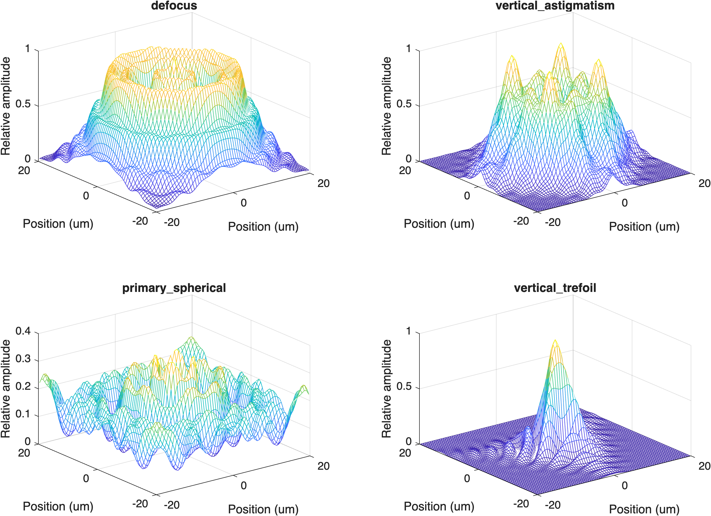

# Wavefronts {#sec-optics-wavefront}


## Wavefronts overview {#sec-optics-wavefront-overview}
This chapter starts out about light, and that section might have been part of the light field section, say in the chapter on diffraction. It was there we first saw that Newton's ray model is clearly wrong and the necessity of having a model in terms of waves. 

I delayed to this point because it wasn't really necessary to talk about wavefronts until we finished with the basic principles of optics that could be described using rays. As we have seen from three hundred years of practice, working with rays is clearly useful. 

At this point, we should start to think about light as wavefronts.  I want you to learn about adaptive optics, and I want you to understand how we use wavefronts in the ISETCam calculations for optics.

Light wavefronts are typically measured using specialized instrumentation and a simple stimulus (a point). They are conceptually realized to the point spread function [@sec-pointspread] we introduced in the diffraction chapter [@sec-diffraction]. We use specialized instruments to estimate the wavefront (@sec-lightfield-measurement). And we incorporate these simple instruments into larger scale image systems for astronomy (@sec-optics-wavefront-sensing) and ophthalmology @sec-adaptive-optics-human. 

## Wavefronts and rays{#sec-optics-wavefront-point}
@sec-optics-rays-wavefronts introduced the connection between a wavefront and a ray. When you are given a sketch of a wavefront, you can draw a perpendicular at each point along it to find the local ray direction [@fig-waves-rays]. This is a simpler picture than a full light field, though. At a point in space, rays from many different scene points cross in many directions, so no single wavefront can describe the field there.

The rays from a single point, however, can be described as forming a wavefront. The incident light field from a point has a collection of rays, each with a unique direction at the lens aperture. If the point is relatively far from the aperture, the rays will be nearly parallel (collimated). If the point is close, the rays will be diverging. If the rays have passed through a turbulent medium, they may point in many different directions (@fig-waves-rays). The surface perpendicular to these rays is the wavefront. 

![The blue waves on the left show a set of parallel waves from a single source.  The wavefront is identified by the dashed lines through the peaks of the waves.  The wavefront is flat as it arrives at the lens. The lens directs the rays to a single focal point, changing the wavefront shape. Were the focus perfect, the wavefront would be spherical (dark curve).  The actual wavefront (red curve) is not spherical. The deviation is called the **wavefront aberration** $W(\rho)$, written as a function of $\rho$ alone because this example is circularly symmetric: only the distance from the center matters, not the angle around it.](images/optics/12-wavefront/wavefront-lens-aberration.png){#fig-wave-aberration width="100%"}

Just as the light field comprises the collection of rays from all the points in the scene, the electromagnetic field is the sum of the wavefronts from all the points in the scene. 

## Wavefront description: time course {#sec-wavefront-time}
@fig-wave-aberration shows the rays as waves rather than straight lines, and indeed they are electric field oscillations traveling away from the point source. A light wave's electric field in air propagates at the speed of light in that medium, and its wavelength is very short: between 400 and 700 nm for visible light. As a result, the oscillation is at a very high temporal frequency, on the order of $10^{14}\text{ Hz}$. 

$$E(t) = a(t)\sin(2\pi \nu_0 t + \phi(t))$$

Here $\nu_0$ is called the carrier frequency, the sine term is the **carrier**, $a(t)$ is the wave **amplitude**, and $\phi(t)$ is the **phase**. Natural sources, such as the sun or an incandescent bulb, emit light through countless independent atomic events, so the field's amplitude and phase fluctuate randomly over time. Hence, the amplitude and phase are not perfectly steady; they fluctuate about the mean randomly, remaining approximately constant over a fairly short interval called the **coherence time**.

{#fig-wavefront-time  fig-align="center" width="70%"}

::: {.callout-note title="The temporal waveform of light" collapse="false"}
The temporal frequency of a light wave at a fixed position is very high. We can compute it from the relationship between speed, wavelength, and temporal frequency $\nu$:

$$
c = \nu \lambda \implies \nu = \frac{c}{\lambda}
$$

* Visible light wavelength ($\lambda$) typically spans roughly $400\text{ nm}$ to $700\text{ nm}$ ($0.4$–$0.7\ \mu\text{m}$).
* The speed of light ($c$) in vacuum is approximately $3 \times 10^8\text{ m/s}$.

For light near the middle of the visible range ($\lambda \approx 500\text{ nm} = 0.5 \times 10^{-6}\text{ m}$), this gives:

$$
\nu = \frac{c}{\lambda} \approx \frac{3 \times 10^8\text{ m/s}}{0.5 \times 10^{-6}\text{ m}} \approx 6 \times 10^{14}\text{ cycles/sec (Hz)}
$$

The amplitude and phase are random, but they stay correlated only over the coherence time — about a femtosecond ($10^{-14}$ to $10^{-15}\text{ s}$) for typical, broadband visible light (@fig-wavefront-time). On longer time scales, the peaks and troughs of the carrier wash out along with the phase.

:::

<!-- fise_wavetimecourse('ncycles',30); -->

### The wavefront representation as a complex number
For most imaging applications, the integration time of the sensor ranges from tens of microseconds to many milliseconds — many orders of magnitude longer than the coherence time. Over that interval, the field passes through a huge number of independent amplitude and phase fluctuations, so only the average irradiance (the mean squared amplitude), not the instantaneous field, is relevant to the measurement.

We typically combine the mean amplitude and phase into a single complex number, which is easier to use for calculations than the sine-and-phase form above. We write the amplitude and phase at each point $\mathbf{x}$ on the wavefront as

$$U(\mathbf{x}) = a(\mathbf{x}) e^{i\phi(\mathbf{x})}$$

The energy of the wave as it arrives at a surface is its irradiance (@sec-lfmeasurement-overview). The irradiance is equal to the squared magnitude of the complex wavefront arriving at that position $\mathbf{x} = (x, y)$ on the sensor plane:[^wave-irradiance]

$$E(\mathbf{x}) = \vert{}U(\mathbf{x})\vert{}^2 = a(\mathbf{x})^2$$

[^wave-irradiance]: Please excuse me for not explaining why the energy is $a()^2$ and not $a()$. It has a good answer that I hope to put into the Resource section some day, involving the electric field of the light and its impact on the electric field within the substrate.

In radiometry the irradiance has units of (Watts/m$^2$). In imaging and photon-based modeling, it is commonly expressed directly as photon flux density[^photon-energy]:

$$
\left[\frac{\text{photons}}{\text{s} \cdot \text{m}^2}\right] \quad \text{or} \quad \left[\frac{\text{q}}{\text{s} \cdot \text{m}^2}\right]
$$

[^photon-energy]: ISETCam has methods to convert back and forth between these two types of units.

## The Pupil Function
How does a lens transform an incident wave?  We have already asked this question for points of light, and come up with the answer of the point spread function. Now, we ask how the lens transforms the input wavefront into an output wavefront. We call the transformation the **pupil function**.  

Because many pupils are circular---like the pupil in your eye---we will introduce the input and output wavefronts using polar coordinates, rather than $\mathbf{x}$. We use $\rho$ for distance from the pupil center and $\theta$ for angle around the center.  The pupil function is specified separately for each wavelength of light, $\lambda$. 

To define an aberration, we first specify a reference wavefront: the ideal spherical wave that would converge to the desired image point.  For an unaberrated lens, the actual wavefront coincides with this reference wavefront.  We saw a one-dimensional version of this idea in @fig-wave-aberration: the gap between the actual wavefront and the ideal (reference) wavefront was the wavefront aberration.  Here we generalize that idea to the full, two-dimensional pupil.  The **wavefront aberration**, $W(\rho, \theta)$, is the optical path difference between the actual and reference wavefronts at each point in the pupil. Thus, $W$ is measured as a length (for example, microns), even though its optical effect is a phase shift. A constant offset in $W$ shifts every phase by the same amount and has no effect on the image, so only variation across the pupil matters.

Let $a(\rho, \theta)$ be the pupil function amplitude, a scalar that is often 1 inside the pupil and 0 outside. After expressing the field relative to the ideal reference wavefront, the pupil function is:

$$
P(\rho, \theta) = a(\rho, \theta) \, e^{i \, \frac{2\pi}{\lambda} W(\rho, \theta)}
$$

The phase term converts the optical path difference into radians. When $W(\rho, \theta)=0$, the pupil has the phase of the ideal reference wavefront; nonzero spatial variation in $W$ represents aberration.

### Phase: Wave direction

These two sections might move into the next chapter, along with the SLM from chapter 9.

Illustrate how a linear phase shift changes the wavefront's direction and thus the direction of a collimated bundle of rays.  Refer to spatial light modulators and devices that leave the amplitude unchanged but shift the phase.

{#fig-optics-phaseramp width="80%"}

Maybe we should move this section and the SLM section into the wavefront-sensing chapter that is next.

### Amplitude: Pupil shape

To model different physical configurations:

* **Stopping down the aperture**
  Modify $A(\rho, \theta)$ to reduce the pupil radius
* **Adding obscurations, vignetting, or scratches**
  Mask parts of $A(\rho, \theta)$ or add amplitude modulation
* **Simulating phase plates or diffractive elements**
  Alter $W(\rho, \theta)$ with custom phase profiles

These changes immediately reflect in the PSF via the Fourier transform.
How we represent the amplitude
Pupil shape can get introduced here.

Enables us to specify properties like scratches, aperture size.  

If we move this, it goes nicely with the flare.

### Paraxial regime and shift-invariance

Get the shift invariance idea inserted and relate it to paraxial analyses.

The complex field in the image plane (at best focus) is proportional to the **Fourier transform of the pupil function**:

$$
U(x, y) \propto \mathcal{F}\{ P(\rho, \theta) \}
$$

The **PSF** is the **intensity** of this field:

$$
\text{PSF}(x, y) = |U(x, y)|^2
$$

Hence, the wavefront shape directly influences the spatial structure of the PSF.

## Imperfections: Wavefront Aberrations and the PSF {#sec-optics-psf-wavefront}
<!-- Originated with ChatGPT in FISE-Optics -->

To model the image of a point source (i.e., the PSF), we consider the **pupil function**, which describes the amplitude and phase of the light at the exit pupil of the system. Aberrations are incorporated into the **phase** component.

Model of plausible PSFs in this Zernike polynomial space is better than the free PSF description.

Complex valued description of the PSF.  Why this rather than just the PSF?  

What is a perfect wavefront for a thin lens, or really any lens?  Collimated input, what is the output?

Deviations from the perfect wavefront.  Notice that people measure aberrations in different ways (see below).

## Zernike wavefront model
The wavefront function $W(\rho, \theta)$ is often expanded in terms of **Zernike polynomials** $Z_n^m(\rho, \theta)$, which form an orthonormal basis over the unit circle:

$$
W(\rho, \theta) = \sum_{n,m} a_n^m Z_n^m(\rho, \theta)
$$

Each coefficient $a_n^m$ corresponds to a specific aberration mode:

* defocus
* astigmatism
* coma
* spherical aberration
* trefoil, etc.

This representation enables:

* systematic control over image degradation
* parametric simulations of optical quality
* statistical modeling (e.g., for manufacturing tolerances or biological variation)

::: {.panel-tabset}

## Diffraction limited

{#fig-optics-pupil-diffraction width="80%"}

## Defocus

{#fig-optics-pupil-defocus width="80%"}
:::

Efficient representations.  Zernike polynomials.

Seidel aberrations Link to Resource.

Explain the Zernike polynomials as an approximation to the wavefront aberration.  Born and Wolf description of derivation might be good here.

This pdf from the Born and Wolf book might be what I mean:  appVII circle_polynomials_of_zernike_921
It has a lot of functional equations.

{#fig-optics-zernike-gallery width="80%"}

