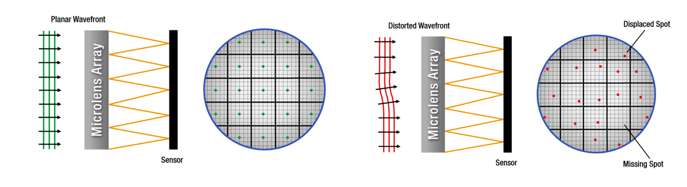
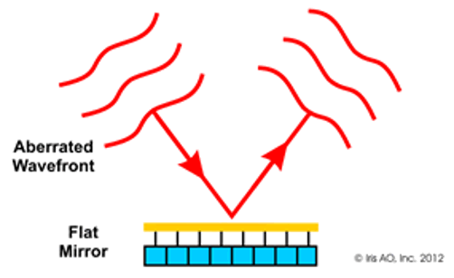

# Wavefront sensing {#sec-optics-wavefront-sensing}



## Wavefront sensing overview {#sec-optics-wavefront-sensing-overview}

The previous chapter described how to represent a wavefront, $W(\rho,\theta)$, and how that representation determines the point spread function (@sec-optics-wavefront). But the wavefront itself is not something an ordinary image sensor can measure directly—a sensor records the intensity of light, not its phase. This chapter describes an instrument that measures the wavefront, the Shack-Hartmann wavefront sensor, and how it can be coupled with other optical instruments for applications ranging from astronomy to ophthalmology.

## Shack-Hartmann wavefront sensor {#sec-shack-hartmann}

The **Shack-Hartmann wavefront sensor** measures $W$ indirectly, using the fact that a lenslet focuses collimated light to a point that shifts when the incoming rays are tilted.

The sensor places a lenslet array in front of an image sensor, with a small sensor region behind each lenslet (@fig-shack-hartmann). Each lenslet samples a small sub-aperture of the pupil. If the wavefront were flat over that sub-aperture, the lenslet would focus its light to a spot centered on its axis; a locally tilted wavefront shifts the spot away from center by an amount proportional to the local slope, $\nabla W$. Measuring the spot displacement at every lenslet therefore samples $\nabla W(\rho,\theta)$ across the whole pupil, from which $W$ itself can be reconstructed—for example by fitting Zernike polynomials to the measured slopes and integrating. This is a direct extension of the ray-based lenslet measurement introduced in @sec-lightfield-measurement: assembling many lenslets, each with its own small sensor region, turns a single local-angle measurement into a sampled estimate of the wavefront across the entire pupil.

{#fig-shack-hartmann width="100%" fig-align="center" .margin-caption}

Using Zernike decomposition on the measured slopes allows immediate interpretation and simulation without needing to reconstruct PSFs from images.

::: {.callout-note title="Hartmann's screen"}
Johannes Franz Hartmann, a German astronomer, faced a version of this problem around 1900: how to measure whether a telescope objective sent out parallel rays from an on-axis point source. He covered the aperture with a screen pierced by an array of pinholes and photographed the resulting spots on either side of focus. A ray bundle emerging parallel to the axis produced a spot centered behind its pinhole; any deviation from parallel displaced the spot, revealing the local ray error. Diffraction blurred each pinhole's image into a small spot rather than a point, and the pinholes passed little light, so the technique was not very sensitive.

Roland Shack and Ben Platt's 1971 innovation was to replace each pinhole with a small lens—a lenslet—which collects far more light and focuses it to a sharper spot: the design described above.

[Arizona history of the Shack-Hartmann sensor.](https://www.optics.arizona.edu/sites/default/files/2022-07/Historical-Development-Shack-Hartman-Wavefront-Sensor.pdf?utm_source=chatgpt.com)
:::

## Adaptive optics {#sec-adaptive-optics-astronomy}

A wavefront sensor becomes especially powerful when paired with a **deformable mirror**.  This is a front surface mirror whose shape can be adjusted locally, over small regions.  When the rays in a light field are reflected by the mirror the shape of the surface sculpts the direction of the rays, or equivalently we can say the mirror changes the wavefront. An **adaptive optics** system first measures the direction of the rays (the wavefront) and then applies a correction to the rays with the deformable mirror.  This reduces the aberrations so that we can focus the light and form a high quality image.

The concept was first applied in astronomical imaging: light from a guide star at the edge of the atmosphere would arrive with a flat wavefront if the atmosphere were not present, but atmospheric turbulence distorts it along the way. An adaptive optics system measures the distorted wavefront with a Shack-Hartmann sensor and corrects it with a deformable mirror in real time, producing a much sharper image of the sky than the atmosphere alone would allow.

::: {.content-visible when-format="html"}
{#fig-deformable-mirror width="60%" fig-align="center" .margin-caption}
:::

::: {.content-visible when-format="pdf"}
{#fig-deformable-mirror-static width="60%" fig-align="center" .margin-caption}
:::

Here is the whole system with the sensor to measure the deformation and the 

, which credits C. Max, Center for Adaptive Optics.](images/optics/13-wavefront-sensing/01-wavefront-sensing.png){#fig-wavefront-sensing width="80%" fig-align="center" .margin-caption}

::: {.callout-note title="YouTube: Adaptive optics in astronomy" collapse="true"}
Here is an excellent, detailed, YouTube video describing the use of adaptive optics in astronomical imaging.  The author describes how to build a deformable mirror!  Very enjoyable - to some of us.

::: {.content-visible when-format="html"}

<!-- Responsive, centered YouTube embed -->

  
 <!-- 16:9 -->
    <iframe
      src="https://www.youtube.com/embed/TPyQI7bJo6Q"
      style="position: absolute; top: 0; left: 0; width: 100%; height: 100%; border: 0;"
      allow="accelerometer; autoplay; clipboard-write; encrypted-media; gyroscope; picture-in-picture; web-share"
      allowfullscreen>
    </iframe>
  

:::

::: {.content-visible when-format="pdf"}
[In this YouTube video, learn more about the application of adaptive optics in astronomical imaging.](https://youtu.be/TPyQI7bJo6Q){target=_blank}
:::

:::

The same architecture measures the optics of the human eye, where the aberrating medium is the cornea and lens rather than the atmosphere; we describe that application, and the resulting adaptive-optics imaging of the retina, in @sec-adaptive-optics.
