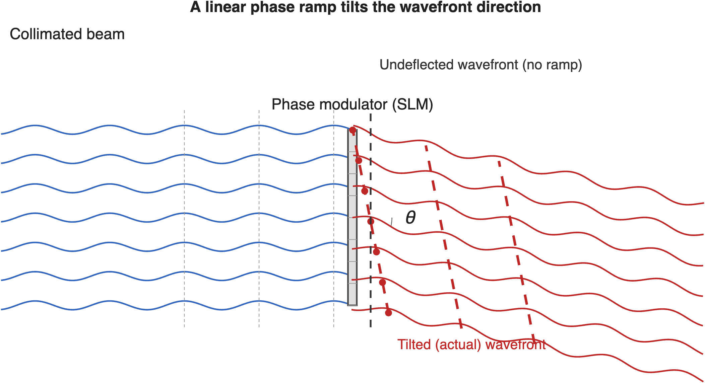

# Wavefront sensing {#sec-optics-wavefront-sensing}



## Wavefront sensing overview {#sec-optics-wavefront-sensing-overview}

The previous chapter described how to represent a wavefront, $W(\rho,\theta)$, and how that representation determines the point spread function (@sec-optics-wavefront). But the wavefront itself is not something an ordinary image sensor can measure directly—a sensor records the intensity of light, not its phase. This chapter describes an instrument that measures the wavefront, the Shack-Hartmann wavefront sensor, and how it can be coupled with other optical instruments for applications ranging from astronomy to ophthalmology.

## Shack-Hartmann wavefront sensor {#sec-shack-hartmann}

The **Shack-Hartmann wavefront sensor** measures $W$ indirectly, using the fact that a lenslet focuses collimated light to a point that shifts when the incoming rays are tilted.

The sensor places a lenslet array in front of an image sensor, with a small sensor region behind each lenslet (@fig-shack-hartmann). Each lenslet samples a small sub-aperture of the pupil. If the wavefront were flat over that sub-aperture, the lenslet would focus its light to a spot centered on its axis; a locally tilted wavefront shifts the spot away from center by an amount proportional to the local slope, $\nabla W$. Measuring the spot displacement at every lenslet therefore samples $\nabla W(\rho,\theta)$ across the whole pupil, from which $W$ itself can be reconstructed—for example by fitting Zernike polynomials to the measured slopes and integrating. This is a direct extension of the ray-based lenslet measurement introduced in @sec-lightfield-measurement: assembling many lenslets, each with its own small sensor region, turns a single local-angle measurement into a sampled estimate of the wavefront across the entire pupil.

{#fig-shack-hartmann width="100%" fig-align="center" .margin-caption}

Using Zernike decomposition on the measured slopes allows immediate interpretation and simulation without needing to reconstruct PSFs from images.

::: {.callout-note title="Hartmann's screen"}
Johannes Franz Hartmann, a German astronomer, faced a version of this problem around 1900: how to measure whether a telescope objective sent out parallel rays from an on-axis point source. He covered the aperture with a screen pierced by an array of pinholes and photographed the resulting spots on either side of focus. A ray bundle emerging parallel to the axis produced a spot centered behind its pinhole; any deviation from parallel displaced the spot, revealing the local ray error. Diffraction blurred each pinhole's image into a small spot rather than a point, and the pinholes passed little light, so the technique was not very sensitive.

Roland Shack and Ben Platt's 1971 innovation was to replace each pinhole with a small lens—a lenslet—which collects far more light and focuses it to a sharper spot: the design described above.

[Arizona history of the Shack-Hartmann sensor.](https://www.optics.arizona.edu/sites/default/files/2022-07/Historical-Development-Shack-Hartman-Wavefront-Sensor.pdf?utm_source=chatgpt.com)
:::

## Adaptive optics {#sec-adaptive-optics-astronomy}

A wavefront sensor becomes especially powerful when paired with a **deformable mirror**.  This is a front surface mirror whose shape can be adjusted locally, over small regions.  When the rays in a light field are reflected by the mirror the shape of the surface sculpts the direction of the rays, or equivalently we can say the mirror changes the wavefront. An **adaptive optics** system first measures the direction of the rays (the wavefront) and then applies a correction to the rays with the deformable mirror.  This reduces the aberrations so that we can focus the light and form a high quality image.

The concept was first applied in astronomical imaging. The astronomer shines a strong laser into the upper atmosphere to create a signal that will be visible on the ground. The laser is usually set to 589 nm, which excites sodium atoms in a layer of the atmosphere about 90 km (56 miles) above the earth, in the mesosphere.  These atoms, which were left behind by microscopic meteorites, are energized and when they relax back emit light in all directions at the same wavelength (resonance fluorescence). Were there no atmosphere, light from these atoms would arrive back to the telescope collimated (a flat wavefront). But atmospheric turbulence distorts the light. 

](images/optics/13-wavefront-sensing/laser-guide-star.png){#fig-optics-laser-guidestar width="80%"}

A wavefront sensor measures the distorted wavefront and controls a deformable mirror, as illustrated in the gif.  The mirror changes it shape by just the amount necessary to correct the wavefront, making the rays collimated (flattening the wavefront).

::: {.content-visible when-format="html"}
{#fig-deformable-mirror width="60%" fig-align="center" .margin-caption}
:::

::: {.content-visible when-format="pdf"}
{#fig-deformable-mirror-static width="60%" fig-align="center" .margin-caption}
:::

This whole process updates fairly rapidly (milliseconds) because the atmosphere is changing quickly. This means the sensing must be fast and the deformable mirror must be fairly light and responsive so it can change shape quickly. The whole system is illustrated in @fig-wavefront-astronomy. The corrected image of the stars in the sky is much sharper than would be possible by imaging through the atmosphere.

, which credits C. Max, Center for Adaptive Optics.](images/optics/13-wavefront-sensing/01-wavefront-sensing.png){#fig-wavefront-astronomy width="70%" fig-align="center" .margin-caption}

::: {.callout-note title="YouTube: An informal explanation of adaptive optics" collapse="false"}
Here is an informal, very nice explanation of the adaptive optics system for astronomy.  Maybe a little too cute, or maybe just pefect?  I like it.

::: {.content-visible when-format="html"}

<!-- Responsive, centered YouTube embed -->

  
 <!-- 16:9 -->
    <iframe
      src="https://www.youtube.com/embed/gDGvNyVApgg?si=66-yeXvR2vX7Y_-G"
      style="position: absolute; top: 0; left: 0; width: 100%; height: 100%; border: 0;"
      allow="accelerometer; autoplay; clipboard-write; encrypted-media; gyroscope; picture-in-picture; web-share"
      allowfullscreen>
    </iframe>
  

:::

::: {.content-visible when-format="pdf"}
[In this YouTube video, learn more about the application of adaptive optics in astronomical imaging.](https://youtu.be/gDGvNyVApgg?si=66-yeXvR2vX7Y_-G){target=_blank}
:::

:::

::: {.callout-note title="YouTube: Adaptive optics in astronomy" collapse="false"}
Here is an excellent, detailed, YouTube video describing the use of adaptive optics in astronomical imaging. The author describes how to build a deformable mirror!  Very enjoyable!

::: {.content-visible when-format="html"}

<!-- Responsive, centered YouTube embed -->

  
 <!-- 16:9 -->
    <iframe
      src="https://www.youtube.com/embed/TPyQI7bJo6Q"
      style="position: absolute; top: 0; left: 0; width: 100%; height: 100%; border: 0;"
      allow="accelerometer; autoplay; clipboard-write; encrypted-media; gyroscope; picture-in-picture; web-share"
      allowfullscreen>
    </iframe>
  

:::

::: {.content-visible when-format="pdf"}
[In this YouTube video, learn more about the application of adaptive optics in astronomical imaging.](https://youtu.be/TPyQI7bJo6Q){target=_blank}
:::

:::

The same architecture measures the optics of the human eye, where the aberrating medium is the cornea and lens rather than the atmosphere; we describe that application, and the resulting adaptive-optics imaging of the retina, in @sec-adaptive-optics-human.

### Controlling wave direction: phase

Illustrate how a linear phase shift changes the wavefront's direction and thus the direction of a collimated bundle of rays.  Refer to spatial light modulators and devices that leave the amplitude unchanged but shift the phase.

{#fig-optics-phaseramp width="80%"}

Maybe we should move this section and the SLM section into the wavefront-sensing chapter that is next.

### Spatial Light Modulators {#sec-SLM}
What if a lens could be reconfigured on the fly? **Spatial light modulators (SLMs)** are devices that can dynamically control the properties of a light field on a pixel-by-pixel basis. They are essentially programmable optical elements.

*   **Phase SLMs**, often based on liquid crystal arrays, can locally alter the phase of light, effectively acting as a reconfigurable lens or diffraction grating. They can be used to correct for aberrations in real-time or to sculpt a light beam into a complex pattern.
*   **Amplitude SLMs**, which use technologies like MEMS (micro-electro-mechanical systems) mirrors, modulate the intensity of light at each pixel.

With pixel sizes on the order of microns and arrays containing millions of elements, SLMs are powerful tools in adaptive optics, holography, and advanced imaging systems. This figure shows a recent phase SLM with extremely high resolution.

{target=_blank}](images/optics/07-principles/slm-holoeye.png){#fig-slm-holoeye width="60%"}

## ISETCam simulation:  Calculating flare

Let's finish with an ISETCam flare example.  Using pupil functions for in automotive application exampl.e

Aperture shape - non circular causes some stuff.

Scratches and HDR rendering illustrated

Zhenyi's simulations.

