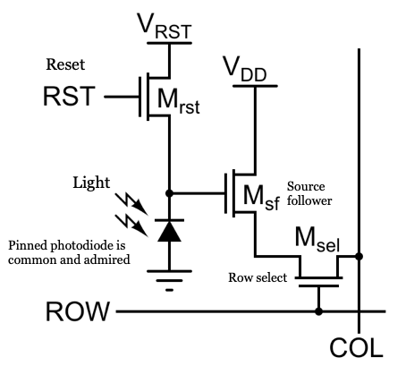
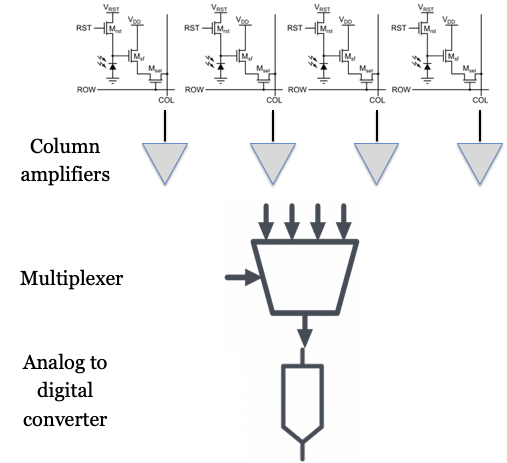
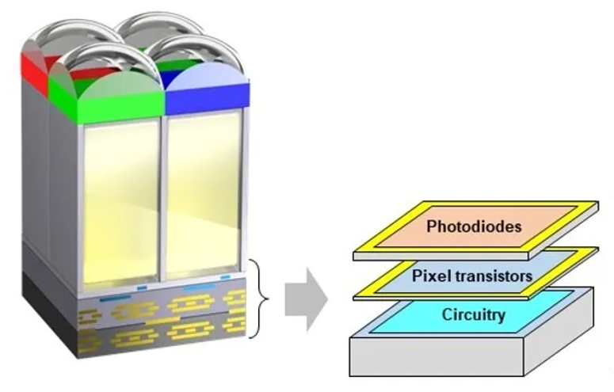

# Pixels and sensors {#sec-pixels}


## Pixels and sensors {#sec-pixels-overview}

This chapter connects the physics of photon-to-electron conversion (@sec-sensors-photons-electrons) to the engineering of image sensor pixels. In the previous chapter, we saw how absorbed photons generate mobile electron–hole pairs in silicon. Without an electric field, however, the liberated electrons and holes quickly recombine. In both CCD and CMOS sensors, an internal electric field—created by a reverse-biased diode junction or a biased gate electrode—separates the charges and collects the electrons in a potential well. 

The defining challenge of an image sensor is not how electrons are created, but **how that collected charge is transferred and read out** across an array of millions of pixels.

The earliest digital image sensors, known as charge-coupled devices (CCD), were built using metal-oxide semiconductor technology (MOS). Measuring the electrons captured by the array of photodiodes in a CCD requires significant power, making them unsuitable for mobile devices and limiting their early adoption to scientific and other high-end applications. The earliest attempts to use CMOS sensors had relied on passive pixels (PPS), which suffered from high noise and slow readout. 

A major breakthrough came in the early 1990s with the development of the modern Complementary Metal-Oxide Semiconductor (CMOS) active pixel sensor (APS) [@fossum1993-ccd-dinosaurs; @fossum1995-patent]. By placing an active amplifier in each pixel and incorporating on-chip timing, control, and analog-to-digital conversion, the JPL team demonstrated the "camera-on-a-chip." Because CMOS sensors could be manufactured using standard microelectronics fabrication lines, they consumed far less power than CCDs and paved the way for the widespread adoption of electronic image sensors in mobile devices and many other applications.

{#fig-olympus-overview style=".float-right" width="60%"}

Finally, we review how pixel structures have evolved since the first implementation, from a front-side to back-side illumination, deep photodiodes, stacking, and digital pixels.  These changes vastly improved sensitivity, speed, and dynamic range. In subsequent chapters, we see how additional on-sensor components—such as color filters and microlenses—shape the captured data (@sec-sensor-components) and how to model and measure sensor performance (@sec-system-modeling-overview).

## Two Readout Paradigms {#sec-sensor-circuits}

Solid-state image sensors rely on two fundamentally different readout architectures:

1. **Charge transport (CCD):** Charge packets are physically shifted across the silicon array step-by-step—like a bucket brigade—to a single corner amplifier.
2. **In-pixel amplification (CMOS):** Each pixel converts charge to a voltage locally, and an addressable matrix of row and column wires reads out the voltages, much like digital random-access memory (RAM).

### Charge Transfer: The CCD Bucket Brigade {#sec-ccd-readout}

Boyle and Smith's invention of the CCD (@boyle1970-ccd-first) was a pivotal milestone: the principle of using the photoelectric effect to convert light into charge within semiconductor silicon remains the foundation of all solid-state imaging. A second, equally critical aspect of sensor design is how to measure the charge collected within the silicon substrate. The original Boyle and Smith design had no transistors inside the imaging area; the pixels were simply a sequence of MOS capacitors (metal or polysilicon gates over thin silicon dioxide on silicon). With this technology, it was not feasible to include amplifier circuits at each pixel. Instead, they devised an ingenious method—analogous to a bucket brigade—to move charge packets across the substrate without loss to a shared measuring circuit.

This method uses a coordinated, two-stage transfer process (@fig-ccd-animation). Sets of gate electrodes are laid out across the silicon and driven by alternating voltages. Raising the voltage on an adjacent gate while lowering it on the current gate sequentially creates a traveling electrostatic potential well that sweeps electrons along. During readout, the entire two-dimensional array shifts its charge packets downward one row at a time into a specialized, high-speed **serial readout register** running along the bottom edge of the sensor. While the vertical array pauses, this serial register clocks the row of charge packets rapidly along the edge to the corner of the chip. There, each packet is transferred onto a tiny capacitor called the **floating diffusion node**. Dumping the electrons onto this capacitor produces a voltage drop that is proportional to the number of electrons ($\Delta V = Q/C$). A single, dedicated buffer amplifier senses this voltage and sends it to an analog-to-digital converter (ADC) to record the pixel's digital value.

::: {#fig-ccd-animation}

::: {.content-visible when-format="html"}

:::

::: {.content-visible when-format="pdf"}
[Watch an animation of the CCD charge transfer sequence on Vimeo.](https://vimeo.com/103279733){target=_blank}
:::

Animation of charge transfer in a CCD image sensor. Photoelectrons collected across the array shift downward row by row into a high-speed serial register at the edge. The colors of the charge packets in the animation indicate the color filter above each photodiode; the photoelectrons themselves are identical. Notice the timing difference: the full array advances one row at a time, while the serial register clocks each packet rapidly to a single floating diffusion capacitor and output amplifier at the corner of the chip. Because every pixel's charge is measured by the exact same amplifier, CCDs achieve outstanding spatial uniformity (near-zero fixed-pattern noise) and high linearity.

:::

Precisely moving charge across large silicon wafers requires high clocking voltages (10–15 V), consumes substantial power, and is relatively slow. Implementing this approach requires specialized manufacturing lines that cannot integrate digital logic, clock generators, or ADCs on the same chip. @nte-sensor-cte describes why moving and measuring the charge imposes a strong constraint on the precision of the movement if we hope to measure the signal accurately. 

::: {#nte-sensor-cte .callout-note collapse="true" title="Charge Transfer Efficiency: The necessity of 'six nines'"}
In a CCD, charge packets are shifted across the silicon array from pixel to pixel. For a high resolution image sensor, there will be many steps. Each step must be very high quality or the loss of image quality can be significant.

Consider a $2048 \times 2048$ array. To read out the pixel in the corner furthest from the output amplifier, its charge packet must be shifted vertically down 2,048 rows, and then shifted horizontally across 2,048 columns in the serial readout register. In a typical 3-phase CCD design, this requires $N \approx 4,000$ to $12,000$ individual gate-to-gate transfers.

If the **Charge Transfer Efficiency (CTE)** per transfer is $\eta$, the fraction of the original charge packet that successfully reaches the output amplifier after $N$ transfers is:

$$
\text{Fraction arriving intact} = \eta^N
$$

If $\eta = 0.999$ (99.9%—a value that sounds remarkably good in most engineering contexts), the outcome across 4,000 transfers is disastrous:

$$
(0.999)^{4,000} \approx 0.018
$$

Only $1.8\%$ of the electrons reach the output amplifier in the correct pixel; the remaining $98.2\%$ are left behind in intermediate potential wells, creating a severe trailing smear across the image!

| CTE ($\eta$) | Description | Signal intact after 1,000 transfers | Signal intact after 4,000 transfers | Signal intact after 10,000 transfers |
|:---|:---|:---:|:---:|:---:|
| $0.99$ | Two nines (99%) | $\approx 0.004\%$ | $\approx 0\%$ | $0\%$ |
| $0.999$ | Three nines (99.9%) | $36.8\%$ | $1.8\%$ | $\approx 0.005\%$ |
| $0.9999$ | Four nines (99.99%) | $90.5\%$ | $67.0\%$ | $36.8\%$ |
| $0.99999$ | Five nines (99.999%) | $99.0\%$ | $96.1\%$ | $90.5\%$ |
| $0.999999$ | Six nines (99.9999%) | $99.9\%$ | $99.6\%$ | $99.0\%$ |

To keep trailing smear below $1\%$, scientific and astronomical CCDs require **"six nines"** of efficiency ($\eta \ge 0.999999$). 

To achieve this level of perfection, electrons cannot rely on slow thermal diffusion to drift out of the potential wells; they must be rapidly swept across each gate by strong lateral electric fields. Creating these steep "potential cliffs" deep inside the silicon requires large clock voltage swings (typically 10–15 V), which is the direct source of the CCD's high dynamic power consumption and specialized manufacturing requirements.
:::

### In-Pixel Amplification: The CMOS Active Pixel Sensor {#sec-active-pixel-sensor}

In the 1970s and 1980s, the limitations of unipolar MOS technologies (NMOS and PMOS) became evident: they drew significant static power and suffered from thermal regulation problems as circuit density scaled up. The massive demand for semiconductor memory drove the electronics industry toward CMOS (Complementary MOS), which drew far less power and was much easier to keep cool. Microprocessors shifted soon after.

The earliest experiments with CMOS imagers used **Passive Pixel Sensors (PPS)**. In a passive pixel, each photodiode was simply connected to a column bus through a single transistor switch. Reading the pixel dumped its tiny charge packet directly onto a long, high-capacitance column bus, severely attenuating the signal and drowning it in noise. In his lectures on this topic, my Stanford colleague Abbas El Gamal would refer to dumping charge onto such a line as an "unnatural act": who would pour a few thousand electrons onto a long wire and hope that they would dribble intact to the other end? 

What enabled the breakthrough to practical CMOS sensors? By the early 1990s, CMOS feature sizes shrank below $0.5\,\mu\text{m}$, meaning transistors were finally tiny enough to fit inside each pixel without occupying too much light-sensitive area (maintaining an acceptable **fill factor**). At NASA's Jet Propulsion Laboratory (JPL), Eric Fossum recognized that CCDs were trapped on expensive, specialized fab lines that could not integrate digital logic or support circuits, requiring cumbersome multi-chip camera boards with external clock drivers, multiple voltage regulators, and external ADCs. Fossum realized[^PPS-adelson] that by placing a buffer amplifier (a source-follower transistor) *inside* each pixel—creating the **Active Pixel Sensor (APS)**—charge could be converted to a voltage locally within the pixel. That voltage could then drive the high-capacitance column line with negligible signal loss. This eliminated the 15 V bucket brigade altogether and made it possible to build an entire "camera-on-a-chip" on high-volume, low-voltage commercial CMOS lines [@fossum1993-ccd-dinosaurs].

[^PPS-adelson]: My friend Ted Adelson visited me in the early 2000s when I was working with Abbas El Gamal. I was explaining to Ted—who is a vision scientist and psychologist—the logic of passive pixel sensors in anticipation of an "aha" moment when I revealed Fossum's active pixel idea. As I finished describing the PPS, Ted just looked at me quizzically and said: "Why not put an amplifier in the pixel?" There must be a moral in this story somewhere.

::: {#fig-cmos-animation}

::: {.content-visible when-format="html"}

:::

::: {.content-visible when-format="pdf"}
[Watch an animation of the CMOS readout sequence on Vimeo.](https://vimeo.com/103279734){target=_blank}
:::

Animation of the readout sequence in a CMOS image sensor. In contrast to the CCD (@fig-ccd-animation), charge packets are not transported across the chip. Instead, photoelectrons collected across the array are converted to a voltage locally within each pixel. Column buses then read out the voltages row by row into analog-to-digital converters at the edge of the array. The colors of the charge packets in the animation indicate the color filter above each photodiode; the photoelectrons themselves are identical. The detailed circuitry that performs this readout is described in the following sections.

:::


### CMOS pixel circuitry {#sec-pixel-circuits}

 @fig-cmos-pixel-overview-panel includes two coarse schematics of pixels from early CMOS imagers. Each gives you a sense of the complexity of the early pixel designs as well as their shortcoming. Click on each of the tabs to see the two schematics.
 
 In the first generation of image sensors the distance from the microlens at the top to the photodiode at the bottom was fairly large compared to the size of the photodiode. In these early pixels, light from the main lens had to travel through what was effectively a tunnel to reach the photodiode.

::: {#fig-cmos-pixel-overview-panel .figure}
::: {.panel-tabset}

## CMOS pixel overview 1
![Schematic of the early CMOS pixel architecture.  This image shows a microlens and color filter, which are typically part of the pixel. The microlens is centered over the pixel here, but for pixels at the edge of the sensor array it will be positioned a bit to the side. This color filter passes long wavelength (red-appearing) light, but different pixels will have different color filters. The first layer of silicon, with its photodiode and classic circuitry sharing space, are shown. Source: <a href="https://evidentscientific.com/en/microscope-resource/knowledge-hub/digital-imaging/cmosimagesensors" target="_blank">Evident Scientific.</a>](images/sensors/14-pixels/03-pixel-overview.png){#fig-pixel-overview width="60%"}

## CMOS pixel overview 2
![Color imagers use an array of color filters to create pixels with different wavelength selectivity. The color filters are typically arranged in a repeating pattern, and the smallest repeating unit of the color filter array is called a **super pixel**. The image illustrates a super pixel for a sensor with cyan, magenta, and yellow color filters. This image emphasizes the metal lines, omitted in @fig-pixel-overview. In the original CMOS imagers, light from the main imaging lens had to pass through these metal layers before reaching the photodiode.](images/sensors/14-pixels/03-pixel-overview2.png){#fig-pixel-layers width="50%"}
:::

Two useful overviews visualizations of an early CMOS pixel design.
:::

Pixel architecture has evolved significantly over the years, and there continue to be many novel designs. The most straightforward change is that technology has scaled, enabling pixel sizes to shrink and thus increasing spatial sampling resolution. In addition, the placement of the circuitry and metal lines has changed to below the photodiode; light no longer passes through a deep tunnel. There are other improvements to the circuitry, some experimental, that we will review later in @sec-sensor-innovations. 

<!-- fig-pixel-layers:  not sure where this image comes from -->

It is helpful to first understand the concepts behind the classic circuitry, so that we can better appreciate these innovations. The logical flow of the circuitry is as follows:

-   Before image capture, the sensor circuitry resets each pixel, clearing residual charge from previous exposures.
-   During image acquisition, the photodiode array collects electrons generated by incoming light; these electrons are stored within the photodiode (3T) or in a nearby capacitor (4T).
-   During readout, the circuitry transfers the stored charge to an analog-to-digital converter (ADC).
-   The digital image array records the amount of light captured by each pixel.

The role of the other essential pixel components, the color filter arrays and microlenses, is explained in Section @sec-sensor-components. I describe how to calibrate and model sensor performance, from the scene light field to image capture in @sec-system-modeling-overview.

### Three-Transistor (3T) Pixel Design {#sec-3T-pixel-design}

The original CMOS pixel design uses a three-transistor (3T) circuit to store and read out the charge collected by the photodiode (@fig-sensor-3T-circuit). Each pixel contains three key transistors: $M_{rst}$ (reset), $M_{sel}$ (select), and $M_{sf}$ (source follower). The $M_{rst}$ transistor resets the photodiode by connecting it to the supply voltage (Vdd), clearing any residual charge before image capture. The $M_{sel}$ transistor selects a specific row of pixels, connecting them to the readout circuitry. The $M_{sf}$ transistor acts as a buffer, transferring the stored charge to the analog-to-digital converter (ADC) for measurement. In most sensors, each column has its own ADC, but some designs use a single ADC shared among multiple columns—a technique known as multiplexing (mux).

{#fig-sensor-3T-circuit width="60%"}

Ideally, the photodiode’s response to light is linear, with the number of generated electrons following Poisson statistics. However, the surrounding circuitry introduces additional sources of noise and nonlinearity. For example, the storage capacitor has a limited capacity, so it can saturate at high light levels. The transistors used for readout can also introduce noise and small nonlinearities. Furthermore, variations in pixel properties across the sensor array can cause fixed-pattern noise. In modern CMOS sensors, these nonlinearities and noise sources are typically small—on the order of a few percent [@wang2017-CMOSLinearity] -but they can still affect image quality. Careful characterization and calibration are necessary to minimize these effects and produce high-quality images.

```{=html}
<!-- 
 (http://encyclopedia2.thefreedictionary.com/Vdd also the drain voltage), Vrst is the reset voltage Vee is the negative supply voltage Ground is ground
http://en.wikipedia.org/wiki/Active_pixel_sensor , http://encyclobeamia.solarbotics.net/articles/vxx.html , 
http://en.wikipedia.org/wiki/Active_pixel_sensor , http://encyclobeamia.solarbotics.net/articles/vxx.html , 
Vdd is positive supply voltage  (http://encyclopedia2.thefreedictionary.com/Vdd also the drain voltage), Vrst is the reset voltage Vee is the negative supply voltage Ground is ground
-->
```

### Four-Transistor (4T) pixel design {#sec-4T-pixel-design}

<!--
Resources has a good markdown file about the properties required of the various transistors for the 4T case.  That could be a good callout note. That note could integrate the various comments in this section.
-->

When 3T CMOS sensors first appeared in the 1990s, CCD proponents called them noisy toys ("CCD dinosaurs vs. CMOS fleas"). 3T pixels suffered from high dark current and reset noise because reading the voltage required resetting the photodiode, leaving no uncorrupted reference state[^PDC-fundraising]. 

[^PDC-fundraising]: Abbas may not remember it this way, but I have a clear memory of seeking funding for the Stanford project over several meetings, typically a bad chicken lunch, and being told that CMOS would never overtake CCD. 

The breakthrough that allowed CMOS to match and eventually exceed CCD image quality came from adopting a technology originally invented for CCDs! In 1980, **Nobukazu Teranishi** and colleagues at NEC invented the **pinned photodiode (PPD)** for interline-transfer CCDs to eliminate image lag and dark current [@teranishi1982-pinned-photodiode; @burkey1984-pinned-photodiode; @fossum2014-pinnedpd]. By burying the p-n junction beneath a pinned surface layer, the PPD shielded photoelectrons from the defects and thermal generation typical of the silicon surface.

In the mid-1990s, teams at Kodak and JPL integrated the pinned photodiode and an additional **transfer gate (TX)** transistor into the active pixel, creating the **four-transistor (4T) pixel** [@lee1995-4T-aps; @lee1997-4T-aps-patent; @guidash1997-4t-aps-cds]. In this design (@fig-sensor-4T-circuit), the photodiode is decoupled from the readout circuitry by the transfer gate. Photoelectrons accumulate in the pinned photodiode during exposure, and are then transferred completely to an isolated sensing capacitor called the **floating diffusion node** (with capacitance $C_{fd}$). 

{#fig-sensor-4T-circuit width="60%"}

Separating charge collection from the readout node is what makes true **Correlated Double Sampling (CDS)** possible:

1. The floating diffusion node is reset, and its reset voltage is read *first*.
2. The transfer gate pulses open, transferring the collected charge packet onto the floating diffusion.
3. The new signal voltage is read *second*.

Subtracting the reset voltage from the signal voltage eliminates $kTC$ reset noise entirely (@sec-reset-noise-cds), while the pinned structure drastically lowers dark current (@sec-dark-current). The other circuit elements—the reset, row select, and source follower transistors—remain the same as in the 3T design.

Today, the 4T pixel is the standard in almost all high-performance CMOS image sensors, including those found in smartphones, industrial cameras, cars, and scientific instruments [@fossum2014-pinnedpd; @Fossum2024-nx].

<!--
There is also Theuwissen diagram, with five transistors that he calls a 4T circuit.  In the paper 'Linearity analysis ...' @Wang2017-CMOSLinearity.  He says the source follower is shared by multiple rows of pixels. It is Figure 2.  

The text: "Figure 2 shows the schematic of a typical voltage mode 4T pixel. The pixel circuit consists of a pinned photodiode, a charge
transfer switch (M1), a reset switch (M2), a source follower (M3) and a row select switch (M4). The current source transistor (M5) is shared by multiple rows of pixels. VDD is the power supply while VPIX is the output voltage of pixel. VLN provides an adjustable bias current. In the following analysis, the nonlinearity caused by the row select transistor (M4) is omitted to simplify the analysis."
-->

## Multiplex readout {#sec-cmos-multiplex}
The use of unity gain amplifiers at the pixel was one important innovation. A second innovation is the way the pixel data are read from the image sensor. In the original CCD devices, the important innovation was to find a way to move the electrons across the silicon array to a single analog-to-digital converter. But the electrons in the CMOS pixels are voltages on a large number of output lines. How shall we convert the voltages on all of these separate lines into digital readout values?

{#fig-cmos-multiplex width=70%}

The readout process begins with a control signal sent to a specific row of pixels, activating the row and placing the voltage from each pixel onto its corresponding column readout line. These column lines are connected to amplifiers, which buffer and amplify the signals to ensure accurate transmission. These amplified signals are then passed to an analog-to-digital converter (ADC).  The gain settings on the amplifiers, prior to the ADC, are often adjustable allowing gain settings from 1x to 4x.

In most CMOS sensors, ADCs are shared among groups of columns to reduce complexity and save space. This sharing is achieved through a process called **multiplexing**, where the ADC sequentially converts the analog signals from each column in its group into digital values. Typically, ADCs multiplex signals from 8 or 16 columns, depending on the sensor design and application. Once the data from the active row is fully read out, the control signal moves to the next row, and the process repeats. 

Because the rows of the sensor are read out sequentially, the exposure duration of each row begins and ends at slightly different times. This sequential row-by-row timing, known as a **rolling shutter**, and its alternative, the **global shutter**, are analyzed in detail in @sec-rolling-shutter.

## Sensor evolution {#sec-sensor-evolution}

There has been a large engineering effort to reduce various sources of noise, including temporal and fixed pattern noise, as well as other limitations in the sensor design relating to color and dynamic range. The engineering effort was supported by the enormous demand for CMOS sensors. In 2020, approximately 6.5 billion sensors were shipped.  In 2025, we expect about 13 billion sensors to be produced. That's a lot of sensors and the demand motivates a lot of engineering. This section covers the evolution of the pixel and sensor design.

The sensor architecture I have described is known as **front-side illumination (FSI)**. The architecture has the obvious challenge of placing multiple metal layers above the semiconductor substrate (@fig-pixel-layers). Even at the time of the original implementation, it was clear that requiring light to pass through the metal layers to reach the light-sensitive photodiode created many problems. 

Additionally, both the photodiodes and their associated circuitry share the same substrate. Requiring the circuitry and photodiode to share space reduced the sensitivity of the sensor. Finally, the original pixels were fairly large, $6 \mu \text{m}$ or more. As technology scaled and pixels became smaller -many CMOS imagers have pixels as small as $0.8 \mu \text{m}$ and a reduction in area of $50x$- additional problems arose. Different opportunities arose as well.

These challenges, and the huge success of CMOS sensors, were met by a massive, world-wide, engineering effort to improve the system. The evolution of image sensor pixel technology that came from this effort enabled dramatic improvements in image quality, sensitivity, and device functionality. The following sections describe the key milestones that were achieved through academic and industry partnerships. For an authoritative review, consult @oike2022-stackedevolution.

<!--# https://www.pcmag.com/how-to/whats-the-difference-between-cmos-bsi-cmos-and-stacked-cmos 
https://news.skhynix.com/evolution-of-pixel-technology-in-cmos-image-sensor

https://image-sensors-world.blogspot.com/2023/06/sonys-world-first-two-layer-image.html

-->

:::{.callout-note title="Pixel Evolution timeline" collapse="false"}
<!-- See Research doc 'The Genesis and Evolution of Stacked Pixel Structures ....' -->

Here is a timeline for the key milestones described in the sections below.

| Technology                | Commercialization | Key Benefit                                 |
|---------------------------|------------------|----------------------------------------------|
| **Front-Side Illumination (FSI)**   | 1990s–2000s      | Simplicity, but limited by wiring obstruction|
| **Back-Side Illumination (BSI)**    | ~2007–2010       | Higher QE, better low-light, smaller pixels  |
| **Deep Trench Isolation (DTI)**     | ~2010s           | Reduced crosstalk, higher pixel density      |
| **Deep Photodiode**                 | ~2015+           | Higher sensitivity, dynamic range            |
| **Stacked Sensor**                  | ~2015+           | Advanced features, compact design            |

<!--
- **Front-Side Illumination (FSI):** Early standard; light passes through wiring before reaching the photodiode.
- **Back-Side Illumination (BSI):** Introduced ~2010; light enters from the back, improving efficiency for small pixels.
- **Deep Trench Isolation (DTI):** Early 2010s; insulating trenches reduce crosstalk between pixels.
- **Deep Photodiode:** Mid-2010s; deeper photodiodes increase sensitivity and dynamic range.
- **Stacked Sensor:** Mid-2010s onward; sensor and circuitry are stacked for advanced features and compact design.


- **Front-Side Illumination (FSI) (1970s–2000s)**
    - Standard architecture for early CCD and CMOS sensors.
    - Light enters from the front, passing through metal wiring and transistors before reaching the photodiode.
    - Wiring blocks some light, reducing quantum efficiency, especially as pixel sizes shrink.

- **Back-Side Illumination (BSI) (Late 2000s, commercialization ~2007–2010)**
    - Sensor wafer is thinned and flipped so light enters from the back, directly reaching the photodiode.
    - Dramatically improves quantum efficiency, especially for small pixels.
    - First widely adopted in smartphone cameras (e.g., iPhone 4 in 2010).

- **Deep Trench Isolation (DTI) (Early 2010s)**
    - Introduced to reduce electrical and optical crosstalk between pixels.
    - Trenches filled with insulating material are etched between pixels, confining photo-generated electrons.
    - Enables higher pixel density and better color fidelity.

- **Deep Photodiode (Mid 2010s)**
    - Photodiodes are engineered to extend deeper into the silicon substrate.
    - Increases the volume for photon absorption, improving sensitivity and full-well capacity.
    - Particularly beneficial for small pixels and high dynamic range imaging.

- **Stacked Sensor (3D Stacking) (Mid–Late 2010s)**
    - Sensor and circuitry are fabricated on separate silicon layers and then stacked (bonded) together.
    - Allows for more complex circuitry (e.g., faster readout, on-chip memory, AI processing) without sacrificing pixel area.
    - Now common in high-end smartphone and professional sensors.
  
  -->
:::

## Back-side illuminated (BSI) {#sec-sensor-bsi}
After years of incremental improvements, engineers developed a new architecture to overcome the limitations of front-side illuminated (FSI) sensors. The resulting design, known as **Back-Side illuminated (BSI)** CMOS, rearranges the device layers to improve sensitivity. In BSI sensors, the photodiode and wiring layers are flipped; the light no longer needs to pass through the wires.  

{#fig-sensor-bsi2 width="60%"}

In addition to flipping the order of the silicon and wires, it was necessary to change the thickness of the substrate (@fig-sensor-bsi2). In the FSI pixel, the photodiode is embedded in a relatively thick layer of silicon. Flipping this structure would require the light to pass through a substantial amount of silicon prior to reaching the photodiode. This is problematic because the silicon absorbs light, and particularly short-wavelength light (@sec-sensor-wavelength). Thus, it was necessary to find a way to thin the silicon substrate and still have a working photodiode and circuitry. 

::: {#sensor-bsi .callout-note collapse="false" title="BSI technology development"}

The concept of back-side illumination (BSI) was first developed decades earlier for specialized charge-coupled devices (CCDs) used in astronomy and space missions, where incoming light struck the thinned backside of the silicon substrate unobstructed by surface gate electrodes. Bringing BSI to commercial CMOS image sensors, however, required solving formidable manufacturing challenges: the silicon wafer had to be thinned to only a few micrometers and its back surface carefully passivated to prevent catastrophic dark current and pixel crosstalk.

After more than a decade of process development across the semiconductor industry, OmniVision Technologies (working with TSMC) introduced one of the first commercial BSI CMOS sensors (the OV8810) in 2008. Sony followed closely in 2009 with its widely adopted "Exmor R" sensors, which firmly established BSI as the standard architecture for high-performance consumer and smartphone cameras. See more in this [Wikipedia article on BSI](https://en.wikipedia.org/wiki/Back-illuminated_sensor).

Here is an SEM cross section of an early BSI sensor from Sony.  You can see the photodetector (PD) is close to the microlens array level without all the intervening metal layers.

](images/sensors/14-pixels/sensor-bsi-SEM.png){#fig-bsi-sony-sem width="60%"}
:::

## Deep photodiodes {#sec-sensor-deepdiode}
@fig-sensor-skhynix illustrates a further improvement in the BSI design. SK Hynix, Omnivision and other manufacturers recognized that simply flipping the sensor (BSI) improved light capture. But as pixel sizes continued to shrink there was relatively little ability to store electrons.  Thus the well capacity was reduced which limited the pixel's dynamic range (@sec-wellcapacity-dynamicrange). Moreover, the sensitivity to longer wavelengths, which penetrates deeper into silicon, became a challenge (@sec-sensor-wavelength). 

To overcome these limitations, many vendors invented methods to build photodiodes that extend significantly deeper into the silicon (deep photodiode technology). Increasing the volume of the photodiode has two benefits.  First, the photodiode can gather more charge before saturating.  Second, the photodiode has higher long-wavelength sensitivity. 

{#fig-sensor-skhynix width="70%"}

## Stacked sensors {#sec-sensor-stacked}
In the original planar technology, photodiodes are adjacent to the transistor circuits within the silicon substrate. Thus, photodiodes must compete for space with the transistors.  Reducing the photodiode area means less light efficiency; reducing the transistor size means noisier performance. Youse pays yer money and yer makes yer choice.

The **stacked sensor** architecture overcomes this limitation by physically separating the photodiode layer from the readout and processing circuitry. In a stacked sensor, the photodiodes occupy one silicon layer, while the supporting electronics are fabricated on a separate layer beneath. This structure maximizes the light-sensitive area (fill factor) for each pixel and enables the use of more advanced, lower-noise circuitry without sacrificing pixel size.

{#fig-sensor-stacked width="50%"}

The key enabling technology is called **die stacking**. The silicon layers are bonded together and electrically connected using two main methods. The original approach used **Through-Silicon Vias (TSVs)**—tiny holes etched through the silicon and filled with a conductive material (such as copper or tungsten) to create vertical electrical connections. 

More recently, **Cu-Cu (copper-to-copper)** direct bonding has become common. In this method, patterned copper pads on each wafer are precisely aligned and bonded under heat and pressure, allowing for dense, fine-pitch interconnects between the pixel and logic layers. Cu-Cu bonding is ideal for high-resolution, high-speed sensors, enabling features like per-pixel memory used for [global shutters](sensors-05-control.qmd#def-global-shutter) which are sold by many companies. TSVs are still used for tasks such as power delivery and global I/O routing.

Stacked sensors have unlocked new capabilities in image sensor design. By separating the photodiode and circuitry layers, manufacturers can improve light sensitivity, reduce noise, and add advanced processing features directly beneath the pixel array. This architecture forms the foundation for ongoing innovation in sensor performance and functionality.

<!-- 
Stacked Sensor Structures Google doc 
A significant step towards multi-layer integration was taken by Mitsumasa Koyanagi of Tohoku University, who pioneered the technique of wafer-to-wafer bonding with TSV in 1989
-->

::: {.callout-note title="Stacked sensor applications" collapse="false"}
Stacked CMOS sensors build on the BSI CMOS architecture by integrating the pixel array with a separate logic layer. This close integration enables advanced features such as high dynamic range (HDR) imaging, faster frame rates, and on-chip processing—including artificial intelligence (AI) functions.

Some stacked sensors incorporate high-speed DRAM directly beneath the pixel array, allowing for rapid data readout and temporary storage. This architecture made possible innovations like the Sony a9 (2019), which could capture images at 20 frames per second (fps) with a continuous, blackout-free viewfinder experience.

 by Image Sensors World in 2023. The article describes many of the components in detail.](images/sensors/14-pixels/CMOS-stacked-Sony.png){#fig-sem-cmos-stacked width="70%"}

The complexity of the silicon and the multiple functions achieved by these stacked sensors is very impressive; it reminds me of the complexity of the retina. Many important functions for image systems are integrated into these sensing devices, and these functions  are typically localized in space. Many other functions are carried out in the central processing units which have access to the image across larger regions of the visual field.

:::

## Digital pixel sensor {#sec-digital-pixel}
The Digital Pixel Sensor (DPS) was a significant parallel development in image sensor technology.  The initial ideas were presented in the mid 1990s, at roughly the same time as the APS 3T and 4T circuits were implemented.  The APS circuitry included an analog-to-digital conversion (ADC) at the column or chip level. The DPS architecture extended the pixel circuit by including an ADC within the pixel circuit @fowler1995-dps-patent @udoy2025-dps-review.

Digitizing the signal at the pixel had several advantages for high dynamic range imaging, global shuttering and readout speed (@elgamal2005-cmos-imagesensors, @kleinfelder2001-10000fps, @wandell2002-CommonPrinciples). An important feature of the original digital pixel sensors was that the pixel voltage was read non-destructively and repeatedly, say at 1 ms, 2 ms, 4 ms, and so forth. As the photon generated electrons increased in the well, the voltage was sampled.  The voltage for each pixel was reported when the pixel had passed one half well capacity, assuring it was much larger than the noise.  It would be reported at a time before the well capacity was reached, so that it was below saturation. The information from each pixel was the voltage and the time at which it reached that voltage. Thus, each pixel had its own exposure duration -or put another way, the sensor had a space-varying exposure duration. Pixels in dark regions of the scene had longer exposure times than pixels in the bright regions. We explain the value of this approach for high dynamic range imaging in @sec-exposure-control.  

The DPS concept was introduced at an early point in the development of CMOS imagers, and thus it faced significant hurdles in miniaturization. The idea of an ADC on the sensor foreshadowed an opportunity that has arisen as pixel architecture evolves. The stacked pixel structure offers a remedy by allowing the ADC and memory circuits to be placed in a separate layer underneath the photodiode. This enables higher pixel density and broader application of in-pixel conversion. The next generation of image sensors will implement the DPS concept (@Fossum2024-nx).

::: {.callout-note collapse="false" title="Commercialization of the digital pixel sensor"}
El Gamal co-founded Pixim, Inc. in 1998, a fabless semiconductor company that commercialized chipsets for security cameras based on this DPS technology. A challenge for early DPS implementations was the reduced photodiode area in the planar array due to the additional ADC circuitry. This increased the cost of the chip and narrowed the field of potential applications and prevented widespread mainstream adoption for many years. Pixim was acquired by Sony Electronics in 2012.

In 2023 Sony introduced the [Sony a9 iii](https://en.wikipedia.org/wiki/Sony_%CE%B19_III). It has 24.6 Megapixels and a global shutter.  The camera can operate at high frame rates [(120 frames per sec)](https://www.sony.co.uk/interchangeable-lens-cameras/products/ilce-9m3?locale=en_GB). It appears to be using a digital pixel approach. 

[Yusuke Oike](https://sites.google.com/site/yusukeoike), who was a visiting scholar in the El Gamal group from 2010–2012, was the manager in charge of the project that developed the groundbreaking global shutter sensor at the core of the a9 III's capabilities. He has been with Sony Corporation and Sony Semiconductor Solutions Corporation for many years, leading research and development in CMOS image sensors, pixel architecture, circuit design, and imaging device technologies. He has held leadership positions including Senior General Manager of the Research Division and was appointed CTO of Sony Semiconductor Solutions Corporation in 2025.
:::
