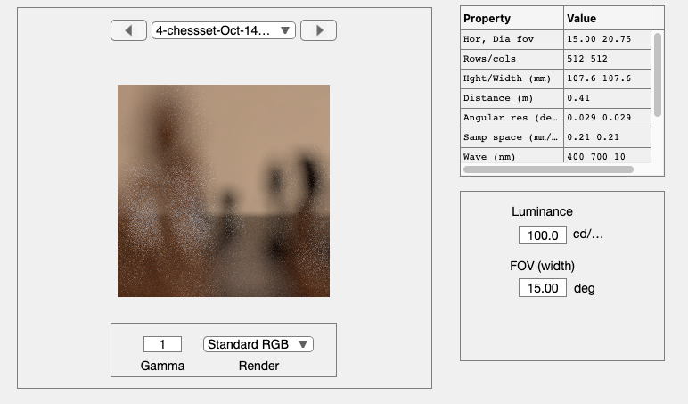
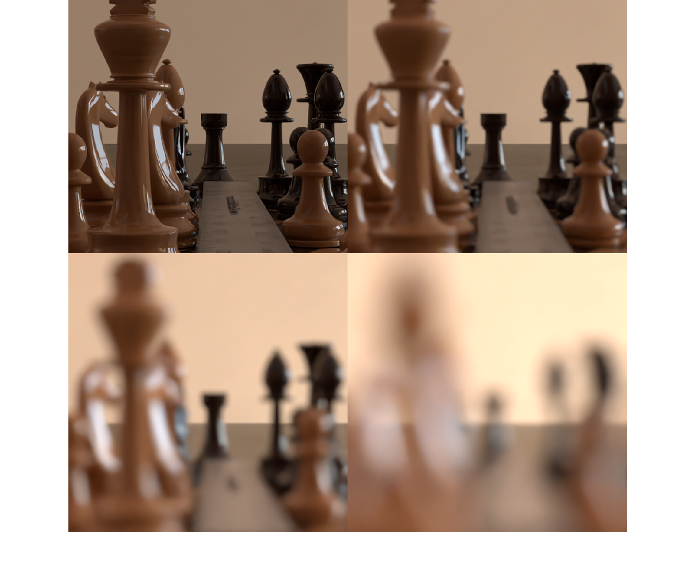
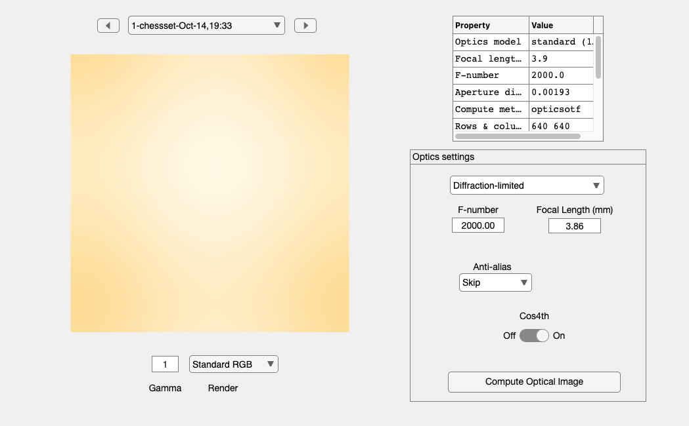
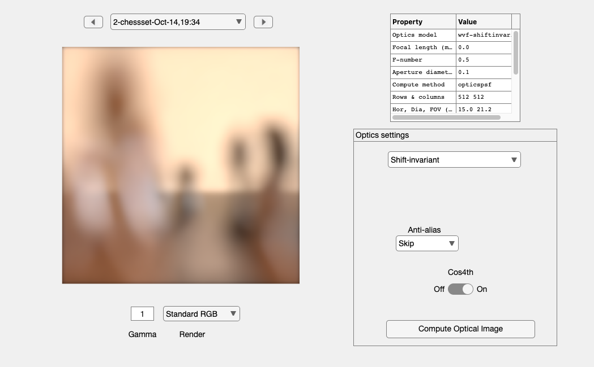

# <span style="color:rgb(213,80,0)">Foundations of Image Systems Engineering</span>

## Chapter 1, Light Fields

Render the chess set scene with a pinhole camera (perspective) mode. We use a range of aperture sizes to show the blurring effect.


**Requires**: ISET3d\-tiny and remote rendering.

# Initialize ISET/ISET3d
```matlab
ieInit;
if ~piDockerExists, piDockerConfig; end
```
# Load the chess scene

The default chess set scene has a fairly small horizontal field of view, (30 deg). Thus there is little intensity fall off across the rendered scene.

```matlab
thisR = piRecipeDefault('scene name','chessset');
thisR.set('spatial samples',[512 512]);
thisR.set('fov',15);
```
# Increasing pinhole size

By default for a pinhole camera, ISET3d renders the image on a film surface.  . The horizontal field of view for the chess set scene is 30 deg (part of the recipe).  By default, the film has a diagonal size of 10 mm which is big enough to capture the scene.  Both parameters can be changed this a thisR.set() command.


This loop renders the scene though a pinhole, changing the radius (mm). A radius of 0 means we only let through a single ray.  The images all have some rendering noise, so we clean that up and collect the images.

```matlab
radius = [0, 0.0010, 0.0032, 0.0100]; % In millimeters
img = cell(4,1);
for ii=1:numel(radius)
    thisR.set('pinhole radius',radius(ii));
    scene   = piWRS(thisR,'verbosity',0,'show',true);
    scene   = piAIdenoise(scene,'quiet',true);
    % Save this scene for later
    if radius(ii) == 0, scene0 = scene; end
    img{ii} = sceneGet(scene,'srgb');
end
```

<center></center>


We can calculate the (implicit) distance from the pinhole to the film this way, but with a pinhole the depth of field is infinite, so there isn't much point worrying. 

<pre>
filmDistance = sceneGet(scene,'width','mm')/tand(sceneGet(scene,'fov'));
fprintf('Implicit distance of the film %f mm\n',filmDistance);
</pre>

# The image 

I don't understand why a 20 micron diameter (4th image) would blur the image this much in the absence of diffraction.  The samples in the original image are  spaced about 210 microns.  Why does the PBRT pinhole calculation blur so much?  Read the book about what the pinhole is doing.

```matlab
ieNewGraphWin; 
montage(img);
```

<center></center>

# Diffraction

We create diffraction limited optics and set the f/\# to match the ratio of a typical sensor distance (4mm) and the size of the pinhole diameter (2 microns) that was a relatively sharp pinhole image in the absence of diffraction.  This f/\# is ridiculously large. 

```matlab
oi = oiCreate('diffraction limited');  % Diffraction limited optics
apertureDiameter = radius(2)*2;   % Radius in mm
filmDistance = 4;                 % 4 mm
fNumber = filmDistance/apertureDiameter;
oi = oiSet(oi,'fnumber',fNumber);
fprintf('\nDiameter:\t%f mm\nFocal length\t%.2f mm\nf/#\t\t%.2f\n',...
    oiGet(oi,'optics diameter','mm'), ...
    oiGet(oi,'focal length','mm'), ...
    oiGet(oi,'fNumber'));
```

```matlabTextOutput
Diameter:    0.001931 mm
Focal length    3.86 mm
f/#        2000.00
```
# Accounting for diffraction

 The optical image is blurred beyond recognition.  

```matlab
oi = oiCompute(oi,scene0);
oiWindow(oi);
```

<center></center>

# Fix this

If we simulate the image plane much closer, about 100 microns from the pinhole, the f/\# would be 5.  Then we could can create a small image.  We are not changing all the parameters here, just the f/\#.  That is because the sampling of the diffraction limited optics doesn't do well with such small sizes.  And I haven't made the 'wvf' form calculate properly.

```matlab
[~,wvf] = oiCreate('wvf');
fNumber = 5;
wvf = wvfSet(wvf,'calc pupil diameter',0.1); %% mm, so 100 microns
wvf = wvfSet(wvf,'focal length',0.01*fNumber);

% When the aperture is extremely small, the number of samples has to be
% very large.
wvf = wvfSet(wvf,'spatial samples',512);
wvf = wvfCompute(wvf);
% Create the oi
oi  = wvf2oi(wvf);
oi = oiCompute(oi,scene,'crop',true);
oiWindow(oi);
```

<center></center>

# End
