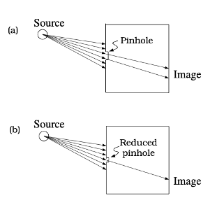
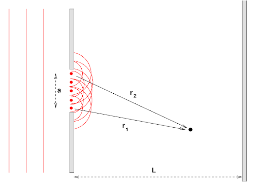
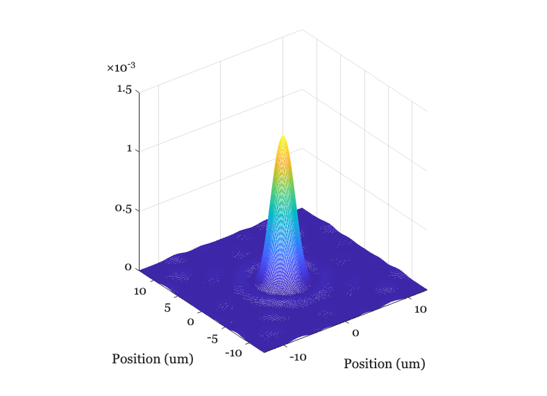
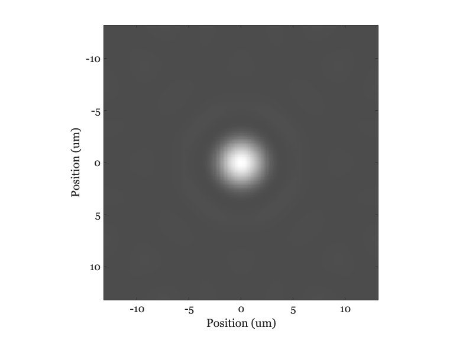
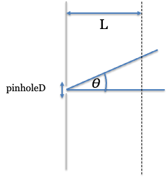
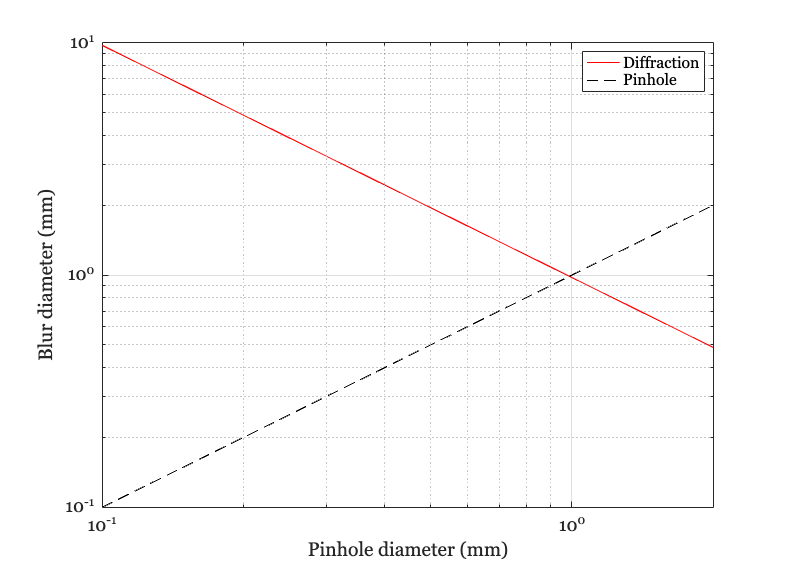
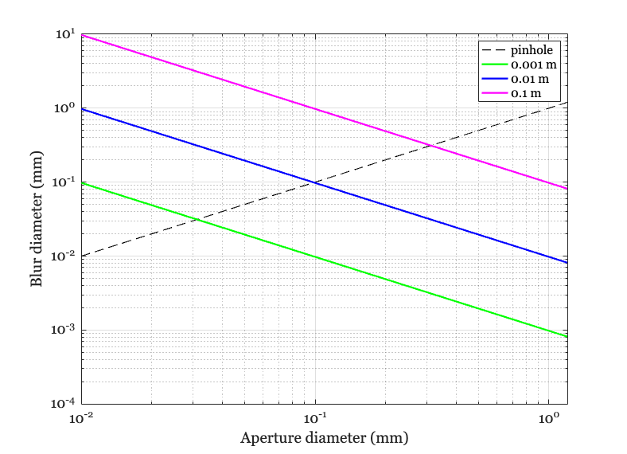

# <span style="color:rgb(213,80,0)">Comparing two sources of blur: Pinholes and Diffraction</span>

We can summarize image system blur by measuring how light from a point source is spread on the image.  The image of a point is called the *point spread function*.  We will see many point spread functions in this book.


For a pinhole camera, two factors contribute to the blur: the pinhole diameter and the diffraction.


The larger the pinhole the larger the blur. Consider a distant point, so that the rays arrive at the pinhole and they are parallel. As the diameter of the pinhole diameter increases, the rays will be spread over an area that roughly matches the pinhole size.  


         


Second, consider the light from a distant point as a wave.  In this case the light is 'collimated', which is to say the wave appears as a set of parallel peaks and troughs.  As the wave enters the pinhole, particularly for a small pinhole diameter compared to the wavelength, the rays will spread over a larger angle.  


&nbsp;&nbsp;&nbsp;&nbsp; 


As the pinhole diameter increases, the blur caused bgy these two physical factors have opposite effects. When the pinhole is large, the blur is mainly from the pinhole; when the pinhole is small the blur is mainly from diffraction. 


This script calculates which effect would dominate for different pinhole sizes. 

# Choosing parameters

Let's explore for this range of diameters, from about 100 microns to 1200 microns (1.2mm).  The wavelength of the light will matter also for the wave calculation.  Let's pick a short wavelength.

```matlab
pinholeD = (100:100:2000)*1e-6;   % Pinhole diameter (meters)
wave = 400e-9;                    % Wavelength (meters)
```

As Lord Airy described in 1835, we can calculate the expected image as waves pass through a circular pinhole.  We calculate these in ISETCam using this code. 

```matlab
fNumber = 8;   % Longer wavelength
[~,img] = airyDisk(wave,fNumber,'units','um');
```

```matlabTextOutput
*** The oi fov is not set yet.  Using a default fov of 10.
oiGet:  No scene, arbitrary oi angle: 10 deg
```

```matlab
ieNewGraphWin; 
mesh(img.x,img.y,img.data); 
xlabel('Position (um)'); ylabel('Position (um)'); axis square
```

<center></center>


Notice that there is a big central peak (the Airy disk) and then a series of small rings that are separated by zero\-crossings.  If we look at the data as an image, the surrounding rings are very dim.

```matlab
ieNewGraphWin;
imagesc(img.x,img.y,img.data); 
axis image; colormap(0.7*gray+0.3); xlabel('Position (um)'); ylabel('Position (um)');
```

<center></center>

# Airy Disk size

The size of the central region is called the Airy Disk. The diameter of the disk has a simple formula that we can express as the angle swept out by the the light emerging from the pinhole.  The angle is $\theta$ and the distance to the wall is $L$ . If we know those values, we can calculate the size of the spread on the wall.





This is the formula for the Airy Disk radius in degrees

```matlab
diffractionDeg = asind(1.22*(wave ./ pinholeD));
```

The wall (imaging surface) is L meters away

```matlab
L = 1;   
```

From standard geometry, here is the relationship between the angle and the radius

 $$ tan(\theta )=\frac{opp}{adj} $$ 

Let's make the angle in degrees, and thus use the tand() function. We multiply by 2 to get the diffraction diameter

```matlab
diffractionD = 2*L*tand(diffractionDeg);
```

This graph plots (a) the spread from diffraction, and (b) from the pinhole itself.  These are plotted as a function of pinhole diameter. The two lines intersect at the pinhole size where the two effects are equal. The graph shows that when the wall is 1 meter away,  the effects are equal for a pinhole diameter a little less than 1 mm. Below this pinhole size, diffraction dominates.  Larger than this size, pinhole blur dominates.

```matlab
ieNewGraphWin;
unit = 'mm';
loglog(pinholeD*ieUnitScaleFactor(unit),diffractionD*ieUnitScaleFactor(unit),'-');
hold on;
loglog([0;pinholeD(:)]*ieUnitScaleFactor(unit),[0;pinholeD(:)]*ieUnitScaleFactor(unit),'k--');
xlabel(sprintf('Pinhole diameter (%s)',unit));
ylabel(sprintf('Blur diameter (%s)',unit));
grid on; legend({'Diffraction','Pinhole'});
```

<center></center>


# How does this depend on the distance to the wall?

In the next graph, the colored lines shows the pinhole and diffraction blur for shorter wall distances (100 mm to 1 mm). As the distance to the wall shrinks, the diameter at which diffraction and pinhole blur cross also shrinks.

```matlab
pinholeD = (10:10:1200)*1e-6;   % Pinhole diameter (meters)
diffractionDeg = asind(1.22*(wave ./ pinholeD));

Lmeters = [0.001, 0.01, 0.1];  % Meters
match = zeros(size(Lmeters));

ieNewGraphWin;
loglog([0;pinholeD(:)]*ieUnitScaleFactor(unit),[0;pinholeD(:)]*ieUnitScaleFactor(unit),'k--');
hold on;

unit = 'mm';  % Let's plot in millimeters
for ii=1:numel(Lmeters)
    % Radius size on a wall, L meters away
    L = Lmeters(ii);
    diffractionD = 2*L*tand(diffractionDeg);
    p = loglog(pinholeD*ieUnitScaleFactor(unit),diffractionD*ieUnitScaleFactor(unit),'-','LineWidth',2);    
end
xlabel(sprintf('Aperture diameter (%s)',unit));
ylabel(sprintf('Blur diameter (%s)',unit)); grid on
legend({'pinhole','0.001 m','0.01 m','0.1 m'})
```

<center></center>

