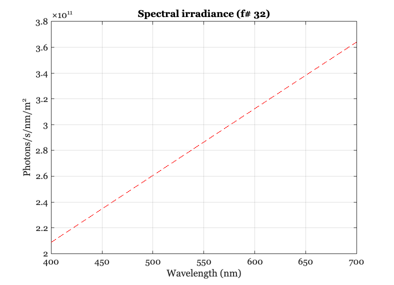
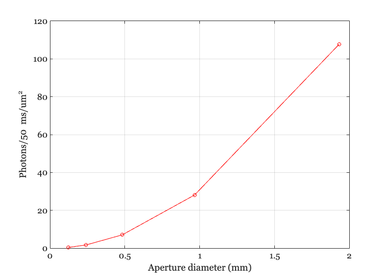
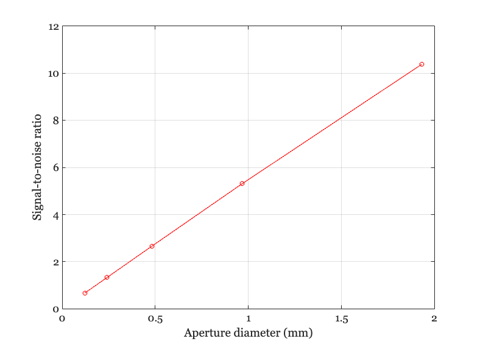

# <span style="color:rgb(213,80,0)">Calculate the number of photons at a sensor surface</span>

```matlab
ieInit
```
# To just count, it is easy to use a uniform scene
```matlab
scene = sceneCreate('uniform ee',[512 512]);
scene = sceneSet(scene,'mean luminance',10);
```
# Create spectral irradiance at the sensor for optics with a range of f\#
```matlab
% The default optics as a 3.9 mm focal length
oi = oiCreate;  % Basic diffraction-limited optics

% Region in the OI we use to measure
roiRect = [291 202 16 23];

% Loop for different f numbers
fnumbers = [2,4,8,16,32];

% Store the total number of photons here
totalQ = zeros(1,length(fnumbers));

% Store the aperture diameter in mm for each fnumber here
apertureD = zeros(size(totalQ));

for ff = 1:length(fnumbers)
    % OI controls focal length and fnumber.  If we set the fnumber,
    % the focal length remains the same.  Hence, only the aperture is
    % changed.  This was a choice that fnumber mattered more than
    % aperture, which is true for ideal lenses.
    oi = oiSet(oi,'optics fnumber',fnumbers(ff));
    oi = oiCompute(oi,scene);
    apertureD(ff) = oiGet(oi,'optics aperture diameter','mm');
    spectralIrradiance = oiGet(oi,'roi mean photons',roiRect);
    totalQ(ff) = sum(spectralIrradiance);
end
```
# Plot one spectral irradiance
```matlab
ieNewGraphWin;
plot(oiGet(oi,'wave'),spectralIrradiance,'--');
grid on
xlabel('Wavelength (nm)'); ylabel('Photons/s/nm/m^2');
title(sprintf('Spectral irradiance (f# %d)',fnumbers(end)));
```

<center></center>

# Plot the number of photons as a function of aperture diameter

Suppose a micron pixel aperture and a 50 ms time period

```matlab
ieNewGraphWin;
sFactor = (1e-6)^2*50e-3;
plot(apertureD,totalQ*sFactor,'-o');
grid on;
xlabel('Aperture diameter (mm)'); ylabel('Photons/{50 ms}/{um}^2')
```

<center></center>

# Signal\-to\-noise

How many standard deviations of signal at the level?  This tells us how many steps of intensity we can reliably discriminate.

```matlab
SNR = totalQ*sFactor ./ sqrt(totalQ*sFactor);

ieNewGraphWin;
plot(apertureD,SNR,'-o');
grid on;
xlabel('Aperture diameter (mm)'); ylabel('Signal-to-noise ratio')
```

<center></center>

